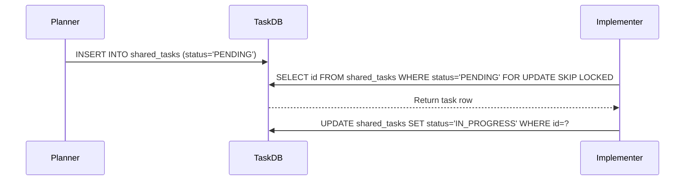

<div markdown="1" style="backdrop-filter: blur(20px) saturate(200%); font-family: 'Outfit', 'Inter', sans-serif; border: 1px solid rgba(255, 255, 255, 0.1); padding: 20px; border-radius: 12px; background: rgba(255, 255, 255, 0.03); color: #fff;">

# OHC: KAIROS Orchestration Design
**Author:** Principal Product Architect & KAIROS Orchestrator (L7)

## Overview
The OHC swarm relies on the **KAIROS** distributed orchestration system. KAIROS unifies multi-agent coordination, task decomposition, and memory retention across Cloud-Native Mode (PostgreSQL, Redis), Standalone Mode (SQLite), and Thin Client Mode.

## 1. Phase 1: Shared Task List (Decomposition)
The Shared Task List tracks complex feature decomposition into actionable, sequenced `shared_tasks`. It relies on strict database locking mechanisms (`FOR UPDATE SKIP LOCKED` on PostgreSQL, and application mutexes or `BEGIN EXCLUSIVE` on SQLite) to ensure autonomous agents safely pull from the queue.

**Database Schema (PostgreSQL/SQLite):**
```sql
CREATE TABLE IF NOT EXISTS shared_tasks (
    id UUID PRIMARY KEY DEFAULT gen_random_uuid(),
    organization_id VARCHAR NOT NULL,
    title VARCHAR NOT NULL,
    description TEXT,
    status VARCHAR NOT NULL DEFAULT 'PENDING', -- PENDING, IN_PROGRESS, COMPLETED, BLOCKED
    agent_id VARCHAR, -- Nullable until claimed
    priority VARCHAR NOT NULL DEFAULT 'P2',
    payload JSONB,
    created_at TIMESTAMP WITH TIME ZONE DEFAULT CURRENT_TIMESTAMP,
    updated_at TIMESTAMP WITH TIME ZONE DEFAULT CURRENT_TIMESTAMP
);

CREATE TABLE IF NOT EXISTS task_dependencies (
    task_id UUID REFERENCES shared_tasks(id) ON DELETE CASCADE,
    depends_on_task_id UUID REFERENCES shared_tasks(id) ON DELETE CASCADE,
    PRIMARY KEY (task_id, depends_on_task_id)
);
```

**Sequence Diagram:**


## 2. Phase 2: Orchestration (Teammate Mesh Architecture)
To coordinate in real-time, the agents rely on a publish-subscribe Teammate Mesh utilizing Redis via the `rueidis` library.
It operates over two primary channels:
- `mesh:tasks`: For broadcasting task claims and completion events.
- `mesh:coordination`: For generic inter-agent negotiation and synchronization.

*In Standalone mode, this degrades gracefully to an in-memory Go channel bus.*

## 3. Phase 3: autoDream (Memory Consolidation Pipeline)
Continuous evolution demands that agents retain long-term memory. The AutoDream worker processes isolated agent sessions and pushes consolidated findings into the vector database.
- Consumes from `.agent-task/memory/*.yml`
- Stores in `autodream_memories` table using `pgvector` for retrieval and LLM context injection.

```sql
CREATE TABLE IF NOT EXISTS agent_memories (
    id UUID PRIMARY KEY DEFAULT gen_random_uuid(),
    organization_id VARCHAR NOT NULL,
    content TEXT NOT NULL,
    embedding vector(1536),
    created_at TIMESTAMP WITH TIME ZONE DEFAULT CURRENT_TIMESTAMP
);
```

## 4. Phase 4: Sub-Agent Orchestration Queue
For isolating smaller sub-tasks, KAIROS leverages a dedicated `sub_agent_jobs` queue.
- Jobs have exponential backoff for retries (`attempts`, `max_attempts`).
- Lock durations managed via `locked_until`.

```sql
CREATE TABLE IF NOT EXISTS sub_agent_jobs (
    id TEXT PRIMARY KEY,
    parent_task_id TEXT,
    agent_role TEXT NOT NULL,
    payload JSONB NOT NULL,
    status TEXT NOT NULL DEFAULT 'QUEUED', -- QUEUED, RUNNING, FAILED, COMPLETED
    attempts INTEGER DEFAULT 0,
    max_attempts INTEGER DEFAULT 3,
    run_after DATETIME DEFAULT CURRENT_TIMESTAMP,
    locked_until DATETIME,
    created_at DATETIME DEFAULT CURRENT_TIMESTAMP,
    updated_at DATETIME DEFAULT CURRENT_TIMESTAMP
);
CREATE INDEX IF NOT EXISTS idx_jobs_runnable ON sub_agent_jobs (status, run_after) WHERE status = 'QUEUED';
```

</div>