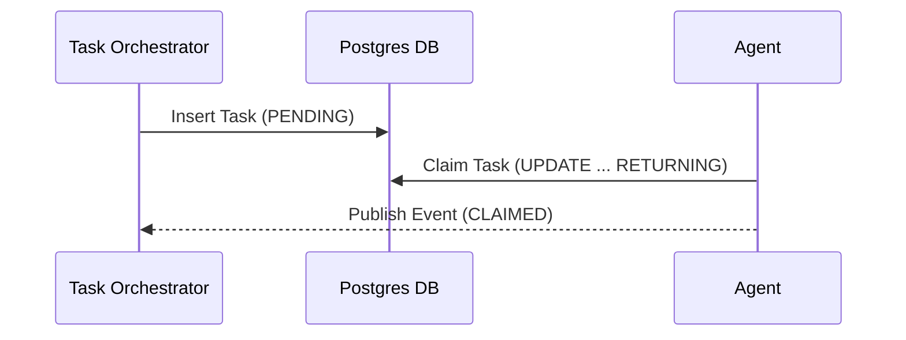

# KAIROS Orchestrator Premium Design Doc

<div markdown="1" style="backdrop-filter: blur(20px) saturate(200%); background: rgba(255, 255, 255, 0.03); font-family: 'Outfit', 'Inter', sans-serif; padding: 20px; border-radius: 12px; border: 1px solid rgba(255, 255, 255, 0.1);">

## 1. Shared Task List Decomposition

### Database Schema
The primary datastore for KAIROS tasks will be Postgres, to ensure distributed consistency.

```sql
CREATE TABLE tasks (
    id UUID PRIMARY KEY DEFAULT gen_random_uuid(),
    epic_id UUID REFERENCES epics(id),
    title VARCHAR(255) NOT null,
    status VARCHAR(50) NOT null CHECK (status IN ('PENDING', 'CLAIMED', 'DONE', 'FAILED')),
    assigned_agent VARCHAR(100),
    created_at TIMESTAMP WITH TIME ZONE DEFAULT CURRENT_TIMESTAMP,
    updated_at TIMESTAMP WITH TIME ZONE DEFAULT CURRENT_TIMESTAMP
);
```

### Sequence Diagram


---

## 2. Realtime Teammate Mesh APIs

The Teammate Mesh facilitates intra-swarm communication via Redis Pub/Sub, ensuring rapid state propagation.

### Architecture
- **Transport**: Redis Pub/Sub channels (e.g., `mesh:events:task_updates`).
- **Protocols**: Events serialized in JSON or Protobuf.
- **API Endpoints**:
  - `POST /mesh/publish`
  - `GET /mesh/subscribe (WebSocket upgrade)`

---

## 3. AutoDream Data Pipelines for OHC VectorDB

To synthesize the agent's long-term learnings, AutoDream extracts structural state into a pgvector store.

### Pipeline Architecture
1. **Extraction**: Cron-driven jobs extract finalized UltraPlans and resolved Tasks.
2. **Embedding**: Payloads sent to LLM for dense vector embedding generation.
3. **Storage**: Vectors upserted into `pgvector` indexed tables.

```sql
CREATE TABLE knowledge_embeddings (
    id UUID PRIMARY KEY,
    content TEXT,
    embedding VECTOR(1536)
);
CREATE INDEX ON knowledge_embeddings USING ivfflat (embedding vector_cosine_ops);
```

</div>
