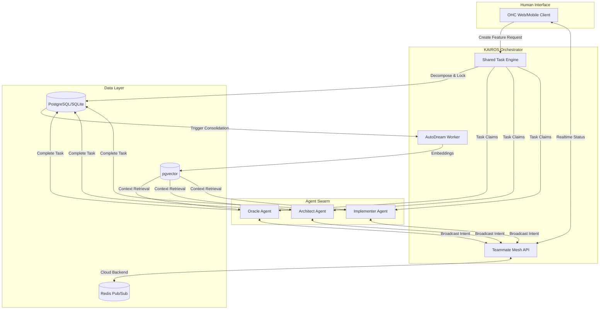

# KAIROS Orchestrator System Diagram

```mermaid
graph TD
    subgraph Human Interface
        UI[OHC Web/Mobile Client]
    end

    subgraph KAIROS Orchestrator
        Orch[Shared Task Engine]
        Mesh[Teammate Mesh API]
        Dream[AutoDream Worker]
    end

    subgraph Agent Swarm
        Agent1[Oracle Agent]
        Agent2[Architect Agent]
        Agent3[Implementer Agent]
    end

    subgraph Data Layer
        DB[(PostgreSQL/SQLite)]
        Redis[(Redis Pub/Sub)]
        VectorDB[(pgvector)]
    end

    UI -->|Create Feature Request| Orch
    UI <-->|Realtime Status| Mesh

    Orch -->|Decompose & Lock| DB
    Orch -->|Task Claims| Agent1
    Orch -->|Task Claims| Agent2
    Orch -->|Task Claims| Agent3

    Agent1 <-->|Broadcast Intent| Mesh
    Agent2 <-->|Broadcast Intent| Mesh
    Agent3 <-->|Broadcast Intent| Mesh

    Mesh <-->|Cloud Backend| Redis

    Agent1 -->|Complete Task| DB
    Agent2 -->|Complete Task| DB
    Agent3 -->|Complete Task| DB

    DB -->|Trigger Consolidation| Dream
    Dream -->|Embeddings| VectorDB
    VectorDB -->|Context Retrieval| Agent1
    VectorDB -->|Context Retrieval| Agent2
    VectorDB -->|Context Retrieval| Agent3
```

