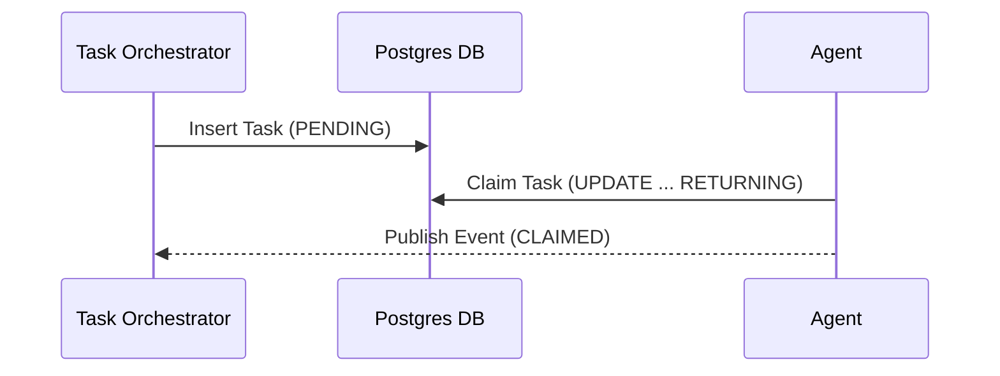

# Shared Task List Decomposition Design

<div markdown="1" style="backdrop-filter: blur(20px) saturate(200%); background: rgba(255, 255, 255, 0.03); font-family: 'Outfit', 'Inter', sans-serif; padding: 20px; border-radius: 12px; border: 1px solid rgba(255, 255, 255, 0.1);">

## Database Schema
The primary datastore for KAIROS tasks will be Postgres, to ensure distributed consistency.

```sql
CREATE TABLE tasks (
    id UUID PRIMARY KEY DEFAULT gen_random_uuid(),
    epic_id UUID REFERENCES epics(id),
    title VARCHAR(255) NOT null,
    status VARCHAR(50) NOT null CHECK (status IN ('PENDING', 'CLAIMED', 'DONE', 'FAILED')),
    assigned_agent VARCHAR(100),
    created_at TIMESTAMP WITH TIME ZONE DEFAULT CURRENT_TIMESTAMP,
    updated_at TIMESTAMP WITH TIME ZONE DEFAULT CURRENT_TIMESTAMP
);
```

## Sequence Diagram


</div>
