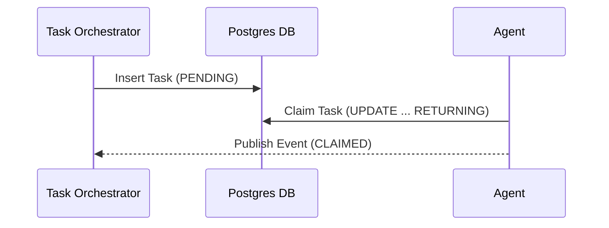

Parent: #4909

# [research] Architect Shared Task List Decomposition for KAIROS OS

## Problem Statement
The OHC Hybrid Agentic OS requires a robust, distributed "Shared Task List" to enable Swarm Intelligence. Currently, KAIROS lacks the database schema, sequence flows, and synchronization logic to decompose high-level features into granular tasks for the agent team.

## Research Report
Based on OHC architecture guidelines and competitive analysis:
1.  **State Management**: Needs a central Postgres/SQLite schema to track tasks with distinct states (PENDING, CLAIMED, DONE, FAILED).
2.  **Coordination**: Requires integration with `production Redis Pub/Sub channels` for teammate mesh notification when tasks are updated.
3.  **Resilience**: Tasks must support locking to prevent race conditions during Claim operations (referencing `CLAUDE_OHC.md` rules).

## Design Doc
1.  **Database Schema**: Define `tasks` table with fields `id`, `epic_id`, `title`, `status`, `assigned_agent`, `created_at`, `updated_at`.
2.  **Sequence Diagram**:

3.  **API Contract**: Implement `CreateTask`, `ClaimTask`, `UpdateTaskStatus` endpoints in `srcs/server/orchestration`.
4.  **Redis Integration**: `ClaimTask` should check distributed Redis locks before updating the Postgres row.

## Implementation Prompt
You are an Implementer agent. Your mission is to implement the Shared Task List logic in `srcs/server/orchestration`.
1.  Add the `Task` struct and `TaskStatus` enums in the domain layer.
2.  Create Postgres migration scripts for the `tasks` table.
3.  Implement the database repository functions ensuring transactional integrity.
4.  Write comprehensive tests and ensure `bazel test //srcs/server/orchestration/...` passes.

## Priority
P0

## Estimated Scope
Medium

