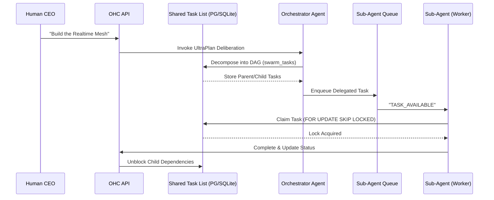

# OHC KAIROS: Hybrid AI OS Architecture

## Core Schemas

### Shared Tasks and Dependencies
```sql
CREATE TABLE IF NOT EXISTS shared_tasks (
    id UUID PRIMARY KEY DEFAULT gen_random_uuid(),
    organization_id VARCHAR NOT NULL,
    title VARCHAR NOT NULL,
    description TEXT,
    status VARCHAR NOT NULL DEFAULT 'PENDING',
    agent_id VARCHAR,
    priority VARCHAR NOT NULL DEFAULT 'P2',
    payload JSONB,
    parent_plan_id TEXT,
    locked_until TIMESTAMP WITH TIME ZONE,
    created_at TIMESTAMP WITH TIME ZONE DEFAULT CURRENT_TIMESTAMP,
    updated_at TIMESTAMP WITH TIME ZONE DEFAULT CURRENT_TIMESTAMP
);

CREATE TABLE IF NOT EXISTS task_dependencies (
    task_id UUID NOT NULL REFERENCES shared_tasks(id) ON DELETE CASCADE,
    depends_on_task_id UUID NOT NULL REFERENCES shared_tasks(id) ON DELETE CASCADE,
    PRIMARY KEY (task_id, depends_on_task_id)
);
```

### State Machine Transitions
```sql
CREATE TABLE IF NOT EXISTS state_machine_transitions (
    id TEXT PRIMARY KEY,
    entity_id TEXT NOT NULL,
    entity_type TEXT NOT NULL,
    from_state TEXT NOT NULL,
    to_state TEXT NOT NULL,
    agent_id TEXT,
    reason TEXT,
    occurred_at TIMESTAMPTZ DEFAULT CURRENT_TIMESTAMP
);
CREATE INDEX IF NOT EXISTS idx_sm_entity ON state_machine_transitions(entity_id, entity_type);
```

### AutoDream Memories (Vector Store)
```sql
CREATE EXTENSION IF NOT EXISTS vector;
CREATE TABLE IF NOT EXISTS autodream_memories (
    id UUID PRIMARY KEY DEFAULT gen_random_uuid(),
    topic TEXT NOT NULL,
    content TEXT NOT NULL,
    embedding vector(1536),
    created_at TIMESTAMP WITH TIME ZONE DEFAULT CURRENT_TIMESTAMP
);
```

## Sequence Diagram: UltraPlan Deliberation & State Tracking


## Phase 2: Orchestration (Teammate Mesh Architecture)

Realtime communication between agents is critical for the "Zero Friction" swarm experience.

### Realtime API Contracts
- **Transport**: WebSockets / gRPC locally, backed by Redis Pub/Sub for horizontal scaling in Cloud-Native Mode.
- **Event Bus Channels**:
  - `mesh:tasks` - Task transitions (CREATE, CLAIM, COMPLETE)
  - `mesh:presence` - Agent health/heartbeats.
- **Message Format (JSON)**:
  ```json
  {
    "event_type": "TASK_CLAIMED",
    "agent_id": "Implementer-1",
    "payload": {
      "task_id": "123e4567-e89b-12d3-a456-426614174000",
      "timestamp": "2026-04-05T22:45:00Z"
    }
  }
  ```
