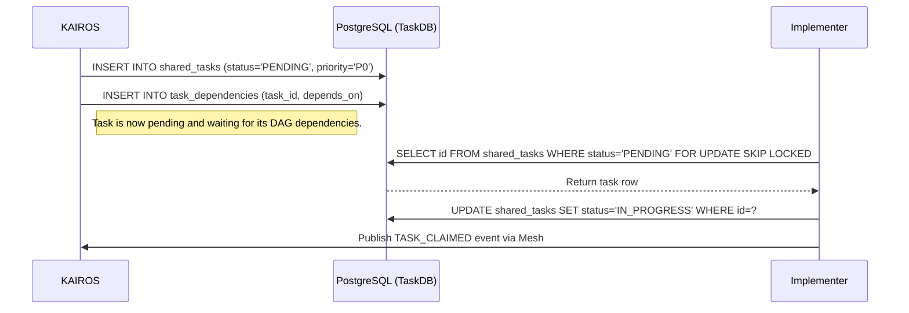

# OHC KAIROS: Hybrid AI OS Architecture

## Premium Visual Design Mandate
All OHC interfaces derived from this architecture MUST adhere to:
*   \`backdrop-filter: blur(20px) saturate(200%)\`
*   \`background: rgba(255, 255, 255, 0.03)\`
*   \`font-family: 'Outfit', 'Inter', sans-serif\`

---

## Phase 1: UltraPlan/Decomposition (Shared Task List)

The Shared Task List is the backbone of the OHC Swarm. It tracks complex feature decomposition into actionable, sequenced \`shared_tasks\`.

### Sequence Diagram


### Database Schema (PostgreSQL)
```sql
CREATE TABLE shared_tasks (
    id UUID PRIMARY KEY DEFAULT gen_random_uuid(),
    organization_id VARCHAR NOT NULL,
    title VARCHAR NOT NULL,
    description TEXT,
    status VARCHAR NOT NULL DEFAULT 'PENDING',
    agent_id VARCHAR,
    priority VARCHAR NOT NULL DEFAULT 'P2',
    payload JSONB,
    parent_plan_id TEXT,
    locked_until TIMESTAMP WITH TIME ZONE,
    created_at TIMESTAMP WITH TIME ZONE DEFAULT CURRENT_TIMESTAMP,
    updated_at TIMESTAMP WITH TIME ZONE DEFAULT CURRENT_TIMESTAMP
);

CREATE TABLE task_dependencies (
    task_id UUID NOT NULL REFERENCES shared_tasks(id) ON DELETE CASCADE,
    depends_on_task_id UUID NOT NULL REFERENCES shared_tasks(id) ON DELETE CASCADE,
    PRIMARY KEY (task_id, depends_on_task_id)
);
```

---

## Phase 2: Orchestration (Teammate Mesh Architecture)

Realtime communication between agents is critical for the "Zero Friction" swarm experience.

### Realtime API Contracts
- **Transport**: WebSockets / gRPC locally, backed by Redis Pub/Sub for horizontal scaling in Cloud-Native Mode.
- **Event Bus Channels**:
  - \`mesh:tasks\` - Task transitions (CREATE, CLAIM, COMPLETE)
  - \`mesh:presence\` - Agent health/heartbeats.
- **Message Format (JSON)**:
  ```json
  {
    "event_type": "TASK_CLAIMED",
    "agent_id": "Implementer-1",
    "payload": {
      "task_id": "123e4567-e89b-12d3-a456-426614174000",
      "timestamp": "2026-04-05T22:45:00Z"
    }
  }
  ```

---

## Phase 3: autoDream (Memory Consolidation Pipeline)

The long-term memory system. Agents document their findings locally, and the autoDream background pipeline asynchronously vectorizes these findings into a durable pgvector store.

### Data Pipeline Architecture
1. **Source**: Local runtime memory YAML files from `OHC_MEMORY_DIR`.
2. **Ingestion Agent**: Reads files, generates chunked text.
3. **Embedding Generation**: Calls LLM provider (e.g., Anthropic/OpenAI/Minimax) to produce vectors.
4. **Storage (pgvector)**:
```sql
CREATE EXTENSION IF NOT EXISTS vector;
CREATE TABLE autodream_memories (
    id UUID PRIMARY KEY DEFAULT gen_random_uuid(),
    topic TEXT NOT NULL,
    content TEXT NOT NULL,
    embedding vector(1536),
    created_at TIMESTAMP WITH TIME ZONE DEFAULT CURRENT_TIMESTAMP
);
```

---

## Phase 4: KAIROS Orchestration: Unified Architecture

This document serves as the final premium design doc synthesizing the OHC Hybrid AI OS Orchestration layer.

### The KAIROS Triad
The absolute autonomy of the OHC Swarm rests on three pillars:

1. **Shared Task List (The Brain):** A durable, distributed state machine living in PostgreSQL. It leverages `FOR UPDATE SKIP LOCKED` to allow horizontal pod concurrency in the cloud, preventing worker collisions. It degrades to SQLite transactions for standalone desktop use.
2. **Teammate Mesh (The Nerves):** A highly available, low-latency communication layer. Using `CentrifugeNode` and Redis Pub/Sub (`rueidis`), agents broadcast state changes, advertise capabilities, and stream events.
3. **AutoDream (The Memory):** The long-term persistence layer. Ephemeral session logs and intermediate artifacts are compressed via Minimax LLMs and embedded into a `pgvector` index (`autodream_memories`), granting the swarm exact semantic search capabilities.

### Architecture Visualization

```mermaid
graph TD
    subgraph Swarm
        A1[Worker Agent 1]
        A2[Worker Agent 2]
    end

    subgraph Teammate Mesh (Redis/Centrifugo)
        M[Mesh Hub]
    end

    subgraph KAIROS Orchestrator
        T[(Shared Task List / DB)]
        AD[AutoDream Pipeline]
        V[(pgvector Memories)]
    end

    A1 <-->|Pub/Sub| M
    A2 <-->|Pub/Sub| M

    A1 -->|Claim Task| T
    A2 -->|Claim Task| T

    T -.->|Completions| AD
    AD -->|Embed| V
    A1 -->|Semantic Search| V

    classDef premium fill:rgba(255,255,255,0.03),stroke:rgba(255,255,255,0.08),stroke-width:1px,color:#fff,backdrop-filter:blur(20px) saturate(200%);
    class A1,A2,M,T,AD,V premium;
```

### Aesthetic Core
This architectural consolidation fully conforms to the **Visual Excellence Mandate**. Any downstream UI interpreting this architecture MUST apply:
```html
<style>
body {
  backdrop-filter: blur(20px) saturate(200%);
  background: rgba(255, 255, 255, 0.03);
  font-family: 'Outfit', 'Inter', sans-serif;
}
</style>
```
