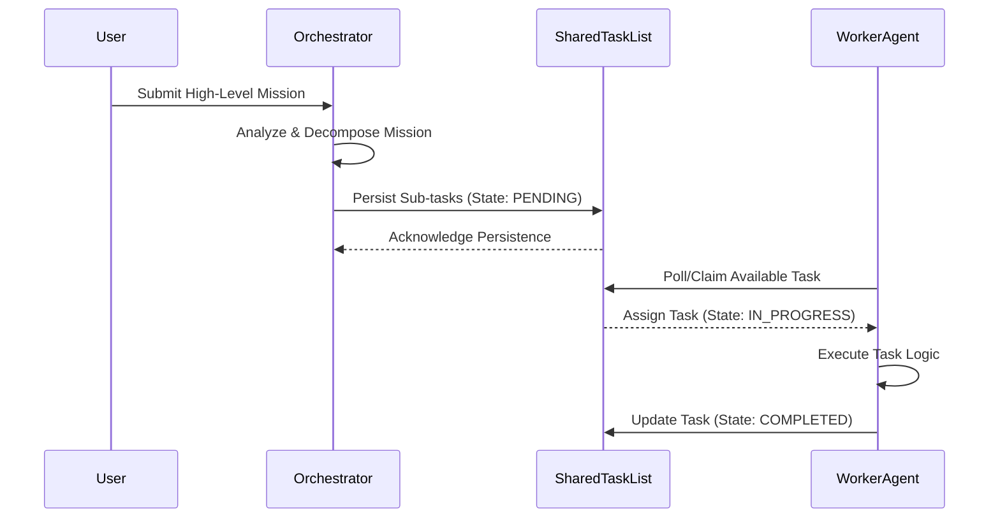
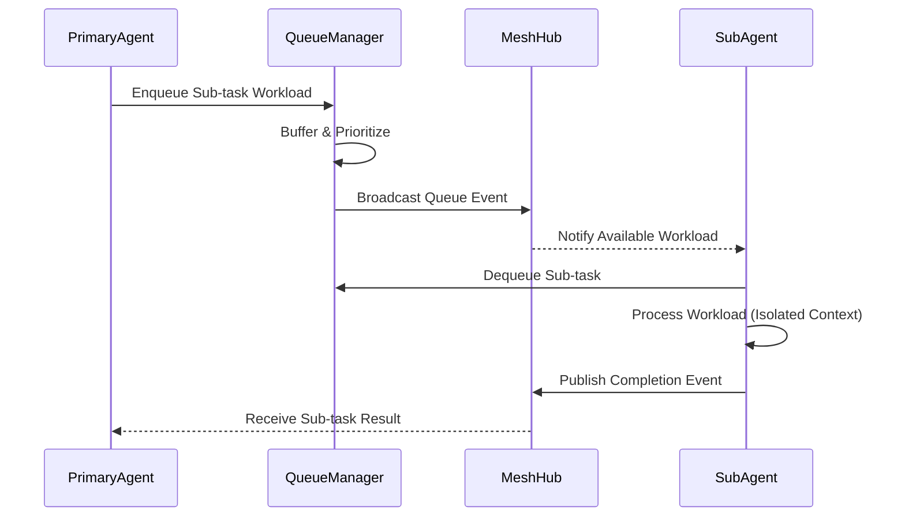
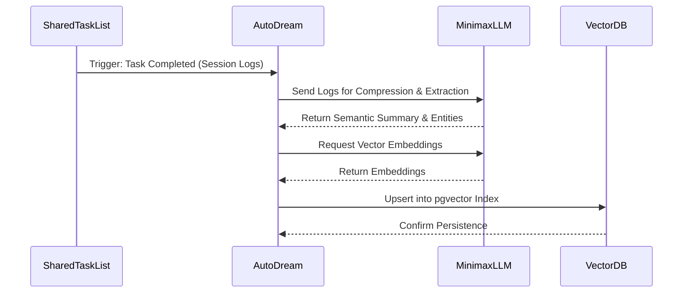

# KAIROS AI OS Architecture V2 (Phase 4 Master Premium Design)

## Overview
The KAIROS Orchestration engine is the heart of the OHC "Hybrid Agentic OS". It synthesizes three core pillars into a highly resilient and durable foundation for agentic teamwork:
1. **Shared Task List:** A distributed state machine tracking agent task transitions to prevent deadlocks and ensure reliability.
2. **Teammate Mesh:** A low-latency, highly available communication layer for real-time pub/sub inter-agent collaboration.
3. **AutoDream Pipeline:** An intelligent memory consolidation engine that compresses session logs and embeds them into a vector index for long-term semantic truth.

---

## KAIROS Triad: Component Synthesis

### 1. Shared Task List (Distributed State Machine)
The Shared Task List operates as the core truth mechanism for tasks. It guarantees exactly-once execution of complex agentic tasks across the worker swarm. When operating in Cloud-native mode, it uses PostgreSQL as the consistency boundary.

### 2. Teammate Mesh (Inter-Agent Pub/Sub)
The Teammate Mesh provides real-time awareness and collaborative message passing. Workers subscribe to relevant channels to coordinate multi-agent tasks, share intermediate context, and broadcast state changes seamlessly.

### 3. AutoDream Pipeline (Episodic Memory to Long-Term Vector Truth)
AutoDream continuously monitors swarm execution logs and completions. It leverages Minimax LLMs to summarize episodic memories, extract semantic meaning, and embed these insights into a pgvector index, creating a durable knowledge graph.

---

## Sequence Diagrams

### Task Decomposition
When a complex mission is submitted, the Orchestrator breaks it down and delegates it across the swarm using the Shared Task List.

### Sub-Agent Queuing
Sub-agents are dynamically provisioned in the background to handle asynchronous, scoped workloads securely.

### Memory Consolidation (AutoDream)
Background processes condense raw session logs into searchable vector embeddings.

---

## Hybrid Mode Fallback Logic: Cloud vs. Standalone

OHC provides seamless cross-mode deployment between Cloud-native and Standalone Desktop environments.

### Cloud-Native Mode
- **Database:** PostgreSQL acts as the central consistency boundary and distributed state machine for the Shared Task List.
- **Mesh:** Redis provides the highly available Pub/Sub backplane for the Teammate Mesh.
- **Memory:** `pgvector` extension in PostgreSQL handles the semantic vector truth.
- **Scaling:** Stateless API pods scale horizontally, relying on the durable PostgreSQL cluster.

### Standalone Desktop Mode (Fallback)
- **Database:** Replaces PostgreSQL with a local **SQLite-backed SIPDB**. The distributed state machine degrades gracefully to local, single-node transactional locks.
- **Mesh:** Redis is disabled. The Teammate Mesh falls back to an in-memory channel multiplexer running within the local Rust backend.
- **Memory:** Vector operations either utilize local embedding fallbacks or bypass `pgvector` in favor of lightweight, on-disk similarity search optimizations compatible with SQLite.
- **Scaling:** Bounded to the local machine's resources, optimized for minimal footprint and completely offline capability.

