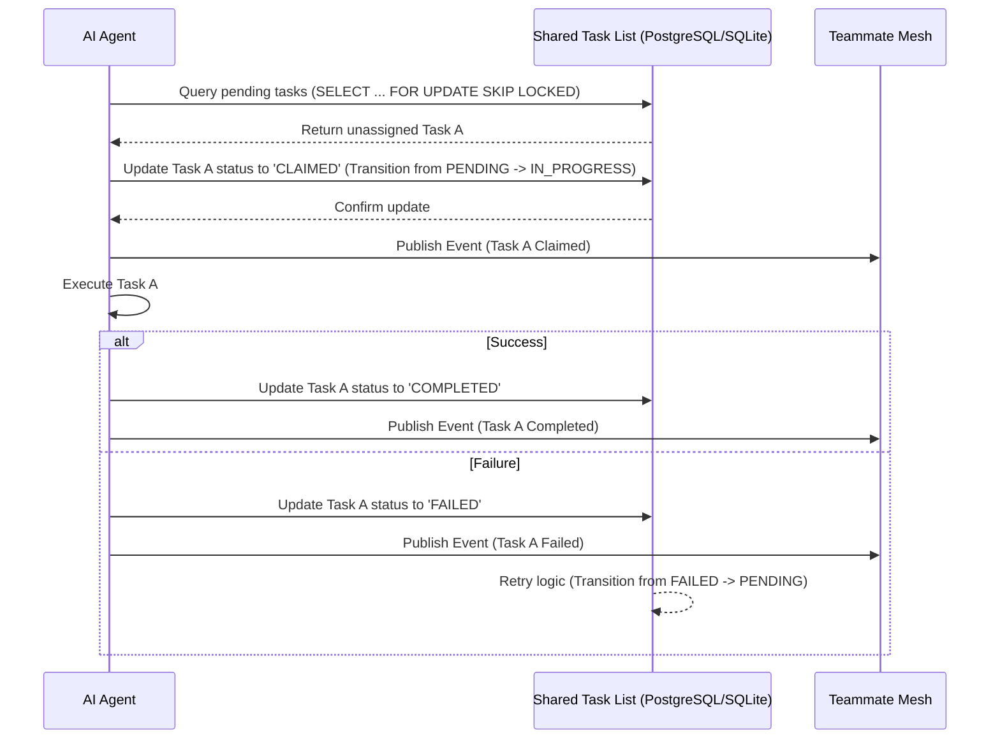
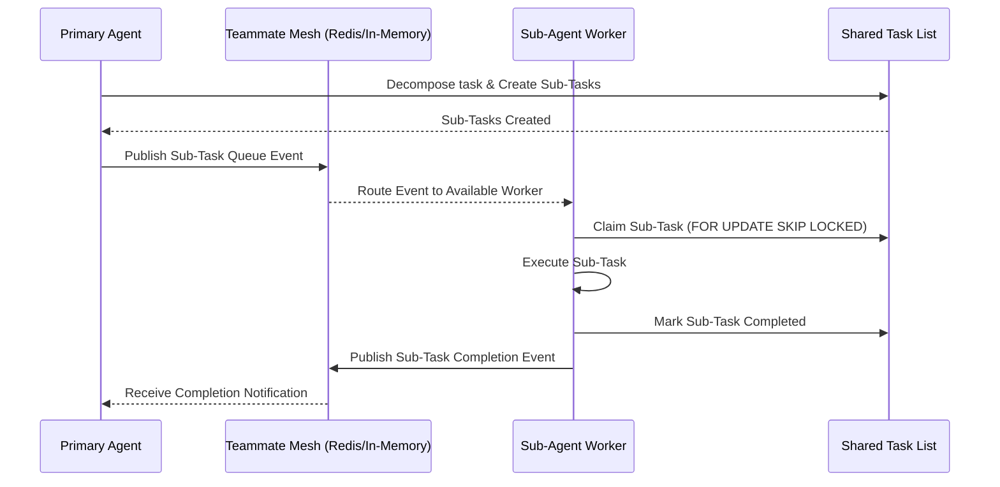
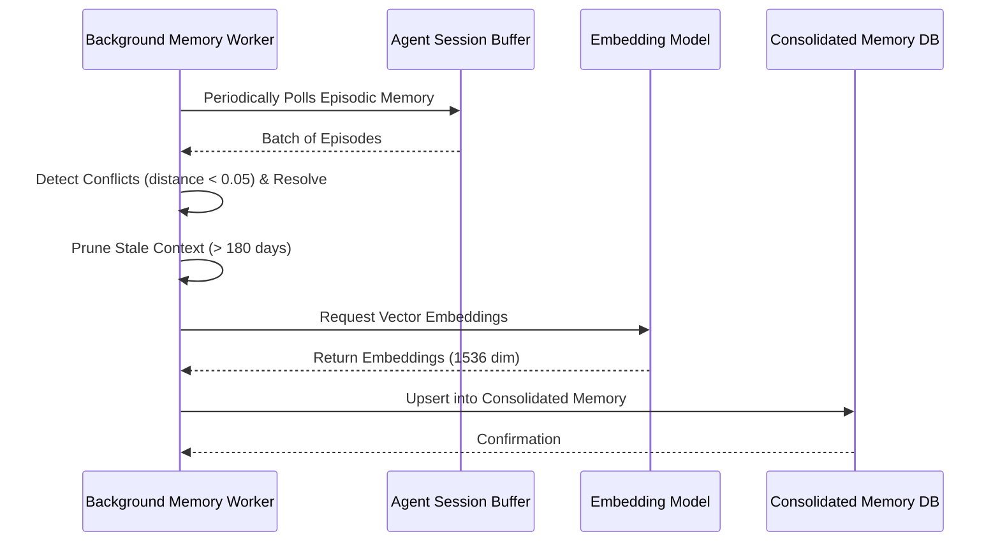

# KAIROS AI OS Architecture: Premium Hybrid Design (Phase 4)

This document serves as the master design reference for the OHC KAIROS AI OS, consolidating the core orchestration components into a unified, high-performance architecture. The system ensures robust, scalable AI operations with strong consistency and multi-tenant data isolation.

## The KAIROS Triad

The Swarm is powered by the KAIROS engine which maintains stability and orchestration via three core pillars: the Shared Task List, Teammate Mesh, and AutoDream.

### 1. Shared Task List (Task Decomposition)

The Shared Task List governs the lifecycle of tasks across the swarm and handles the complex DAG structures of agentic tasks. It ensures safe task claiming and transitions across distributed agent nodes, guaranteeing hybrid consistency.

- **Cloud-Native Mode**: Utilizes **PostgreSQL** (`SELECT FOR UPDATE SKIP LOCKED`) to provide transaction safety and robust concurrency control.
- **Standalone Mode**: Provides **SQLite graceful degradation** using local DB file locks or application mutexes.

#### Task Decomposition Sequence

### 2. Teammate Mesh (Sub-Agent Queuing & Orchestration)

To enable real-time sub-agent communication and queuing, the Teammate Mesh provides a high-throughput, low-latency messaging layer for cross-node coordination.

- **Cloud-Native Mode**: Employs **Redis Pub/Sub** for routing vast amounts of agent tasks and events securely in the background.
- **Standalone Mode**: Falls back to a **local in-memory event bus**, achieving sub-millisecond IPC for single-process edge scenarios.

#### Sub-Agent Queuing Sequence

### 3. AutoDream (Memory Consolidation)

The AutoDream pipeline handles the continuous self-reflection, experience distillation, and long-term memory consolidation of our agent swarm. It converts episodic session memory into long-term embedded vector truth, allowing for cross-department context sharing.

- **Cloud-Native Mode**: Managed **`pgvector`** Database with `VECTOR(1536)` dimensions.
- **Standalone Mode**: Local Vector DB / SQLite with `vec_distance_cosine`.

#### Memory Consolidation Sequence

## Hybrid Mode Fallback Logic

The KAIROS OS is designed to seamlessly transition between Cloud-Native and Standalone (Edge) execution modes based on the deployment target, with specific fallback logic handling the core infrastructure layers:

| Feature | Cloud-Native Mode | Standalone (Edge) Mode (Fallback) |
|---------|-------------------|-----------------------------------|
| **Task Storage** | PostgreSQL | SQLite |
| **Concurrency Control** | `SELECT FOR UPDATE SKIP LOCKED` | Local DB file locks |
| **IPC / Messaging** | Redis Pub/Sub (`redis`) | In-memory Event Bus |
| **Memory Storage** | Managed `pgvector` Database | Local Vector DB / SQLite VSS |
| **Target Environment** | Distributed Kubernetes Cluster | Mobile / Desktop App (Flutter) |
| **Latency Profile** | ~10-50ms network overhead | < 1ms local memory access |

The system intelligently detects its environment. If the PostgreSQL or Redis connection string is absent or unreachable during a local or edge deployment, the system initializes its corresponding fallback interface. The API abstraction ensures that agents interact with a consistent orchestration interface, unaware of the underlying infrastructure state.

