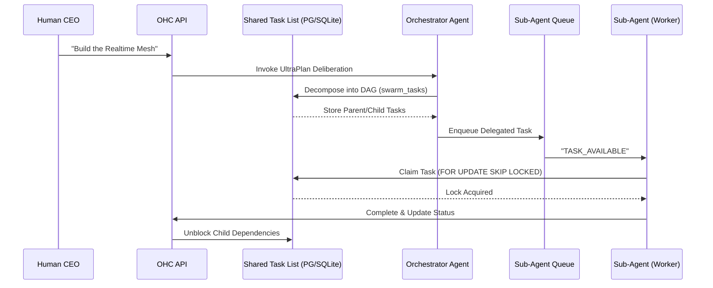
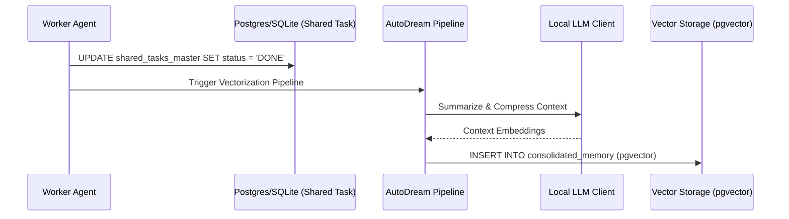

# KAIROS Phase 4: Master Premium Design Doc
**Author:** Principal Product Architect & KAIROS Orchestrator (L7)

## 1. Overview
The OHC Hybrid Agentic OS requires an autonomous, resilient backbone to seamlessly decompose massive human goals into isolated, parallel agentic workflows. KAIROS Orchestration is this unified architecture, driving "Shared Task Lists", "Teammate Mesh", and "AutoDream" pipelines across both Kubernetes/PostgreSQL clouds and local SQLite standalone footprints.

## 2. KAIROS Triad

### 2.1 Phase 1: Shared Task List (Decomposition)
To prevent agents from stepping on each other and to manage complex, multi-agent DAG flows, we deploy a robust distributed state machine backed by the database.

**Fallback Logic:**
- **Cloud Mode (PostgreSQL):** Uses native `FOR UPDATE SKIP LOCKED` inside explicit transactions to guarantee absolute race-condition immunity for horizontally scaled K8s pods.
- **Standalone Mode (SQLite):** Gracefully degrades to local transaction locks or application-level `sync.Mutex` combined with `UPDATE ... RETURNING` checks, preventing SQLite lock contention.

**Sequence Diagram: Task Decomposition & Sub-Agent Queuing**

### 2.2 Phase 2: Teammate Mesh (Coordination)
A high-throughput realtime event bus for intent broadcast and memory coordination.

**Fallback Logic:**
- **Cloud Mode:** Agents publish to production Redis Pub/Sub channels (`mesh:tasks`, `mesh:coordination`). Up to 10k msgs/sec multiplexed down to the CEO dashboard via WebSockets.
- **Standalone Mode:** Fallbacks to in-memory Go channels (`MemoryMeshTransport`) for seamless offline functionality.

### 2.3 Phase 3: AutoDream (Memory Consolidation)
The long-term persistence layer embedding ephemeral context. Agents run passively to translate ephemeral thoughts into durable truth, preventing context window overflows.

**Fallback Logic:**
- **Cloud Mode (PostgreSQL):** Uses `pgvector` (`autodream_memories_master`) for exact Nearest Neighbor search of embeddings.
- **Standalone Mode (SQLite):** Fallback maps vectors to local blobs or uses recency-based search.

**Sequence Diagram: AutoDream Memory Consolidation**

