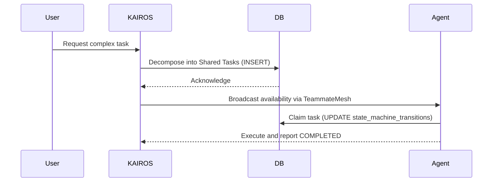
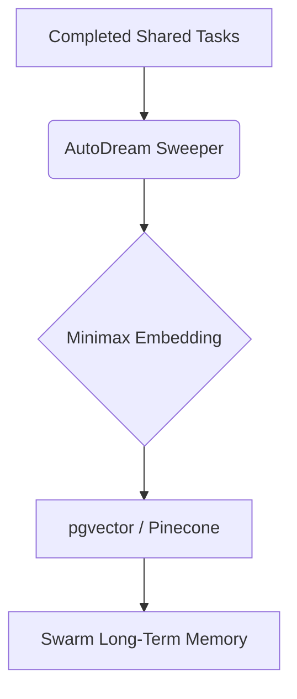

# 🚀 OHC KAIROS AI OS Architecture Design

This document details the blueprint for KAIROS, the distributed orchestrator empowering the OHC swarm.

## 1. Overview
The OHC swarm relies on KAIROS for task decomposition, secure agent coordination, and long-term memory consolidation. KAIROS unifies **Cloud-Native** and **Standalone** modes through a realtime Teammate Mesh and an intelligent Shared Task List.

## 2. Shared Task List Architecture
To eliminate isolation and coordinate multi-step workflows, we implement a central `shared_tasks` table and `state_machine_transitions` tracker.

### Database Schema
*   **`shared_tasks`**: Stores decomposed tasks with `dependencies` and `status` (e.g., PENDING, COMPLETED).
*   **`state_machine_transitions`**: Audits every state change, enabling resilient recovery if an agent crashes mid-task.

## 3. Teammate Mesh APIs
The `TeammateMesh` interface unifies realtime communication:
*   **Redis Pub/Sub (Cloud Mode)**: Horizontal scaling using `rueidis` for high concurrency.
*   **WebSocket/SQLite (Standalone Mode)**: Graceful degradation for single-user desktop mode without external dependencies.
*   **Core APIs**: `BroadcastTask`, `SubscribeTasks`, `Publish`, and `AcquireLock`.

## 4. AutoDream Data Pipeline
AutoDream processes episodic memories (completed tasks) into long-term `pgvector` embeddings during quiet periods.

1.  **Extract**: Identify `COMPLETED` tasks from `shared_tasks`.
2.  **Transform**: Call Minimax LLM to generate vector embeddings.
3.  **Load**: Upsert into `autodream_memories` for robust RAG retrieval during future swarm context assembly.

