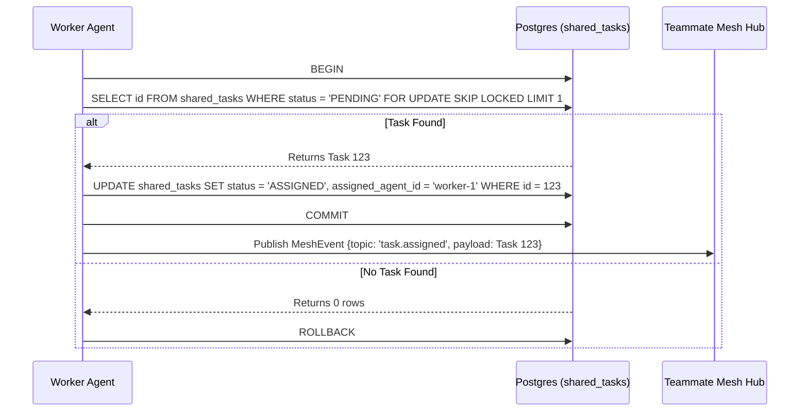

# KAIROS AI OS Architecture

## Overview
This document details the design of the three core KAIROS features: Shared Task List, Teammate Mesh, and AutoDream Memory Consolidation. This outlines the complete architecture for the Swarm OS.

## Phase 1: Shared Task List
**Goal:** Distributed task tracking.
**Design:** Uses Postgres `FOR UPDATE SKIP LOCKED` for Cloud-Native multi-tenancy, and application-level mutexes for local SQLite standalone mode.

## Phase 2: Teammate Mesh APIs
**Goal:** Realtime sub-agent coordination and state broadcasting.
**Design:**
- **Cloud-Native Mode:** Uses `rueidis` Redis Pub/Sub for cross-pod coordination.
- **Standalone Mode:** Uses in-memory Go channels for efficient local coordination.

## Phase 3: AutoDream Memory Consolidation
**Goal:** Summarize episodic execution logs into long-term vector memory.
**Design:** A background daemon `AutoDreamDaemon` processes completed tasks, uses OpenAI embeddings to convert summaries to vectors, and persists to `agent_memories` using `pgvector`.
