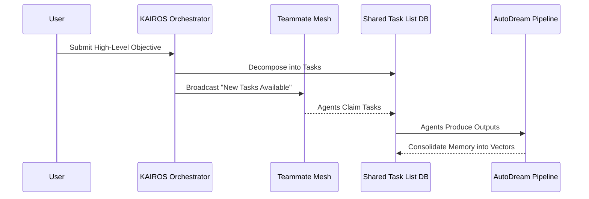

# KAIROS Orchestrator: Hybrid Agentic OS Master Design Document

## 1. Vision
To build the world's most autonomous, aesthetically superior, and market-aware Agentic Operating System. One Human Corp (OHC) empowers a single human to orchestrate a vast swarm of AI agents.

## 2. Architecture Overview (OHC-HA)
### 2.1 Modes of Operation
- **Cloud-Native Mode**: Multi-tenant, Kubernetes orchestrated, utilizing PostgreSQL and Redis.
- **Standalone Desktop Mode**: Local single-user, relying on SQLite and in-memory structures to degrade gracefully.

### 2.2 System Decomposition
We decompose the overarching architecture into three primary pillars (Missions):
1. **Shared Task List**: A unified SQL schema for tracking asynchronous swarm task queues.
2. **Teammate Mesh**: A Redis Pub/Sub (and graceful degraded fallback) layer for realtime lock coordination and inter-agent messages.
3. **AutoDream Pipeline**: A continuous background vectorization job to persist Agent memory into pgvector/SQLite as `[]byte`.

## 3. Interaction Flow

## 4. Aesthetic Mandate
All generated artifacts follow the OHC Premium Feel:
- Glassmorphism, 20px blur, High-Saturate Blurs.
- Outfit/Inter typography.

