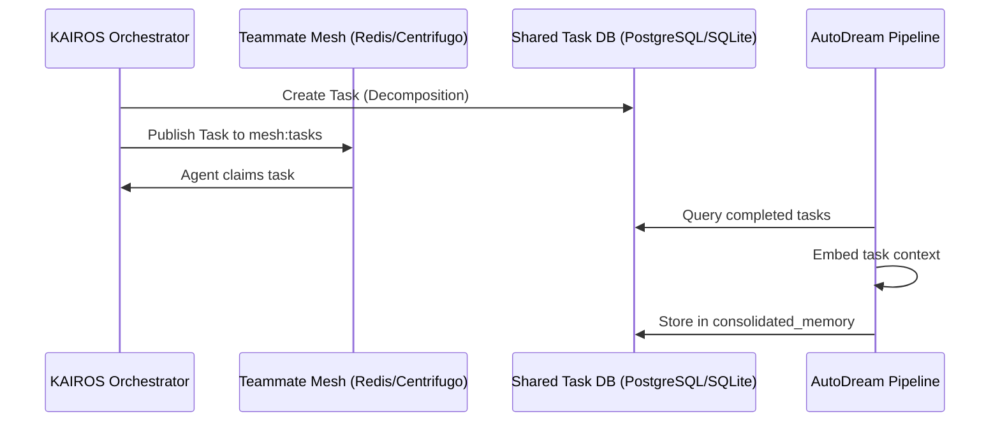

<div markdown="1" style="backdrop-filter: blur(20px) saturate(200%); font-family: 'Outfit', 'Inter', sans-serif; background: rgba(255, 255, 255, 0.03); color: #fff; padding: 20px; border-radius: 12px; border: 1px solid rgba(255, 255, 255, 0.1);">

# KAIROS AI OS Orchestration: Final Master Design Document

**Title**: Architect the KAIROS Orchestration Master Design Doc
**Priority**: P1
**Estimated Scope**: Large

## Problem Statement
The OHC Hybrid Agentic OS requires a comprehensive, master premium Design Document detailing the architectural integration of the Shared Task List, Teammate Mesh, and autoDream pipelines. The current implementations and concepts are fragmented across multiple mission files and code components. To ensure "Aesthetic Excellence" and "Full-Spectrum Observability," a unified, visually premium markdown artifact containing deep technical depth must be generated and committed to the repository for future agent and human consumption.

## Research Report
- Based on OHC-HA architecture, we need a robust coordination and memory system.
- **Shared Task List**: A centralized state machine backed by `shared_tasks` in PostgreSQL (Cloud FOR UPDATE SKIP LOCKED) or SQLite (Standalone mode fallback).
- **Teammate Mesh**: Realtime communication via WebSockets (Centrifugo) and Redis Pub/Sub channels (`mesh:tasks`, `mesh:coordination`).
- **autoDream**: A vector ingestion pipeline for long-term memory consolidation, targeting `consolidated_memory` via pgvector.

## Design Doc

### Phase 1: Shared Task List (State Machine & Decomposition)
We will manage the distributed state machine utilizing a transactional database with fallback support for standalone environments.

**PostgreSQL Schema (Cloud)**
```sql
CREATE TABLE IF NOT EXISTS shared_tasks (
    id UUID PRIMARY KEY DEFAULT gen_random_uuid(),
    title VARCHAR(255) NOT NULL,
    description TEXT,
    status VARCHAR(50) NOT NULL DEFAULT 'PENDING',
    agent_id UUID,
    parent_plan_id TEXT,
    created_at TIMESTAMP WITH TIME ZONE DEFAULT CURRENT_TIMESTAMP,
    updated_at TIMESTAMP WITH TIME ZONE DEFAULT CURRENT_TIMESTAMP
);
```

**SQLite Schema (Standalone)**
```sql
CREATE TABLE IF NOT EXISTS shared_tasks (
    id VARCHAR PRIMARY KEY,
    title VARCHAR NOT NULL,
    description TEXT,
    status VARCHAR NOT NULL DEFAULT 'PENDING',
    agent_id VARCHAR,
    parent_plan_id TEXT,
    created_at TIMESTAMP WITH TIME ZONE DEFAULT CURRENT_TIMESTAMP,
    updated_at TIMESTAMP WITH TIME ZONE DEFAULT CURRENT_TIMESTAMP
);
```

### Phase 2: Teammate Mesh APIs (Orchestration)
Agents will coordinate asynchronously utilizing the Teammate Mesh, exposing REST endpoints that interact with the Pub/Sub backend.

**API Contracts (`srcs/server/dashboard/server.go`)**
- `POST /api/mesh/broadcast`: Broadcasts payloads to `mesh:tasks` or `mesh:coordination`.
- `POST /api/queue/subagent`: Enqueues isolated sub-agents into scalable queues (e.g., BullMQ equivalent).
- `GET /api/mesh/mailbox`: Checks the agent's mailbox for incoming instructions.

**Interfaces**
```go
type TeammateMesh interface {
    Publish(channel string, message []byte) error
    Subscribe(channel string) (<-chan []byte, error)
}
```

### Phase 3: autoDream (Memory Consolidation)
Long-term findings are stored using vector embeddings.

**Database Schema (pgvector)**
```sql
CREATE TABLE IF NOT EXISTS consolidated_memory (
    id UUID PRIMARY KEY,
    embedding vector(1536),
    metadata JSONB,
    created_at TIMESTAMP WITH TIME ZONE DEFAULT CURRENT_TIMESTAMP
);
```

### Phase 4: Master Architecture Sequence


</div>
