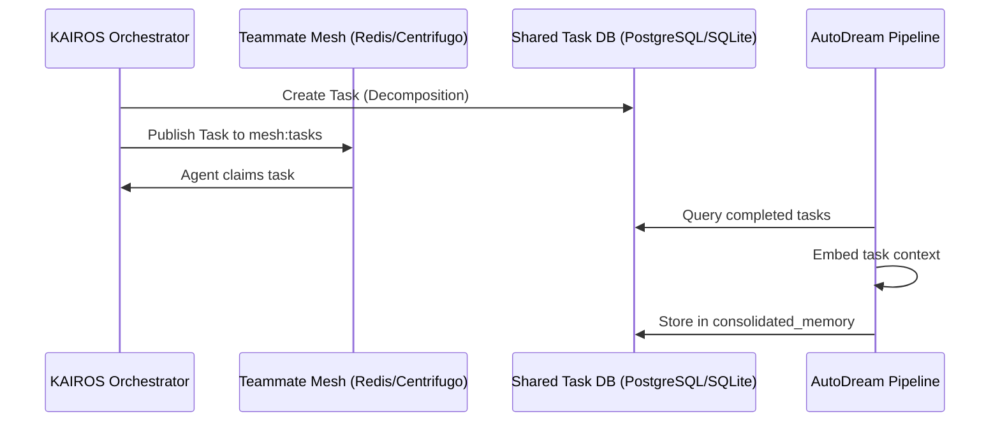

<div markdown="1" style="backdrop-filter: blur(20px) saturate(200%); font-family: 'Outfit', 'Inter', sans-serif; background: rgba(255, 255, 255, 0.03); color: #fff; padding: 20px; border-radius: 12px; border: 1px solid rgba(255, 255, 255, 0.1);">

# KAIROS AI OS Orchestration: Final Master Design Document

## Phase 1: Shared Task List (State Machine & Decomposition)
We will manage the distributed state machine utilizing a transactional database with fallback support for standalone environments.

**PostgreSQL Schema (Cloud)**
```sql
CREATE TABLE IF NOT EXISTS shared_tasks (
    id UUID PRIMARY KEY DEFAULT gen_random_uuid(),
    title VARCHAR(255) NOT NULL,
    description TEXT,
    status VARCHAR(50) NOT NULL DEFAULT 'PENDING',
    agent_id UUID,
    parent_plan_id TEXT,
    created_at TIMESTAMP WITH TIME ZONE DEFAULT CURRENT_TIMESTAMP,
    updated_at TIMESTAMP WITH TIME ZONE DEFAULT CURRENT_TIMESTAMP
);
```

**SQLite Schema (Standalone)**
```sql
CREATE TABLE IF NOT EXISTS shared_tasks (
    id VARCHAR PRIMARY KEY,
    title VARCHAR NOT NULL,
    description TEXT,
    status VARCHAR NOT NULL DEFAULT 'PENDING',
    agent_id VARCHAR,
    parent_plan_id TEXT,
    created_at TIMESTAMP WITH TIME ZONE DEFAULT CURRENT_TIMESTAMP,
    updated_at TIMESTAMP WITH TIME ZONE DEFAULT CURRENT_TIMESTAMP
);
```

## Phase 2: Teammate Mesh APIs (Orchestration)
Agents will coordinate asynchronously utilizing the Teammate Mesh, exposing REST endpoints that interact with the Pub/Sub backend.

**API Contracts (`srcs/server/dashboard/server.go`)**
- `POST /api/mesh/broadcast`: Broadcasts payloads to `mesh:tasks` or `mesh:coordination`.
- `POST /api/queue/subagent`: Enqueues isolated sub-agents into scalable queues (e.g., BullMQ equivalent).
- `GET /api/mesh/mailbox`: Checks the agent's mailbox for incoming instructions.

**Interfaces**
```go
type TeammateMesh interface {
    Publish(channel string, message []byte) error
    Subscribe(channel string) (<-chan []byte, error)
}
```

## Phase 3: autoDream (Memory Consolidation)
Long-term findings are stored using vector embeddings.

**Database Schema (pgvector)**
```sql
CREATE TABLE IF NOT EXISTS consolidated_memory (
    id UUID PRIMARY KEY,
    embedding vector(1536),
    metadata JSONB,
    created_at TIMESTAMP WITH TIME ZONE DEFAULT CURRENT_TIMESTAMP
);
```

## Phase 4: Master Architecture Sequence


</div>
