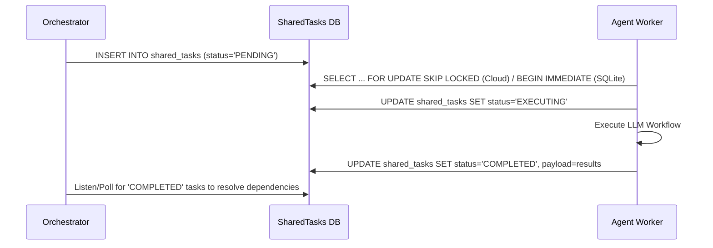
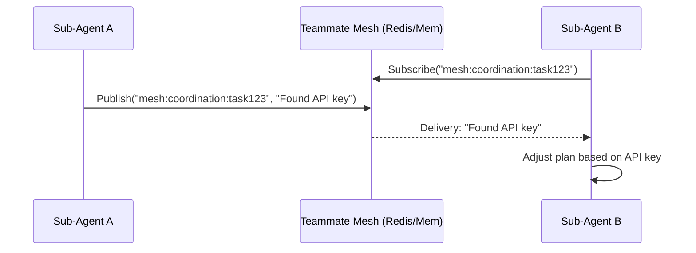
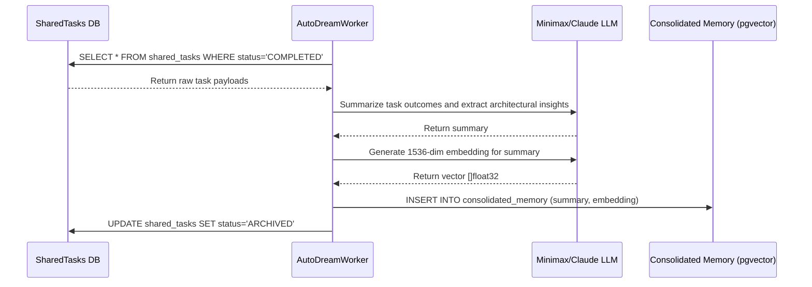

<div markdown="1" style="backdrop-filter: blur(20px) saturate(200%); font-family: 'Outfit', 'Inter', sans-serif; background: rgba(255, 255, 255, 0.03); color: #fff; padding: 20px; border-radius: 12px; border: 1px solid rgba(255, 255, 255, 0.1);">

# KAIROS AI OS IMPLEMENTATION MASTER

This document consolidates the KAIROS Orchestration phases into a unified, deep architectural design for the One Human Corp (OHC) Hybrid Agentic OS.

## Phase 1: Shared Task List Database
Agents orchestrating swarm intelligence require a centralized source of truth. This phase introduces the schema for distributed task state tracking.

### Database Schemas

#### PostgreSQL (Cloud-Native)
The Cloud-Native mode uses PostgreSQL with JSONB columns for payload flexibility and advanced index types.
```sql
CREATE TABLE shared_tasks (
    id UUID PRIMARY KEY DEFAULT gen_random_uuid(),
    organization_id VARCHAR(255) NOT NULL,
    agent_id VARCHAR(255),
    parent_plan_id UUID,
    title VARCHAR(255) NOT NULL,
    status VARCHAR(50) NOT NULL DEFAULT 'PENDING',
    payload JSONB DEFAULT '{}'::jsonb,
    dependencies JSONB DEFAULT '[]'::jsonb,
    created_at TIMESTAMP WITH TIME ZONE DEFAULT CURRENT_TIMESTAMP,
    updated_at TIMESTAMP WITH TIME ZONE DEFAULT CURRENT_TIMESTAMP
);

CREATE INDEX idx_shared_tasks_org_status ON shared_tasks(organization_id, status);
CREATE INDEX idx_shared_tasks_agent ON shared_tasks(agent_id);
```

#### SQLite (Standalone Mode)
The Standalone mode uses SQLite. JSON functions are used for parsing payloads instead of native JSONB.
```sql
CREATE TABLE IF NOT EXISTS shared_tasks (
    id TEXT PRIMARY KEY,
    organization_id TEXT NOT NULL,
    agent_id TEXT,
    parent_plan_id TEXT,
    title TEXT NOT NULL,
    status TEXT NOT NULL DEFAULT 'PENDING',
    payload TEXT DEFAULT '{}',
    dependencies TEXT DEFAULT '[]',
    created_at DATETIME DEFAULT CURRENT_TIMESTAMP,
    updated_at DATETIME DEFAULT CURRENT_TIMESTAMP
);

CREATE INDEX idx_shared_tasks_org_status ON shared_tasks(organization_id, status);
```

### Sequence Diagram: Task Orchestration


## Phase 2: Realtime Teammate Mesh APIs
Feature agents need a reliable, realtime communication layer in production environments for rapid intra-swarm coordination.

### Go API Contracts
```go
package mesh

import "context"

// TeammateMesh provides real-time pub/sub capabilities for swarm coordination.
type TeammateMesh interface {
    // Publish broadcasts a coordination message to a specific channel.
    Publish(ctx context.Context, channel string, message []byte) error

    // Subscribe returns a channel of messages for the specified channel name.
    Subscribe(ctx context.Context, channel string) (<-chan []byte, error)

    // Close terminates the mesh connection gracefully.
    Close() error
}
```

### Architecture Fallbacks
- **Cloud-Native**: Implementation uses `rueidis` to leverage Redis Pub/Sub channels (e.g., `mesh:tasks`, `mesh:coordination`).
- **Standalone**: Implementation uses an in-memory Go channel multiplexer (`sync.Map` of `chan []byte`).

### Sequence Diagram: Teammate Mesh


## Phase 3: autoDream Memory Consolidation Pipeline
To synthesize and consolidate long-term architectural insights from swarm agents, reducing context window sizes in future invocations.

### Pipeline Architecture
The `AutoDreamWorker` runs as a background process. It queries the `shared_tasks` table for 'COMPLETED' tasks, uses an LLM to summarize the payloads, and inserts embeddings.

### Database Schema (pgvector)
```sql
CREATE EXTENSION IF NOT EXISTS vector;

CREATE TABLE consolidated_memory (
    id UUID PRIMARY KEY DEFAULT gen_random_uuid(),
    organization_id VARCHAR(255) NOT NULL,
    task_id UUID REFERENCES shared_tasks(id),
    summary TEXT NOT NULL,
    embedding vector(1536),
    metadata JSONB DEFAULT '{}'::jsonb,
    created_at TIMESTAMP WITH TIME ZONE DEFAULT CURRENT_TIMESTAMP
);

-- HNSW Index for rapid approximate nearest neighbor search
CREATE INDEX idx_consolidated_memory_embedding ON consolidated_memory USING hnsw (embedding vector_cosine_ops);
```

### Sequence Diagram: autoDream Pipeline


</div>
