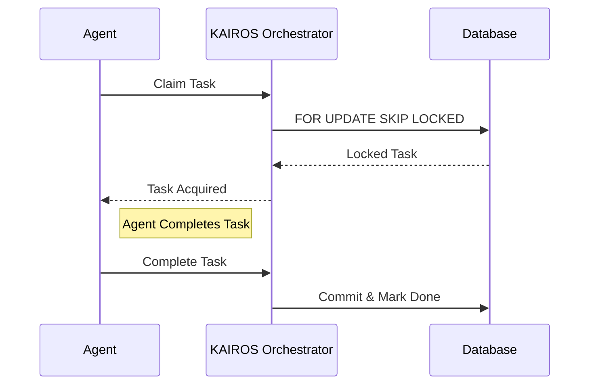

<div markdown="1" style="backdrop-filter: blur(20px) saturate(200%); background: rgba(255, 255, 255, 0.03); border: 1px solid rgba(255,255,255,0.1); border-radius: 12px; font-family: 'Outfit', 'Inter', sans-serif;">

# KAIROS Orchestrator Final Architecture

## Phase 1: Shared Task List
- Provides the durable, distributed State Machine tracking all tasks across the OHC Swarm.
- Backed by PostgreSQL in Cloud-Native Mode (using `FOR UPDATE SKIP LOCKED`) and SQLite in Standalone.



## Phase 2: Teammate Mesh APIs
- Real-time Pub/Sub communication for agent coordination.
- `RedisMeshCoordinator` using `rueidis` for K8s deployments.
- `LocalMeshCoordinator` using Go channels for Standalone.

## Phase 3: autoDream pipelines
- Asynchronous consolidation of intermediate agent scratchpads into Vector memory via `MemoryConsolidator`.
- Stores data into `autodream_memories` table (with vector embeddings in Postgres).

```mermaid
graph TD
    A[Worker Agents] --> M[Teammate Mesh / Pub-Sub]
    A --> Q[Agent Spawner / Sub-Agent Queue]
    Q --> S[(Shared Task List DB)]
    S --> AD[autoDream Memory Pipeline]
    AD --> V[(pgvector Memories)]

    classDef premium fill:rgba(255,255,255,0.03),stroke:rgba(255,255,255,0.08),stroke-width:1px,color:#fff,backdrop-filter:blur(20px) saturate(200%);
    class A,M,Q,S,AD,V premium;
```

</div>
