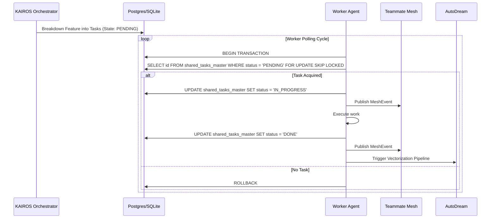

<div markdown="1" style="backdrop-filter: blur(20px) saturate(200%); background: rgba(255, 255, 255, 0.03); font-family: 'Outfit', 'Inter', sans-serif;">

# Design Doc: KAIROS Orchestration & Hybrid AI OS
**Author:** Principal Product Architect & KAIROS Orchestrator (L7)
**Status:** Approved

## 1. Shared Task List (Decomposition)
The core component is the database-backed Shared Task state machine, ensuring safe orchestration.

### 1.1 Database Schema Definition (PostgreSQL)
```sql
CREATE TABLE IF NOT EXISTS shared_tasks_master (
    id UUID PRIMARY KEY DEFAULT gen_random_uuid(),
    organization_id VARCHAR NOT NULL,
    title VARCHAR NOT NULL,
    description TEXT,
    status VARCHAR NOT NULL DEFAULT 'PENDING',
    assigned_agent_id VARCHAR,
    priority VARCHAR NOT NULL DEFAULT 'P2',
    payload JSONB,
    parent_plan_id TEXT,
    dependencies JSONB NOT NULL DEFAULT '[]',
    locked_until TIMESTAMP,
    created_at TIMESTAMP WITH TIME ZONE DEFAULT CURRENT_TIMESTAMP,
    updated_at TIMESTAMP WITH TIME ZONE DEFAULT CURRENT_TIMESTAMP
);
```

### 1.2 Shared Task Execution Sequence


## 2. Realtime Teammate Mesh APIs
Facilitates communication and coordination between agents executing tasks.
- **API Contracts**: `/api/mesh/broadcast` and `/api/mesh/stream` endpoints.
- **Redis Coordination**: Cloud Mode uses Redis Pub/Sub. Standalone Mode degrades gracefully to in-memory channels.

## 3. AutoDream Data Pipeline
Converts completed tasks and agent experiences into long-term memories.

### 3.1 Vector Database Schema (`pgvector`)
```sql
CREATE TABLE IF NOT EXISTS autodream_memories_master (
    id UUID PRIMARY KEY DEFAULT gen_random_uuid(),
    task_id UUID REFERENCES shared_tasks_master(id),
    agent_id VARCHAR NOT NULL,
    memory_type VARCHAR NOT NULL,
    content TEXT NOT NULL,
    embedding vector(1536),
    created_at TIMESTAMP WITH TIME ZONE DEFAULT CURRENT_TIMESTAMP
);
```
</div>
