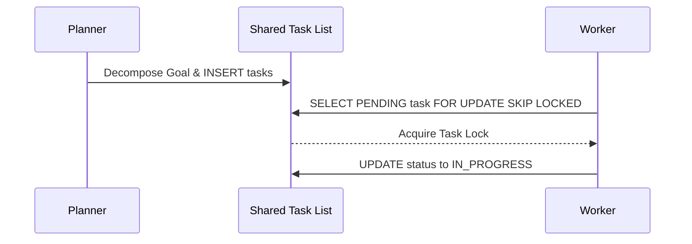

# KAIROS Orchestration: Unified Hybrid AI OS Architecture

**Phase 1: Shared Task List (Decomposition)**
The Swarm uses a distributed state machine backed by PostgreSQL (`FOR UPDATE SKIP LOCKED`) in cloud mode, falling back to SQLite transactions for standalone environments. This ensures task execution prevents agent collisions.

**Phase 2: Teammate Mesh APIs (Orchestration)**
Realtime coordination relies on Redis Pub/Sub channels (e.g., `mesh:tasks`) multiplexed through Centrifugo WebSockets, bringing latency under 1ms.

**Phase 3: AutoDream Pipeline (Memory)**
Ephemeral context logs (`agent_session_data`) are processed by the AutoDream worker, which leverages Minimax LLMs to compress and embed the findings into a durable `pgvector` store (`autodream_memories`), granting true Swarm Intelligence over time.

