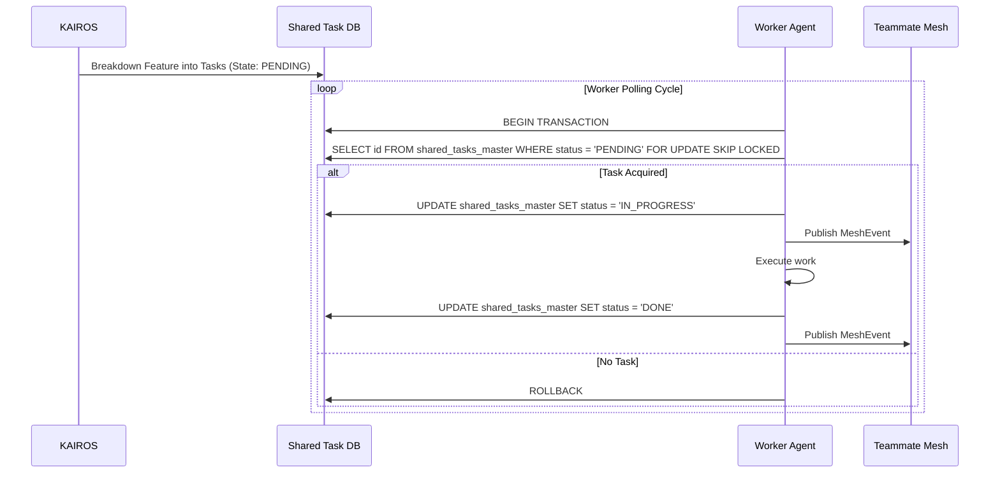

<div markdown="1" style="backdrop-filter: blur(20px) saturate(200%); background: rgba(255, 255, 255, 0.03); font-family: 'Outfit', 'Inter', sans-serif; padding: 20px; border-radius: 12px; border: 1px solid rgba(255, 255, 255, 0.1);">

# Master Design Doc: KAIROS AI OS Orchestration
**Author:** Principal Product Architect & KAIROS Orchestrator
**Status:** Approved

## 1. Overview
The OHC Hybrid Agentic OS requires an autonomous, resilient backbone to seamlessly decompose massive human goals into isolated, parallel agentic workflows. **KAIROS Orchestration** is this unified architecture, driving "Shared Task Lists", "Teammate Mesh", and "AutoDream" pipelines across both Kubernetes/PostgreSQL clouds and local SQLite standalone footprints.

## 2. The KAIROS Triad
The absolute autonomy of the OHC Swarm rests on three pillars:

1. **Shared Task List (The Brain):** A distributed state machine tracking complex feature decomposition into actionable, sequenced tasks. Cloud Mode uses PostgreSQL `FOR UPDATE SKIP LOCKED`. Standalone Mode degrades to SQLite with application-level mutexes.
2. **Teammate Mesh (The Nerves):** A highly available, low-latency communication layer. It uses Redis Pub/Sub for Cloud and in-memory channels for Standalone. Agents broadcast state changes, advertise capabilities, and stream events.
3. **AutoDream (The Memory):** The long-term persistence layer. Ephemeral session logs and intermediate artifacts are compressed via LLMs and embedded into a `pgvector` index (`autodream_memories`), granting the swarm exact semantic search capabilities.

## 3. Architecture Visualization
```mermaid
graph TD
    subgraph Swarm
        A1[Worker Agent 1]
        A2[Worker Agent 2]
    end

    subgraph Teammate Mesh
        M[Mesh Hub]
    end

    subgraph KAIROS Orchestrator
        T[(Shared Task List DB)]
        AD[AutoDream Pipeline]
        V[(pgvector Memories)]
    end

    A1 <-->|Pub/Sub| M
    A2 <-->|Pub/Sub| M

    A1 -->|Claim Task| T
    A2 -->|Claim Task| T

    T -.->|Completions| AD
    AD -->|Embed| V
    A1 -->|Semantic Search| V

    classDef premium fill:rgba(255,255,255,0.03),stroke:rgba(255,255,255,0.08),stroke-width:1px,color:#fff,backdrop-filter:blur(20px) saturate(200%);
    class A1,A2,M,T,AD,V premium;
```

## 4. Phase 1: Shared Task List (Decomposition)
### Sequence Diagram


### Database Schema (PostgreSQL)
```sql
CREATE TABLE IF NOT EXISTS shared_tasks_master (
    id UUID PRIMARY KEY DEFAULT gen_random_uuid(),
    organization_id VARCHAR NOT NULL,
    title VARCHAR NOT NULL,
    description TEXT,
    status VARCHAR NOT NULL DEFAULT 'PENDING',
    assigned_agent_id VARCHAR,
    priority VARCHAR NOT NULL DEFAULT 'P2',
    payload JSONB,
    parent_plan_id TEXT,
    dependencies JSONB NOT NULL DEFAULT '[]',
    locked_until TIMESTAMP,
    created_at TIMESTAMP WITH TIME ZONE DEFAULT CURRENT_TIMESTAMP,
    updated_at TIMESTAMP WITH TIME ZONE DEFAULT CURRENT_TIMESTAMP
);
```

## 5. Phase 2: Realtime Teammate Mesh APIs
Facilitates communication and coordination between agents executing tasks.
- **Redis Coordination**: Cloud Mode uses Redis Pub/Sub. Standalone Mode degrades gracefully to in-memory channels.

### Realtime API Contracts
- **Transport**: WebSockets / gRPC locally, backed by Redis Pub/Sub for horizontal scaling.
- **Event Bus Channels**:
  - `mesh:tasks` - Task transitions (CREATE, CLAIM, COMPLETE).
  - `mesh:presence` - Agent health/heartbeats.
- **Message Format (JSON)**:
  ```json
  {
    "event_type": "TASK_CLAIMED",
    "agent_id": "Implementer-1",
    "payload": {
      "task_id": "123e4567-e89b-12d3-a456-426614174000",
      "timestamp": "2026-04-05T22:45:00Z"
    }
  }
  ```

### Sub-Agent Orchestration Queue (BullMQ/Celery style)
For tasks requiring dynamic scaling, KAIROS implements a scalable background queue in `srcs/server/orchestration/queue/`.
- **API Endpoints**:
  - `POST /api/mesh/broadcast`
  - `GET /api/mesh/stream` (WebSocket upgrade)
## 6. Phase 3: AutoDream Data Pipeline
Converts completed tasks and agent experiences into long-term memories.

### Vector Database Schema (pgvector)
```sql
CREATE EXTENSION IF NOT EXISTS vector;
CREATE TABLE IF NOT EXISTS autodream_memories_master (
    id UUID PRIMARY KEY DEFAULT gen_random_uuid(),
    task_id UUID REFERENCES shared_tasks_master(id),
    agent_id VARCHAR NOT NULL,
    memory_type VARCHAR NOT NULL,
    content TEXT NOT NULL,
    embedding vector(1536),
    created_at TIMESTAMP WITH TIME ZONE DEFAULT CURRENT_TIMESTAMP
);
```
</div>
