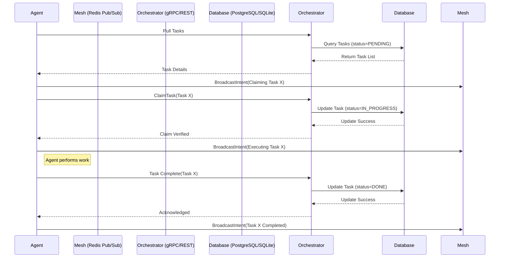

# KAIROS Orchestrator: Hybrid Agentic OS Architecture

## The Swarm Intelligence Vision
One Human Corp (OHC) empowers a single human to orchestrate a vast swarm of AI agents. The KAIROS Hybrid Architecture ensures a frictionless and beautiful experience.

## Phase 1: Shared Task List (UltraPlan Deliberation)
- **Database Schema**: A distributed PostgreSQL (or local SQLite in Standalone Mode) state machine table.
- **Microservices**: A set of internal REST/gRPC endpoints ensuring agents can autonomously pull tasks and lock them with distributed Redis locks.
- **Visual Mandate**: The shared task UI must apply the OHC-SIP Visual Excellence Mandate.

## Phase 2: Realtime Teammate Mesh APIs (Orchestration)
- **Coordination Layer**: Implement Redis Pub/Sub channels for realtime teammate synchronization.
- **Mailbox Protocol**: Agents post their coordination sessions and intentions to other agents through dedicated production Redis Pub/Sub channels.

## Phase 3: AutoDream Data Pipelines
- **Vector Intelligence**: Utilize pgvector to consolidate long-term memory for all agents.
- **Consolidation Pipeline**: Periodic background cron tasks that synthesize past missions and output findings into Vector DB, ensuring OHC evolves over time.

## Sequence Diagram: Shared Task List (Phase 1)

