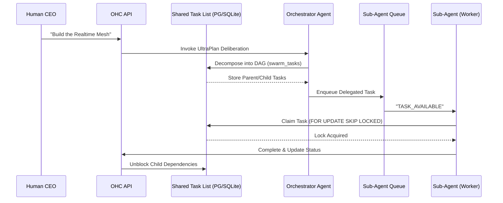

<div markdown="1" style="backdrop-filter: blur(20px) saturate(200%); font-family: 'Outfit', 'Inter', sans-serif; border: 1px solid rgba(255, 255, 255, 0.1); padding: 20px; border-radius: 12px; background: rgba(255, 255, 255, 0.03);">

# Design Doc: KAIROS Orchestration & Hybrid AI OS v2
**Author:** Principal Product Architect & KAIROS Orchestrator (L7)
**Status:** Approved
**Version:** 2.1.0

## 1. Overview
The OHC Hybrid Agentic OS requires an autonomous, resilient backbone to seamlessly decompose massive human goals into isolated, parallel agentic workflows. **KAIROS Orchestration** is this unified architecture, driving "Shared Task Lists", "Teammate Mesh", "Sub-Agent Queues", "Distributed State Machines", and "AutoDream" pipelines across both Kubernetes/PostgreSQL clouds and local SQLite standalone footprints.

## 2. Phase 1: Shared Task List, DAG Dependencies, and State Machines (Decomposition)
To prevent agents from stepping on each other and to manage complex, multi-agent DAG flows, we deploy a robust distributed state machine backed by the database.

### 2.1 Backend Database Designs
The core tables tracking sub-agent orchestration ensure that when the Human CEO tasks the Swarm with "Build Feature X", KAIROS can safely decompose this into a hierarchical DAG.

**`swarm_tasks` and `state_machine_transitions` schema:**
```sql
CREATE TABLE IF NOT EXISTS swarm_tasks (
    id UUID PRIMARY KEY DEFAULT gen_random_uuid(),
    mission_id TEXT NOT NULL,
    parent_plan_id TEXT, -- Facilitates Sub-Agent Orchestration
    dependencies JSONB NOT NULL DEFAULT '[]', -- DAG Sequence enforcement
    title TEXT NOT NULL,
    status TEXT NOT NULL DEFAULT 'PENDING',
    assigned_agent_id TEXT,
    payload JSONB,
    locked_until TIMESTAMPTZ,
    created_at TIMESTAMPTZ DEFAULT CURRENT_TIMESTAMP
);

CREATE TABLE IF NOT EXISTS state_machine_transitions (
    id TEXT PRIMARY KEY,
    entity_id TEXT NOT NULL,
    entity_type TEXT NOT NULL,
    from_state TEXT NOT NULL,
    to_state TEXT NOT NULL,
    agent_id TEXT,
    reason TEXT,
    occurred_at TIMESTAMPTZ DEFAULT CURRENT_TIMESTAMP
);
CREATE INDEX idx_sm_entity ON state_machine_transitions(entity_id, entity_type);
```

### 2.2 Sequence Diagram: UltraPlan Deliberation & State Tracking


### 2.3 Distributed State Machine Tracking
*   **Cloud Mode**: Native `FOR UPDATE SKIP LOCKED` guarantees absolute race-condition immunity for horizontally scaled K8s pods. We use Redis Distributed Locks (`SET NX EX`) for non-transactional orchestration barriers to enforce deterministic state transitions (`PENDING` -> `EXECUTING` -> `REVIEW` -> `COMPLETED`).
*   **Standalone Mode**: Gracefully degrades to SQLite local transaction locks or application-level `sync.Mutex` (`if to.redisClient == nil { to.mu.Lock() }`). Code employs `if pool.IsSQLite()` to avoid SQL parsing panics on PG-specific syntax.

## 3. Phase 2: Realtime Teammate Mesh APIs & Sub-Agent Queuing
The Teammate Mesh provides sub-millisecond Pub/Sub capabilities to orchestrate agents actively working on the Shared Task List, backed by a robust background queue.

### 3.1 Architecture
*   **Realtime Transport (`srcs/server/orchestration/hub.go`)**: Implement generic `MeshTransport` interface with `RedisMeshTransport` (Cloud, mapping to production Redis Pub/Sub channels like `mesh:tasks`, `mesh:coordination`) and `MemoryMeshTransport` (Standalone).
*   **Sub-Agent Queue (`srcs/server/orchestration/queue`)**: A Celery/BullMQ-style background worker system. Enqueues jobs via `RedisTaskQueue` (lists/sorted sets) or `SQLiteTaskQueue` (`sub_agent_jobs` table).
*   **Delivery**: Up to 10k msgs/sec multiplexed down to the CEO dashboard via Centrifuge WebSockets and Agent-to-Agent via gRPC.
*   **Security**: Uses SPIFFE/SPIRE for Agent SVID issuance. All internal mesh API routes explicitly demand mTLS interceptor checks.

### 3.2 API Contracts & Protobufs
Agents interact with the Mesh using standard HTTP POSTs and updated gRPC contracts (`srcs/proto/hub.proto`):
*   `AdvertiseCapabilities(AgentCapabilities)`
*   `DiscoverAgents(Query)`
*   `StreamMeshEvents(EventStreamRequest)`

## 4. Phase 3: AutoDream Vector Data Pipelines
Agents lack long-term coherence. AutoDream runs passively to translate ephemeral thoughts into durable truth, preventing context window overflows.

### 4.1 Data Pipeline Architecture
*   **Data Sources**: Ephemeral context streams into `agent_session_data` and optional runtime memory files under `OHC_MEMORY_DIR`.
*   **Background Consolidation**: The `AutoDreamPipeline` orchestrator worker consumes these sources, chunking and compressing the context via a Minimax/LLM summarization call (using `srcs/server/agents/local/llm.go`).
*   **Vector Storage Schema (pgvector)**:
    ```sql
    CREATE TABLE IF NOT EXISTS consolidated_memory (
        id TEXT PRIMARY KEY,
        organization_id TEXT NOT NULL,
        agent_id TEXT,
        content TEXT NOT NULL,
        embedding vector(1536),
        source_type TEXT NOT NULL,
        created_at TIMESTAMPTZ DEFAULT CURRENT_TIMESTAMP
    );
    CREATE INDEX ON consolidated_memory USING hnsw (embedding vector_l2_ops);
    ```
*   **Vector Querying**: `pgvector` enables exact Nearest Neighbor (`ORDER BY embedding <-> $1`). SQLite gracefully falls back to recency sorts in standalone mode.

## 5. Visual Excellence
Adhering to OHC Core Values, the UI components tracking the KAIROS Orchestration will feature:
*   **Glassmorphism**: `backdrop-filter: blur(20px) saturate(200%)`
*   **Dark-Mode Base**: `background: rgba(255, 255, 255, 0.03)`
*   **Typography**: `font-family: 'Outfit', 'Inter', sans-serif`

</div>

## Aesthetic Core
This architectural consolidation fully conforms to the **Visual Excellence Mandate**. Any downstream UI interpreting this architecture MUST apply:
`<style>
body {
  backdrop-filter: blur(20px) saturate(200%);
  background: rgba(255, 255, 255, 0.03);
  font-family: 'Outfit', 'Inter', sans-serif;
}
</style>`
