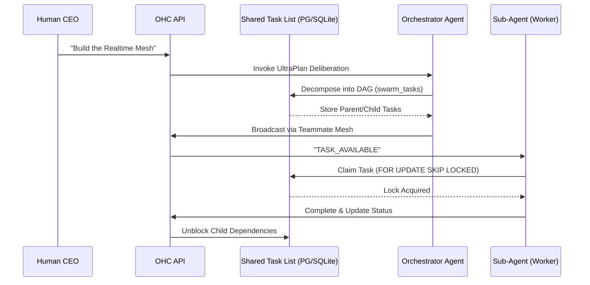

<div markdown="1" style="backdrop-filter: blur(20px) saturate(200%); font-family: 'Outfit', 'Inter', sans-serif; border: 1px solid rgba(255, 255, 255, 0.1); padding: 20px; border-radius: 12px; background: rgba(255, 255, 255, 0.03);">

# Design Doc: KAIROS Orchestration & Hybrid AI OS
**Author:** Principal Product Architect & KAIROS Orchestrator (L7)
**Status:** Approved
**Version:** 2.0.0

## 1. Overview
The OHC Hybrid Agentic OS requires an autonomous, resilient backbone to seamlessly decompose massive human goals into isolated, parallel agentic workflows. **KAIROS Orchestration** is this unified architecture, driving "Shared Task Lists", "Teammate Mesh", and "AutoDream" pipelines across both Kubernetes/PostgreSQL clouds and local SQLite standalone footprints.

## 2. Phase 1: Shared Task List & Sub-Agent Orchestration (Decomposition)
To prevent agents from stepping on each other and to manage DAG-based dependency flows, we deploy a robust distributed state machine backed by the database.

### 2.1 Backend Database Designs
The core tables tracking sub-agent orchestration ensure that when the Human CEO tasks the Swarm with "Build Feature X", KAIROS can safely decompose this into a hierarchical DAG.

**`swarm_tasks` schema:**
```sql
CREATE TABLE IF NOT EXISTS swarm_tasks (
    id UUID PRIMARY KEY DEFAULT gen_random_uuid(),
    mission_id TEXT NOT NULL,
    parent_plan_id TEXT, -- Facilitates Sub-Agent Orchestration
    dependencies JSONB NOT NULL DEFAULT '[]', -- DAG Sequence enforcement
    title TEXT NOT NULL,
    status TEXT NOT NULL DEFAULT 'PENDING',
    assigned_agent_id TEXT,
    payload JSONB,
    locked_until TIMESTAMPTZ,
    created_at TIMESTAMPTZ DEFAULT CURRENT_TIMESTAMP
);
```

### 2.2 Sequence Diagram: UltraPlan Deliberation & State Tracking


### 2.3 State Machine Tracking
*   **Cloud Mode**: Native `FOR UPDATE SKIP LOCKED` guarantees absolute race-condition immunity for horizontally scaled K8s pods. We use Redis Distributed Locks for non-transactional orchestration barriers.
*   **Standalone Mode**: Gracefully degrades to SQLite local transaction locks. Code employs `if pool.IsSQLite()` to avoid SQL parsing panics on PG-specific syntax.

## 3. Phase 2: Realtime Teammate Mesh APIs
The Teammate Mesh provides sub-millisecond Pub/Sub capabilities to orchestrate agents actively working on the Shared Task List.

### 3.1 Architecture
*   **Transport**: Production Redis Pub/Sub channels (`mesh:tasks`, `mesh:coordination`).
*   **Delivery**: Up to 10k msgs/sec multiplexed down to the CEO dashboard via Centrifuge WebSockets.
*   **Security (Zero Secrets)**: Uses SPIFFE/SPIRE for Agent SVID issuance. All internal mesh API routes explicitly demand mTLS interceptor checks.

### 3.2 API Contracts
Agents interact with the Mesh using standard HTTP POSTs:
*   `POST /api/mesh/broadcast`
*   `POST /api/mesh/direct`
*   `GET /api/mesh/mailbox`

## 4. Phase 3: AutoDream Vector Pipelines
Agents lack long-term coherence. AutoDream runs passively to translate ephemeral thoughts into durable truth.

### 4.1 Data Pipeline Architecture
*   **Ephemeral Capture**: Agent outputs stream into `.agent-task/memory/{timestamp}.yml`
*   **Background Consolidation**: The `AutoDreamWorker` consumes these files, compressing the context via a Minimax/LLM summarization call.
*   **Durable State**: The compressed Base64 string is wrapped in a JSON payload and vectorized into the `autodream_memories` table.
*   **Vector Querying**: `pgvector` enables exact Nearest Neighbor (`ORDER BY embedding <-> $1`). SQLite gracefully falls back to recency sorts.

## 5. Visual Excellence
Adhering to OHC Core Values, the UI components tracking the KAIROS Orchestration will feature:
*   **Glassmorphism**: `backdrop-filter: blur(20px) saturate(200%)`
*   **Dark-Mode Base**: `background: rgba(255, 255, 255, 0.03)`
*   **Typography**: `font-family: 'Outfit', 'Inter', sans-serif`

</div>
