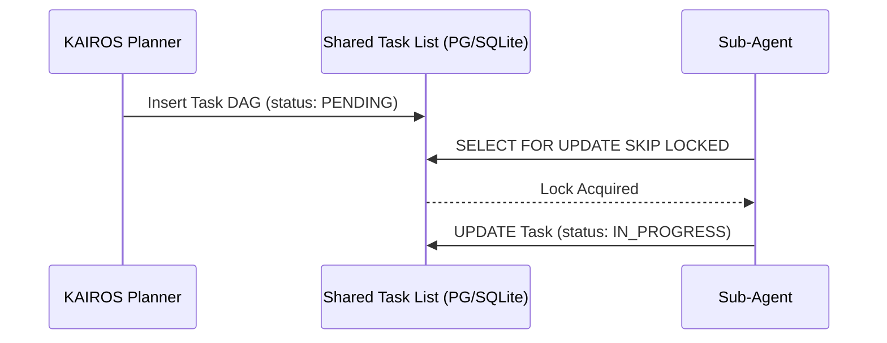

# KAIROS Orchestrator: Implementation Design

## 1. Vision & Architecture Summary
This premium design document establishes the implementation blueprint for the KAIROS Hybrid AI OS Orchestration layer, enabling the OHC Swarm to execute tasks autonomously via a distributed architecture.

## 2. Phase 1: Shared Task List (Decomposition)
To avoid race conditions and safely distribute human goals across the Swarm, the **Shared Task List** leverages a distributed State Machine.

### Database Designs
- **PostgreSQL (Cloud-Native):** Uses `swarm_tasks` and `state_machine_transitions` tables. Employs `FOR UPDATE SKIP LOCKED` for task claiming.
- **SQLite (Standalone):** Uses local transaction locks or application-level `sync.Mutex` (`if pool.IsSQLite()`).

### Sequence Diagram

## 3. Phase 2: Orchestration (Realtime Teammate Mesh APIs)
The **Teammate Mesh** provides realtime Pub/Sub messaging.
- **Components:** `srcs/server/orchestration/hub.go` containing `MeshTransport`.
- **Implementations:** `RedisMeshTransport` (Cloud, mapping to `mesh:tasks`, `mesh:coordination`) and `MemoryMeshTransport` (Standalone).
- **APIs:** gRPC endpoints for `AdvertiseCapabilities(AgentCapabilities)`, `DiscoverAgents(Query)`, and `StreamMeshEvents(EventStreamRequest)` with SPIFFE/SPIRE authentication.

## 4. Phase 3: autoDream Data Pipelines (Memory Consolidation)
The **AutoDream** pipeline ensures Swarm Intelligence is durably preserved.
- **Source:** Ephemeral `.agent-task/memory/` YAML logs.
- **Pipeline:** `AutoDreamPipeline` orchestrator summarizes contexts using `srcs/server/agents/local/llm.go` (Minimax LLM).
- **Storage:** Vectorized into the `consolidated_memory` table using `pgvector(1536)` for semantic recall (`ORDER BY embedding <-> $1`).

