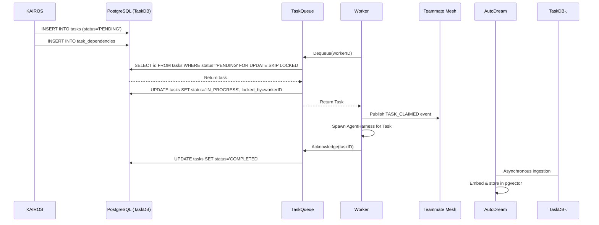

# KAIROS Orchestration: Shared Task List and Agent Queue Design

## Aesthetic Core
This architectural design conforms to the **Visual Excellence Mandate**. Downstream UI must apply:
```html
<style>
body {
  backdrop-filter: blur(20px) saturate(200%);
  background: rgba(255, 255, 255, 0.03);
  font-family: 'Outfit', 'Inter', sans-serif;
}
</style>
```

## Introduction
The OHC Swarm requires a comprehensive system to decompose features, orchestrate sub-agents, and track dependencies across Cloud-Native and Standalone execution modes. This design unifies the Database Schema (Phase 1), Teammate Mesh APIs (Phase 2), AutoDream Pipelines (Phase 3), and Orchestration Queue (Phase 4).

## Phase 1: Database Schema (Shared Task List)
The foundation is a durable, distributed state machine in PostgreSQL, gracefully falling back to SQLite.

### Schema Definition
```sql
CREATE TABLE tasks (
    id UUID PRIMARY KEY DEFAULT gen_random_uuid(),
    epic_id VARCHAR NOT NULL,
    title VARCHAR NOT NULL,
    status VARCHAR NOT NULL DEFAULT 'PENDING',
    payload JSONB,
    created_at TIMESTAMP WITH TIME ZONE DEFAULT CURRENT_TIMESTAMP,
    updated_at TIMESTAMP WITH TIME ZONE DEFAULT CURRENT_TIMESTAMP,
    locked_by UUID,
    locked_at TIMESTAMP WITH TIME ZONE
);

CREATE TABLE task_dependencies (
    task_id UUID NOT NULL REFERENCES tasks(id) ON DELETE CASCADE,
    depends_on_task_id UUID NOT NULL REFERENCES tasks(id) ON DELETE CASCADE,
    PRIMARY KEY (task_id, depends_on_task_id)
);
```

## Phase 2: Orchestration (Teammate Mesh Architecture)
Realtime communication between agents is critical for the "Zero Friction" swarm experience.

### Realtime API Contracts
- **Transport**: WebSockets / gRPC locally, backed by Redis Pub/Sub for horizontal scaling in Cloud-Native Mode.
- **Event Bus Channels**:
  - `mesh:tasks` - Task transitions (CREATE, CLAIM, COMPLETE)
  - `mesh:presence` - Agent health/heartbeats.
- **Message Format (JSON)**:
  ```json
  {
    "event_type": "TASK_CLAIMED",
    "agent_id": "Worker-1",
    "payload": {
      "task_id": "123e4567-e89b-12d3-a456-426614174000",
      "timestamp": "2026-04-05T22:45:00Z"
    }
  }
  ```

## Phase 3: autoDream (Memory Consolidation Pipeline)
The long-term memory system. Agents document their findings locally, and the autoDream background pipeline asynchronously vectorizes these findings into a durable pgvector store.

### Data Pipeline Architecture
1. **Source**: Local runtime memory YAML files from `OHC_MEMORY_DIR`.
2. **Ingestion Agent**: Reads files, generates chunked text.
3. **Embedding Generation**: Calls LLM provider (e.g., Anthropic/OpenAI/Minimax) to produce vectors.
4. **Storage (pgvector)**:
```sql
CREATE EXTENSION IF NOT EXISTS vector;
CREATE TABLE autodream_memories (
    id UUID PRIMARY KEY DEFAULT gen_random_uuid(),
    topic TEXT NOT NULL,
    content TEXT NOT NULL,
    embedding vector(1536),
    created_at TIMESTAMP WITH TIME ZONE DEFAULT CURRENT_TIMESTAMP
);
```

## Phase 4: Queue Architecture and Sub-Agent Orchestration
A `TaskQueue` interface will abstract the underlying DB queries, using `FOR UPDATE SKIP LOCKED` for horizontal pod concurrency.

### Task Queue Interface
```go
type TaskQueue interface {
    Enqueue(ctx context.Context, task *Task) error
    Dequeue(ctx context.Context, workerID uuid.UUID) (*Task, error)
    Acknowledge(ctx context.Context, taskID uuid.UUID) error
}
```

### Worker Pool Design
The orchestrator manages a `WorkerPool` of goroutines. Each worker polls the `TaskQueue`. Upon receiving a task, it spawns an `AgentHarness` to execute the work in a standalone sandbox.

### Sequence Diagram

