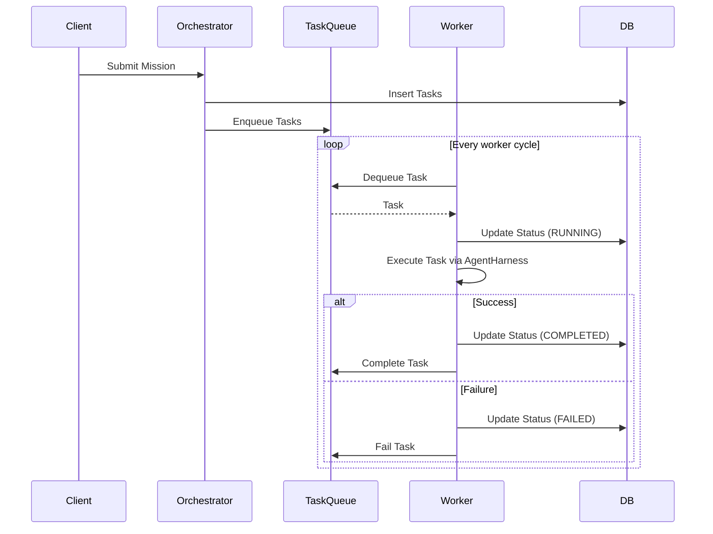

# Universal Shared Task List and Sub-Agent Queue Design Doc

## Introduction
This document serves as the architectural blueprint for Phase 1 and Phase 4 of the KAIROS migration, detailing the implementation strategy for the Universal Shared Task List and Sub-Agent Queue. Integrating these phases reduces ambiguity and ensures seamless integration between data persistence and worker execution.

## Database Schema
The database schema involves two primary tables: `tasks` and `task_dependencies`, designed for PostgreSQL/SQLite compatibility.

### `tasks`
- `id`: UUID (Primary Key)
- `mission_id`: UUID (Foreign Key)
- `status`: Enum (PENDING, RUNNING, COMPLETED, FAILED)
- `payload`: JSONB (Task details)
- `created_at`: Timestamp
- `updated_at`: Timestamp

### `task_dependencies`
- `task_id`: UUID (Foreign Key)
- `depends_on_task_id`: UUID (Foreign Key)

## Queue Architecture
The `TaskQueue` interface will be DB-backed to ensure persistence across restarts.

```go
type TaskQueue interface {
	Enqueue(ctx context.Context, task *Task) error
	Dequeue(ctx context.Context) (*Task, error)
	Complete(ctx context.Context, taskID string) error
	Fail(ctx context.Context, taskID string, reason error) error
}
```

## Worker Pool Design
The orchestrator manages worker goroutines, each responsible for dequeuing tasks and spawning `AgentHarness` instances to execute them. The pool scales dynamically based on load and available resources.

## State Machine & Locking
Distributed locking via Redis (or local equivalent in Standalone Mode) prevents double-execution. Tasks transition through states: PENDING -> RUNNING -> COMPLETED/FAILED.

## Sequence Diagrams

