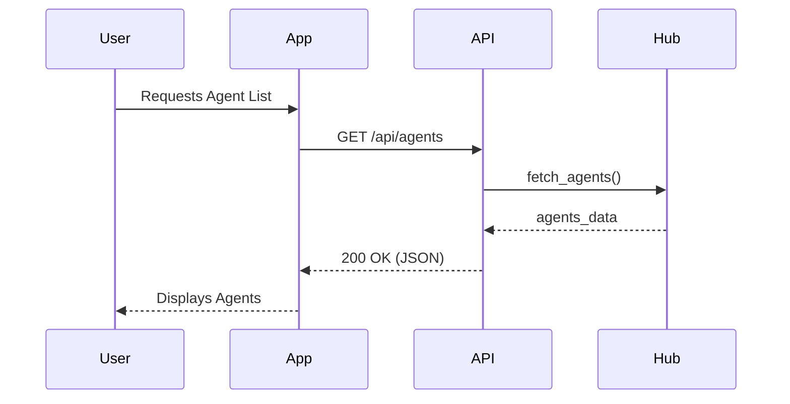

# Interactive API Docs

<div markdown="1" style="backdrop-filter: blur(20px); background: rgba(255,255,255,0.1); border-radius: 12px; padding: 20px; font-family: 'Inter', sans-serif;">
## Welcome to the OHC Interactive API Docs

These premium documentation pages illustrate how developers can interface with the Cloud, Standalone, and Thin Client APIs within the One Human Corp ecosystem.
</div>

## Endpoints

### 1. Agents
```http
GET /api/agents
```
Returns a list of all configured agents within the OHC swarm.

### 2. Capabilities
```http
POST /api/capabilities
```
Registers a new capability to the central mesh.

## Example Flow

