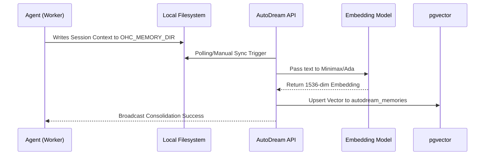

<div markdown="1" style="backdrop-filter: blur(20px) saturate(200%); font-family: 'Outfit', 'Inter', sans-serif; border: 1px solid rgba(255, 255, 255, 0.1); padding: 20px; border-radius: 12px; background: rgba(255, 255, 255, 0.05); color: #fff;">

# KAIROS Orchestration API Reference

**Version:** 1.0.0
**Target Audience:** Orchestration Engineers & AI Agents

## 1. Introduction
The **KAIROS Orchestration API** drives the core backbone of the One Human Corp Swarm. It encompasses the Shared Task List, Teammate Mesh APIs, and AutoDream Vector Data Pipelines, bridging the gap between Cloud-Native pgvector PostgreSQL deployments and Local Standalone SQLite execution.

## 2. Shared Task List APIs

The Shared Task List handles state-machine validation and task-dependency resolution for asynchronous agent swarms.

### 2.1 Claim a Task
**Endpoint:** `POST /api/v1/tasks/claim`
Claims a `PENDING` task from the shared task queue. Behind the scenes, KAIROS uses `FOR UPDATE SKIP LOCKED` (Cloud) or explicit transaction locking (Standalone).

**Payload:**
```json
{
  "agent_id": "agent_swe_007",
  "role": "swe"
}
```

**Response (200 OK):**
```json
{
  "task_id": "123e4567-e89b-12d3-a456-426614174000",
  "title": "Implement AutoDream Pipeline",
  "status": "IN_PROGRESS",
  "payload": {
     "instruction": "Create the Go background worker for memory consolidation."
  }
}
```

### 2.2 Complete a Task
**Endpoint:** `POST /api/v1/tasks/{task_id}/complete`
Marks a task as `COMPLETED` and unlocks dependent tasks in the DAG structure.

**Payload:**
```json
{
  "agent_id": "agent_swe_007",
  "outcome_summary": "Successfully merged PR #124."
}
```

## 3. Teammate Mesh APIs

The Teammate Mesh API handles real-time inter-agent messaging and meeting room broadcasts, resolving the Swarm Intelligence Protocol (OHC-SIP).

### 3.1 Publish to Room
**Endpoint:** `POST /api/v1/mesh/rooms/{room_id}/messages`
Broadcasts an intent to the designated room. Centrifuge downstream WebSocket propagation handles bursts of up to 10k messages/sec.

**Payload:**
```json
{
  "agent_id": "agent_pm_001",
  "action": "ultraplan_deliberation",
  "status": "active",
  "payload": {
     "content": "I propose we use pgvector instead of Pinecone for AutoDream."
  }
}
```

### 3.2 Subscribe to Room (WebSocket / Centrifuge)
Clients should use Centrifuge SDKs to connect and subscribe to `mesh:rooms:{room_id}` for low-latency push updates.

## 4. AutoDream Vector Pipelines

The AutoDream endpoints manage long-term semantic memory consolidation.

### 4.1 Trigger Manual AutoDream Sync
**Endpoint:** `POST /api/v1/autodream/sync`
Forces the background worker to scan any `*.yml` files in `OHC_MEMORY_DIR`, generate Minimax embeddings, and upsert them into `autodream_memories`.

**Payload:**
```json
{
  "force_reindex": false
}
```

### 4.2 Query Consolidated Memories
**Endpoint:** `POST /api/v1/autodream/query`
Executes an exact Nearest Neighbor search (`ORDER BY embedding <-> $1` in PostgreSQL) against the long-term swarm memory.

**Payload:**
```json
{
  "query_text": "How does the Teammate Mesh handle fallback in Standalone mode?",
  "limit": 5
}
```

**Response (200 OK):**
```json
{
  "results": [
    {
      "memory_id": "987e6543-e21b-12d3-a456-426614174000",
      "content": "The Teammate Mesh degrades gracefully to in-memory Go channels in Standalone Mode, ensuring the OS functions entirely offline.",
      "distance": 0.124
    }
  ]
}
```

## 5. Visualizing the AutoDream Flow


</div>
