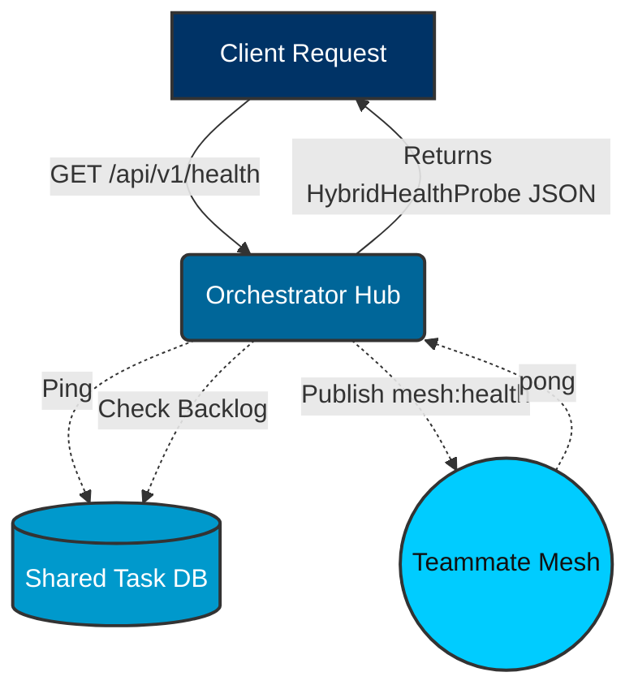
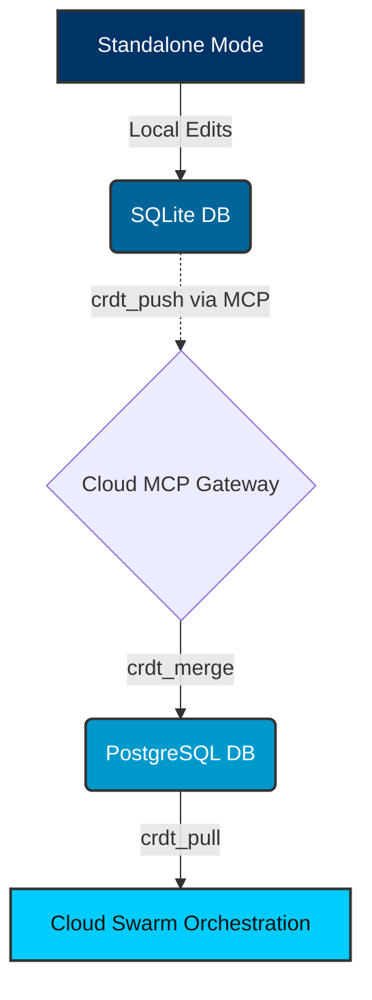

<div markdown="1" style="backdrop-filter: blur(20px) saturate(200%); background: rgba(255, 255, 255, 0.03); font-family: 'Outfit', 'Inter', sans-serif;">

# KAIROS API Playbook

This API Playbook details the core Orchestration APIs that power the KAIROS Hybrid Agentic OS. These APIs enable the Swarm Intelligence Protocol (OHC-SIP), facilitating agent coordination, distributed state management, and long-term memory consolidation.

## 1. Teammate Mesh Architecture

The Teammate Mesh is the real-time communication backbone for agent-to-agent coordination.

```mermaid
graph TD
    subgraph Swarm
        A1[Worker Agent 1]
        A2[Worker Agent 2]
    end

    subgraph Teammate Mesh (Redis/Centrifugo)
        M[Mesh Hub]
    end

    A1 <-->|Pub/Sub| M
    A2 <-->|Pub/Sub| M

    classDef premium fill:rgba(255,255,255,0.03),stroke:rgba(255,255,255,0.08),stroke-width:1px,color:#fff,backdrop-filter:blur(20px) saturate(200%);
    class A1,A2,M premium;
```

### Endpoints

*   **Broadcast Message**
    *   **Method**: `POST`
    *   **Path**: `/api/mesh/v2/broadcast`
    *   **Description**: Broadcasts a message to a specific mesh channel.
    *   **Payload Example**:
        ```json
        {
          "channel": "swarm-events",
          "data": {
            "event": "status_update",
            "status": "IN_PROGRESS"
          }
        }
        ```

*   **Publish to Room**
    *   **Endpoint:** `POST /api/v1/mesh/rooms/{room_id}/messages`
    *   **Description:** Broadcasts an intent to the designated room. Centrifuge downstream WebSocket propagation handles bursts of up to 10k messages/sec.
    *   **Payload Example:**
        ```json
        {
          "agent_id": "agent_pm_001",
          "action": "ultraplan_deliberation",
          "status": "active",
          "payload": {
             "content": "I propose we use pgvector instead of Pinecone for AutoDream."
          }
        }
        ```

## 2. Shared Task List

The Shared Task List manages the distributed state machine, preventing race conditions when sub-agents claim tasks.

*   **Enqueue Task**
    *   **Method**: `POST`
    *   **Path**: `/api/queue/subagent`
    *   **Description**: Queues a new task for sub-agents to claim.
    *   **Payload Example**:
        ```json
        {
          "parent_task_id": "T-123",
          "action": "summarize"
        }
        ```

*   **Claim a Task**
    *   **Endpoint:** `POST /api/v1/tasks/claim`
    *   **Description:** Claims a `PENDING` task from the shared task queue. Behind the scenes, KAIROS uses `FOR UPDATE SKIP LOCKED` (Cloud) or explicit transaction locking (Standalone).
    *   **Payload Example:**
        ```json
        {
          "agent_id": "agent_swe_007",
          "role": "swe"
        }
        ```

*   **Complete a Task**
    *   **Endpoint:** `POST /api/v1/tasks/{task_id}/complete`
    *   **Description:** Marks a task as `COMPLETED` and unlocks dependent tasks in the DAG structure.
    *   **Payload Example:**
        ```json
        {
          "agent_id": "agent_swe_007",
          "outcome_summary": "Successfully merged PR #124."
        }
        ```

## 3. Hybrid Health Probes

The Hybrid Health Probe monitors the status of the orchestration engine across different deployment modes.

*   **Health Check**
    *   **Method**: `GET`
    *   **Path**: `/api/v1/health`
    *   **Description**: Retrieves the health status of the database and mesh components.
    *   **Response Example**:
        ```json
        {
          "mode": "cloud",
          "status": "healthy",
          "db_ping": 15000000,
          "sync_backlog": 0,
          "stuck_missions": 0,
          "mesh_active": true
        }
        ```

### Hybrid Health Probe Flow



## 4. Hybrid CRDT Sync

Manages state synchronization between Cloud-Native and Standalone modes.

*   **Push State Mutation**
    *   **Tool Invoke**: `crdt_push`
    *   **Description**: Pushes local state mutations to the cloud gateway via the MCP protocol.
    *   **Payload Example**:
        ```json
        {
          "entity_id": "task_12345",
          "mutations": [
            {
              "clock": 42,
              "op": "set",
              "path": "status",
              "value": "COMPLETED"
            }
          ]
        }
        ```

### Hybrid CRDT State Synchronization Flow



## 5. AutoDream Pipeline

The AutoDream Pipeline consolidates ephemeral agent memories from `agent_session_data` and the runtime memory directory (`OHC_MEMORY_DIR`, typically `.ohc/runtime/memory`) into long-term vector embeddings in `pgvector`. This process runs autonomously as part of the backend orchestration loop.

### Endpoints

*   **Trigger Manual AutoDream Sync**
    *   **Endpoint:** `POST /api/v1/autodream/sync`
    *   **Description:** Forces the background worker to scan any `*.yml` files in `OHC_MEMORY_DIR`, generate Minimax embeddings, and upsert them into `autodream_memories`.
    *   **Payload Example:**
        ```json
        {
          "force_reindex": false
        }
        ```

*   **Query Consolidated Memories**
    *   **Endpoint:** `POST /api/v1/autodream/query`
    *   **Description:** Executes an exact Nearest Neighbor search (`ORDER BY embedding <-> $1` in PostgreSQL) against the long-term swarm memory.
    *   **Payload Example:**
        ```json
        {
          "query_text": "How does the Teammate Mesh handle fallback in Standalone mode?",
          "limit": 5
        }
        ```

</div>
