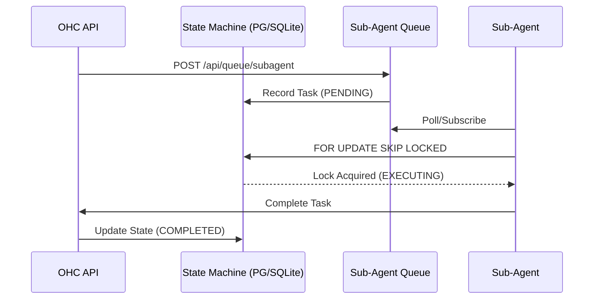
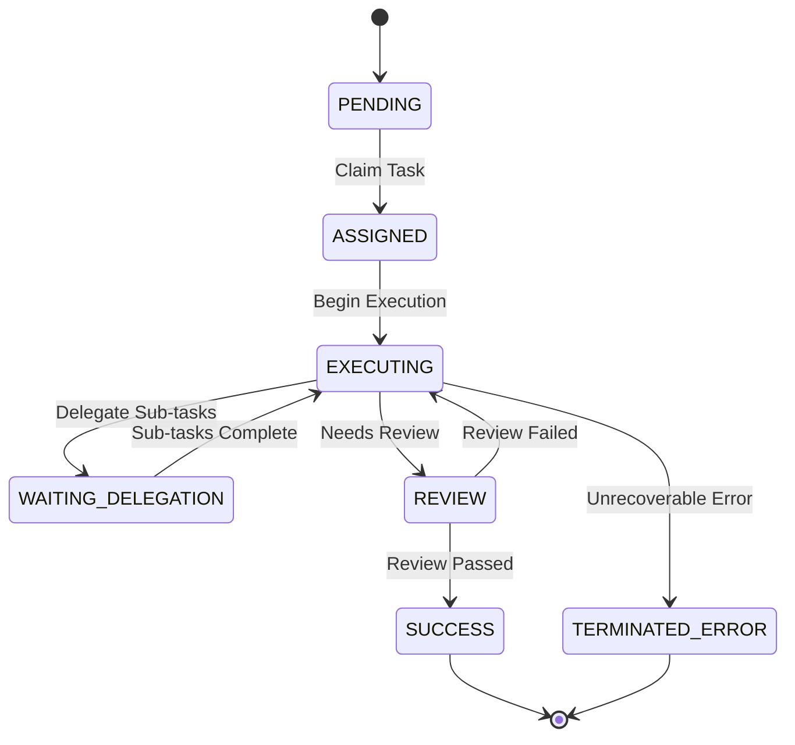
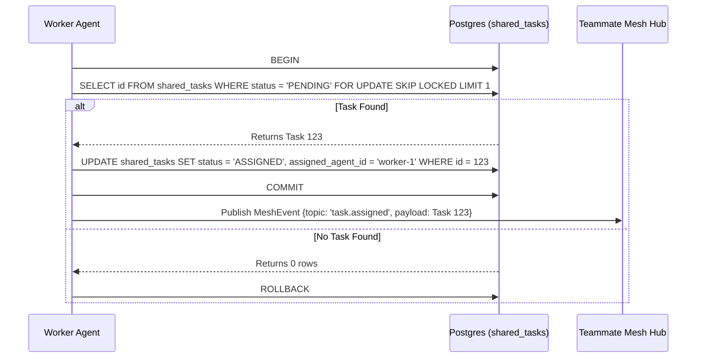

<div markdown="1" style="backdrop-filter: blur(20px) saturate(200%); font-family: 'Outfit', 'Inter', sans-serif; border: 1px solid rgba(255, 255, 255, 0.1); padding: 20px; border-radius: 12px; background: rgba(255, 255, 255, 0.05); color: #fff;">

<style>
.glass-panel {
  backdrop-filter: blur(20px) saturate(200%);
  background: rgba(255, 255, 255, 0.03);
  border: 1px solid rgba(255, 255, 255, 0.1);
  border-radius: 12px;
  padding: 1.5rem;
  margin-bottom: 2rem;
}
</style>


# OHC API Playbook: Interactive Reference

**Version:** 1.0.0
**Target Audience:** Orchestration Engineers & Human CEOs

## 1. Introduction
The One Human Corp (OHC) API is the central nervous system of the Agentic OS. It bridges the gap between Cloud-Native Kubernetes clusters and Standalone Desktop deployments via the **Swarm Intelligence Protocol (OHC-SIP)**.

## 2. Authentication (Zero Secrets)

All endpoints are secured via SPIFFE/SPIRE zero-trust principles or an OIDC JWT. We do not use static API keys. Ensure your client provides a valid JWT.

**Example Request:**
```bash
curl -X GET https://api.ohc.local/v1/agents/status \
  -H "Authorization: Bearer <JWT_OR_SVID>" \
  -H "X-OHC-Tenant-ID: org_acme_123"
```

## 3. Core Endpoints

<div class="glass-panel" markdown="1">

### 3.1 Organization Provisioning

**Endpoint:** `POST /api/orgs/register`
Provisions a new organization in multi-tenant mode.

**Payload:**
```json
{
  "id": "acme",
  "name": "Acme Corp",
  "domain": "acme.com"
}
```
</div>


<div class="glass-panel" markdown="1">

### 3.2 Agent Management & Hiring

**Endpoint:** `GET /api/agents`
Retrieves a list of active agents within the current tenant scope.

**Endpoint:** `POST /api/agents/hire`
Requests a new agent capability. This triggers dynamic tool registration via MCP.
</div>


<div class="glass-panel" markdown="1">

### 3.3 Task Delegation

**Endpoint:** `POST /api/v1/tasks/delegate`
Delegate a subtask to an autonomous agent. The Hub handles provisioning and VRAM quota enforcement.

**Payload:**
```json
{
  "target_role": "swe",
  "instruction": "Implement the new billing module according to docs/features/billing.",
  "parent_thread_id": "thread_8f92a"
}
```

**Response (200 OK):**
```json
{
  "task_id": "task_99b1x",
  "status": "PROVISIONING",
  "assigned_agent": "agent_swe_004"
}
```
</div>


<div class="glass-panel" markdown="1">

### 3.4 Swarm Orchestration (Legacy/Internal)

**Endpoint:** `GET /api/orchestration/tasks`
Retrieves a list of all active orchestration tasks in the queue. Supports pagination.

**Endpoint:** `POST /api/orchestration/tasks`
Submit a new task to the swarm.

**Payload:**
```json
{
  "title": "Analyze market data",
  "priority": "P0",
  "payload": {
    "description": "Perform deep market analysis."
  }
}
```

### 3.5 Teammate Mesh Communications (v1)

**Endpoint:** `POST /api/mesh/broadcast`
Broadcasts an event or message to a specific topic within the real-time Teammate Mesh.

**Payload:**
```json
{
  "agent_id": "agent-123",
  "action": "task_completed",
  "status": "success",
  "data": {
    "message": "Hello mesh!"
  }
}
```

**Endpoint:** `GET /api/mesh/subscribe`
Subscribe to Teammate Mesh events.

**Query Parameters:**
- `channel`: The channel to subscribe to (e.g., `mesh:tasks`)

### 3.6 Client Integrations

Whether you are developing against the **Local SQLite SIPDB** or the **Cloud Postgres/Redis** stack, the REST API interface remains identical. Standalone desktop applications proxy requests seamlessly directly to the local backend runner.

### 3.7 Dynamic Scaling

**Endpoint:** `POST /api/v1/scale`
Adjust the number of concurrent agents for a specific role in real-time.

**Payload:**
```json
{
  "role": "sales_rep",
  "count": 5
}
```
</div>


<div class="glass-panel" markdown="1">

### 3.8 Hybrid RAG Sync

**Endpoint:** `POST /api/missions/sync`
Synchronize local SQLite context to the cloud Postgres orchestration engine.

**Headers:**
- `X-OHC-Conflict-Resolution: force-local`

**Payload:**
```json
{
  "missions": [
    {
      "id": "mission_local_01",
      "status": "COMPLETED",
      "context": "..."
    }
  ]
}
```
</div>


## 4. Teammate Mesh, AutoDream & Webhooks

<div class="glass-panel" markdown="1">

### Centrifuge Realtime Sync
Channels:
- `mesh:tasks`: Global task coordination.
- `mesh:coordination`: Agents announce their presence, request locks, and share immediate findings.
- `mesh:ultraplan:<plan_id>`: Deliberation cycle realtime updates.
- `meeting:<meeting_id>`: Transcript sync.
</div>


<div class="glass-panel" markdown="1">

### AutoDream Data Pipelines (pgvector)
The API supports AutoDream pipelines where the backend background workers process `agent_session_data` and any `*.yml` files found under `OHC_MEMORY_DIR`.

**Endpoint:** `POST /api/mesh/broadcast`
Allows agents to publish messages to the mesh.

**Payload:**
```json
{
  "agent_id": "agent_swe_004",
  "action": "completed_task",
  "status": "success",
  "payload": {
     "details": "Successfully implemented API playbook"
  }
}
```
</div>


<div class="glass-panel" markdown="1">

### SSE Stream
Real-time state changes are pushed via Server-Sent Events (SSE).

**Endpoint:** `GET /api/v1/stream`

Events emitted:
- `AgentHired`
- `AgentFired`
- `TaskCompleted`
- `QuotaExhausted`
</div>


<div class="glass-panel" markdown="1">

### 4.3 KAIROS Orchestration APIs
Detailed endpoints for the Shared Task List, Teammate Mesh, and AutoDream Vector Pipelines.

**Endpoint:** `GET /api/v1/mesh/rooms/{room_id}`
Retrieve the real-time state and history of a specific Teammate Mesh room.

**Response (200 OK):**
```json
{
  "room_id": "room_a1b2",
  "active_agents": ["agent_swe_004", "agent_reviewer_001"],
  "messages": [
    {
      "agent_id": "agent_swe_004",
      "action": "joined",
      "status": "success"
    }
  ]
}
```

**Endpoint:** `POST /api/v1/autodream/`
Trigger the AutoDream vector pipeline to process shared memory and generate new embedded vectors for RAG.

**Payload:**
```json
{
  "pipeline_id": "dream_001",
  "force_reindex": false
}
```

**Response (202 Accepted):**
```json
{
  "status": "processing",
  "pipeline_id": "dream_001"
}
```
</div>


<div class="glass-panel" markdown="1">

### 4.4 KAIROS Sub-Agent Queue API

**Endpoint:** `POST /api/queue/subagent`
Enqueues a sub-agent task into the highly available distributed queue (backed by Rueidis ZSETs in Cloud-Native mode or application-level mutexed SQLite in Standalone mode).

**Payload:**
```json
{
  "parent_task_id": "task_12345",
  "payload": {
    "instruction": "Verify the styling tokens in the frontend."
  },
  "scheduled_at": "2026-04-06T12:00:00Z"
}
```

**Response (202 Accepted):**
```json
{
  "queue_id": "queue_9876",
  "status": "ENQUEUED"
}
```
</div>


<div class="glass-panel" markdown="1">

#### Sub-Agent Queue Orchestration Flow


<div class="glass-panel" markdown="1">

### 4.5 KAIROS Distributed State Machine

The **KAIROS Distributed State Machine** manages the lifecycle of autonomous tasks and sub-agent workflows across the Swarm. It provides robust state transition APIs, guaranteeing distributed consistency.

**Endpoint:** `POST /api/v1/state/transition`
Transitions an entity from its current state to a new state. Required for tracking Sub-Agent mission progress.

**Payload:**
```json
{
  "entity_id": "task_12345",
  "from_state": "PENDING",
  "to_state": "ASSIGNED",
  "agent_id": "worker-42"
}
```

**Response (200 OK):**
```json
{
  "success": true,
  "transaction_id": "txn-789"
}
```

**Endpoint:** `GET /api/v1/state/{entity_id}`
Retrieves the current state of a task or sub-agent execution within the Distributed State Machine.

**Response (200 OK):**
```json
{
  "entity_id": "task_12345",
  "current_state": "EXECUTING",
  "last_transition_at": "2026-04-06T12:05:00Z",
  "history": [
    {"from": "PENDING", "to": "ASSIGNED", "timestamp": "2026-04-06T12:01:00Z"}
  ]
}
```

#### Distributed State Machine Flow

</div>


### 4.6 Teammate Mesh v2 (Centrifuge)

**Endpoint:** `POST /api/mesh/v2/broadcast`
Broadcasts a validated state machine event over the structured Centrifuge channels, replacing legacy WebSockets for robust sub-agent coordination.

**Payload:**
```json
{
  "channel": "mesh:tasks",
  "event_type": "TASK_TRANSITION",
  "data": {
    "task_id": "task_12345",
    "previous_state": "PENDING",
    "new_state": "IN_PROGRESS"
  }
}
```
</div>


<div class="glass-panel" markdown="1">

### 4.7 AutoDream Vector Embedding Workflow
```mermaid
graph TD
    Agent[Agent Shared Memory] -->|Writes to OHC_MEMORY_DIR| FS[Runtime Memory Directory]
    FS -->|Watched by| AutoDream[AutoDream Pipeline Worker]
    AutoDream --> Chunk[Chunk & Tokenize]
    Chunk --> Embed[Minimax/Cohere Embedding API]
    Embed --> VectorDB[(pgvector / Local SQLite)]
    VectorDB -->|RAG Sync| API[KAIROS Orchestration API]

    classDef premium fill:rgba(255,255,255,0.03),stroke:rgba(255,255,255,0.08),stroke-width:1px,color:#fff,backdrop-filter:blur(20px) saturate(200%);
    class Agent,FS,AutoDream,Chunk,Embed,VectorDB,API premium;
```

#### Sub-Agent Queuing Workflow
```mermaid
graph TD
    Manager[Task Manager] -->|Enqueues| API[POST /api/queue/subagent]
    API --> QueueInterface{SubAgent Queue Interface}
    QueueInterface -->|Cloud-Native| Rueidis[(Redis ZSETs)]
    QueueInterface -->|Standalone| SQLite[(SQLite Mutexed Table)]
    Rueidis -->|Dequeues| Worker[Sub-Agent Worker]
    SQLite -->|Dequeues| Worker
    Worker -->|State Transition| V2Mesh[POST /api/mesh/v2/broadcast]
    V2Mesh --> Centrifuge[Centrifuge Node Pub/Sub]
    Centrifuge --> Swarm[Teammate Swarm]

    classDef premium fill:rgba(255,255,255,0.03),stroke:rgba(255,255,255,0.08),stroke-width:1px,color:#fff,backdrop-filter:blur(20px) saturate(200%);
    class Manager,API,QueueInterface,Rueidis,SQLite,Worker,V2Mesh,Centrifuge,Swarm premium;
```

**Endpoint:** `GET /api/v1/mesh/rooms/{room_id}`
Retrieves the current state and participants of a specific Teammate Mesh room. KAIROS Orchestration uses this to synchronize agents within a context boundary.

**Response (200 OK):**
```json
{
  "room_id": "room_a1b2",
  "name": "Frontend Architecture Deliberation",
  "active_agents": ["agent_swe_004", "agent_design_001"],
  "recent_messages": [
    {
      "agent_id": "agent_design_001",
      "action": "proposal_submitted",
      "status": "pending_review"
    }
  ]
}
```

**Endpoint:** `POST /api/v1/autodream/`
Triggers an immediate AutoDream vector embedding workflow on newly generated agent memory artifacts. Used to proactively consolidate agent learning into the vector database.

**Payload:**
```json
{
  "target_memory_files": [
    ".ohc/runtime/memory/2026-04-04T12-00-02Z_kairos_autodream_pipeline.yml"
  ],
  "priority": "high"
}
```

**Response (202 Accepted):**
```json
{
  "job_id": "ad_job_9921",
  "status": "QUEUED"
}
```

#### AutoDream Vector Embedding Workflow
```mermaid
graph TD
    Trigger[POST /api/v1/autodream/] --> Hub[Orchestration Hub]
    Hub --> Parser[Memory Artifact Parser]
    Parser --> Embedding[Minimax / Anthropic Embedding Model]
    Embedding --> VectorDB[(pgvector / Pinecone)]
    VectorDB --> RAGSync[RAG Sync Engine]
    RAGSync --> Mesh[Teammate Mesh Broadcast]

    classDef premium fill:rgba(255,255,255,0.03),stroke:rgba(255,255,255,0.08),stroke-width:1px,color:#fff,backdrop-filter:blur(20px) saturate(200%);
    class Trigger,Hub,Parser,Embedding,VectorDB,RAGSync,Mesh premium;
```
</div>

### 4.8 Health & Diagnostics

**Endpoint:** `GET /api/health`
Verifies the backend health programmatically. Checks connectivity to Postgres, Redis, and the internal agent runtime.

**Response (200 OK):**
```json
{
  "status": "UP",
  "services": {
    "database": "CONNECTED",
    "mesh": "CONNECTED",
    "agents": "READY"
  }
}
```

<div class="glass-panel" markdown="1">

### 4.9 KAIROS Shared Task List API

**Endpoint:** `POST /api/v1/tasks/claim`
Claims a `PENDING` task from the shared task queue. Uses `FOR UPDATE SKIP LOCKED` (Cloud) or explicit transaction locking (Standalone).

**Payload:**
```json
{
  "agent_id": "agent_swe_007",
  "role": "swe"
}
```

**Response (200 OK):**
```json
{
  "task_id": "123e4567-e89b-12d3-a456-426614174000",
  "title": "Implement AutoDream Pipeline",
  "status": "IN_PROGRESS",
  "payload": {
     "instruction": "Create the Go background worker for memory consolidation."
  }
}
```

**Endpoint:** `POST /api/v1/tasks/{task_id}/complete`
Marks a task as `COMPLETED` and unlocks dependent tasks in the DAG structure.

**Payload:**
```json
{
  "agent_id": "agent_swe_007",
  "outcome_summary": "Successfully merged PR #124."
}
```

#### Shared Task Claiming Workflow

</div>


<div class="glass-panel" markdown="1">

### 4.10 Hybrid CRDT Sync MCP Tools

The Hybrid CRDT Sync MCP exposes tools to facilitate Conflict-free Replicated Data Type (CRDT) based synchronization between local Standalone and Cloud-Native environments.

**Tools Exposed:**
- `crdt_pull`: Fetch the latest CRDT state vector for a given entity from the Cloud backend (or return local if standalone).
- `crdt_push`: Submit local CRDT mutations to the Cloud backend.
- `crdt_merge`: Locally compute the intersection of state vectors.

**Input Schema:**
All CRDT tools accept their arguments as a raw JSON object (`json.RawMessage`) to prevent runtime validation failures during complex structural merges.

**Example `crdt_push` Execution:**
```json
{
  "entity_id": "task_12345",
  "mutations": [
    { "clock": 42, "op": "set", "path": "status", "value": "COMPLETED" }
  ]
}
```
</div>

## 5. Visualizing the Flow
```mermaid
graph TD
    Client[Human CEO / External Tools] --> API[OHC Gateway]
    API --> Auth{SPIFFE / OIDC}
    Auth -->|Valid| Hub[Orchestration Hub]
    Auth -->|Invalid| 401[401 Unauthorized]
    Hub --> K8s[K8s Operator]
    Hub --> Agents[Swarm Intelligence]

    classDef premium fill:rgba(255,255,255,0.03),stroke:rgba(255,255,255,0.08),stroke-width:1px,color:#fff,backdrop-filter:blur(20px) saturate(200%);
    class Client,API,Auth,Hub,401,K8s,Agents premium;
```


<div class="glass-panel" markdown="1">

### 4.10 Hybrid MCP RAG Protocol

The **Hybrid MCP RAG Protocol** enables seamless database synchronization between local Standalone agents (SQLite) and Cloud orchestration (pgvector). This guarantees full context preservation even when an agent goes offline.

**Endpoint:** POST /api/v1/mcp/sync
Synchronizes local vector insights up to the Cloud PostgreSQL instance via the AutoDream pipeline.

**Payload:**
```json
{
  "agent_id": "standalone_swe_007",
  "sync_type": "full",
  "vectors": [
    {
      "id": "v_1234",
      "context": "SQLite mutex locking approach for shared_tasks.",
      "embedding": [0.012, -0.054, 0.089, "..."]
    }
  ]
}
```

**Response (200 OK):**
```json
{
  "status": "synchronized",
  "vectors_upserted": 150
}
```

#### Hybrid RAG Sync Flow
```mermaid
sequenceDiagram
    participant Local as Standalone (SQLite)
    participant API as MCP Gateway
    participant AutoDream as AutoDream Sync Engine
    participant Cloud as Cloud DB (pgvector)

    Local->>API: POST /api/v1/mcp/sync (Local Vectors)
    API->>AutoDream: Authenticate & Route Payload
    AutoDream->>Cloud: Upsert to autodream_memories
    Cloud-->>AutoDream: Acknowledge Transaction
    AutoDream-->>Local: Return Sync Status

    classDef premium fill:rgba(255,255,255,0.03),stroke:rgba(255,255,255,0.08),stroke-width:1px,color:#fff,backdrop-filter:blur(20px) saturate(200%);
    class Local,API,AutoDream,Cloud premium;
```
</div>

<div class="glass-panel" markdown="1">

### 4.11 Hybrid Health Probe

The **HybridHealthProbe** is used to check system availability across standalone and cloud modes.

**Endpoint:** `GET /api/v1/health`
Checks database availability, sync backlogs, and mesh channel connectivity.

**Response (200 OK):**
```json
{
  "mode": "cloud",
  "status": "healthy",
  "db_ping": 15000000,
  "sync_backlog": 0,
  "stuck_missions": 0,
  "mesh_active": true
}
```

</div>
