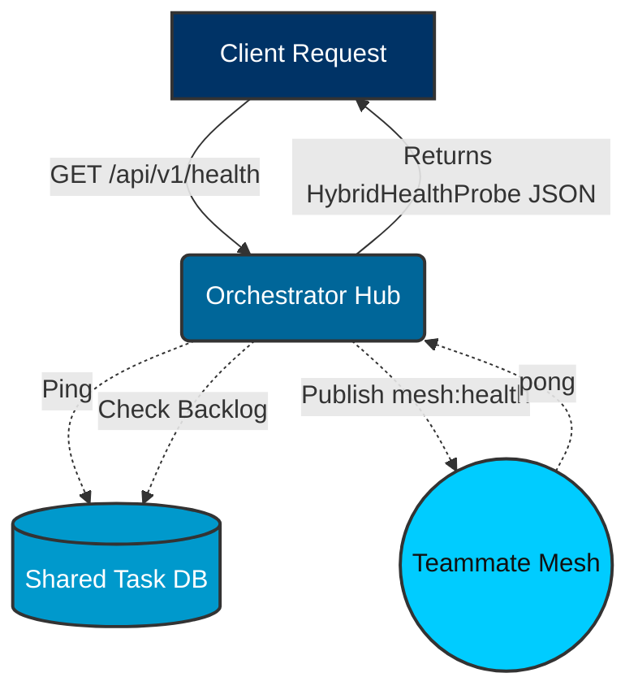
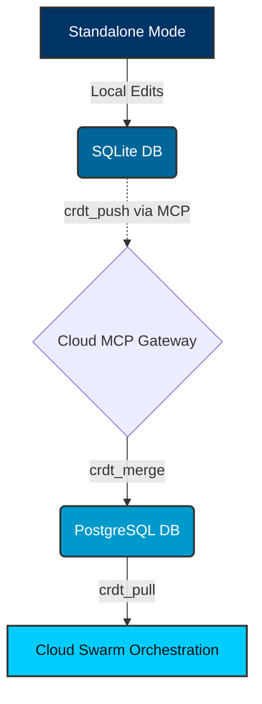

<div markdown="1" style="backdrop-filter: blur(20px) saturate(200%); font-family: 'Outfit', 'Inter', sans-serif; border: 1px solid rgba(255, 255, 255, 0.1); padding: 20px; border-radius: 12px; background: rgba(255, 255, 255, 0.05); color: #fff;">

# OHC Interactive API Playbook

**Version:** 1.1.0
**Target Audience:** Orchestration Engineers, Internal Integrators & Human CEOs

## 1. Introduction
The One Human Corp (OHC) API Playbook provides an interactive reference for the core components of the Hybrid Agentic OS. It outlines key REST endpoints, integration strategies, and the Hybrid API architecture.

## 2. Authentication & AuthZ

The system enforces a **Zero Secrets** policy, relying entirely on SPIFFE/SPIRE for identity and authentication across all deployments.

For local development and testing, an ephemeral token can be used.

**Headers:**
```http
Authorization: Bearer <SPIFFE_TOKEN>
X-OHC-Dev-Token: <OHC_DEV_TOKEN>  # (Optional, local development only)
```

## 3. Core Endpoints

### 3.1 KAIROS Sub-Agent Queue Orchestration

**Endpoint:** `POST /api/queue/subagent`
Enqueues a sub-agent task into the distributed queue.

**Payload:**
```json
{
  "parent_task_id": "task_12345",
  "payload": {
    "instruction": "Verify the styling tokens in the frontend."
  },
  "scheduled_at": "2026-04-06T12:00:00Z"
}
```

**Response (202 Accepted):**
```json
{
  "queue_id": "queue_9876",
  "status": "ENQUEUED"
}
```

### 3.2 Teammate Mesh v2 (Centrifuge)

**Endpoint:** `POST /api/mesh/v2/broadcast`
Broadcasts a validated state machine event over structured Centrifuge channels.

**Payload:**
```json
{
  "channel": "mesh:tasks",
  "event_type": "TASK_TRANSITION",
  "data": {
    "task_id": "task_12345",
    "previous_state": "PENDING",
    "new_state": "IN_PROGRESS"
  }
}
```

### 3.3 Agents List

**Endpoint:** `GET /api/agents`
Returns a list of all configured agents within the OHC swarm.

## 4. Standalone vs. Cloud Routing

The OHC API routes dynamically based on the active OHC Hybrid Architecture mode.

### Cloud-Native Mode
- Queue requests are routed to Redis ZSETs backed by K8s pods.
- Sub-agent coordination uses Redis Pub/Sub channels.

### Standalone Desktop Mode
- Queue requests fall back to an application-level mutexed SQLite instance.
- Sub-agent coordination happens in-memory via direct event passing (graceful degradation).

### Thin Client Mode
- UI forwards all API requests securely to configured cloud API endpoints via OAuth.

## 5. Code Snippets & Testing Instructions

**Testing with cURL (Local Development):**
```bash
# Get list of agents
curl -X GET "http://localhost:8080/api/agents" \
  -H "X-OHC-Dev-Token: <your_dev_token>"

# Broadcast an event
curl -X POST "http://localhost:8080/api/mesh/v2/broadcast" \
  -H "Content-Type: application/json" \
  -H "X-OHC-Dev-Token: <your_dev_token>" \
  -d '{
    "channel": "mesh:test",
    "event_type": "PING",
    "data": {}
  }'

# Enqueue a new task
curl -X POST "http://localhost:8080/api/queue/subagent" \
  -H "Content-Type: application/json" \
  -H "X-OHC-Dev-Token: <your_dev_token>" \
  -d '{
    "parent_task_id": "T-123",
    "action": "summarize"
  }'

# Claim a PENDING task
curl -X POST "http://localhost:8080/api/v1/tasks/claim" \
  -H "Content-Type: application/json" \
  -H "X-OHC-Dev-Token: <your_dev_token>" \
  -d '{
    "agent_id": "agent_swe_007",
    "role": "swe"
  }'

# Complete a task
curl -X POST "http://localhost:8080/api/v1/tasks/123e4567-e89b-12d3-a456-426614174000/complete" \
  -H "Content-Type: application/json" \
  -H "X-OHC-Dev-Token: <your_dev_token>" \
  -d '{
    "agent_id": "agent_swe_007",
    "outcome_summary": "Successfully implemented the memory consolidation logic."
  }'
```

**Interactive Swagger Docs:**
For real-time testing, navigate to `/api/docs` in your local setup, which exposes the Swagger/OpenAPI portal and integrates with WebSockets.


## 6. Teammate Mesh Architecture

The Teammate Mesh is the real-time communication backbone for agent-to-agent coordination.

```mermaid
graph TD
    subgraph Swarm
        A1[Worker Agent 1]
        A2[Worker Agent 2]
    end

    subgraph Teammate Mesh (Redis/Centrifugo)
        M[Mesh Hub]
    end

    A1 <-->|Pub/Sub| M
    A2 <-->|Pub/Sub| M

    classDef premium fill:rgba(255,255,255,0.03),stroke:rgba(255,255,255,0.08),stroke-width:1px,color:#fff,backdrop-filter:blur(20px) saturate(200%);
    class A1,A2,M premium;
```

### Endpoints

*   **Broadcast Message**
    *   **Method**: `POST`
    *   **Path**: `/api/mesh/v2/broadcast`
    *   **Description**: Broadcasts a message to a specific mesh channel.
    *   **Payload Example**:
        ```json
        {
          "channel": "swarm-events",
          "data": {
            "event": "status_update",
            "status": "IN_PROGRESS"
          }
        }
        ```

*   **Publish to Room**
    *   **Endpoint:** `POST /api/v1/mesh/rooms/{room_id}/messages`
    *   **Description:** Broadcasts an intent to the designated room. Centrifuge downstream WebSocket propagation handles bursts of up to 10k messages/sec.
    *   **Payload Example:**
        ```json
        {
          "agent_id": "agent_pm_001",
          "action": "ultraplan_deliberation",
          "status": "active",
          "payload": {
             "content": "I propose we use pgvector instead of Pinecone for AutoDream."
          }
        }
        ```

## 7. Shared Task List APIs

The Shared Task List handles state-machine validation and task-dependency resolution for asynchronous agent swarms.

### 7.1 Enqueue Task
**Endpoint:** `POST /api/queue/subagent`
Queues a new task for sub-agents to claim.

**Payload:**
```json
{
  "parent_task_id": "T-123",
  "action": "summarize"
}
```

### 7.2 Claim a Task
**Endpoint:** `POST /api/v1/tasks/claim`
Claims a `PENDING` task from the shared task queue. Behind the scenes, KAIROS uses `FOR UPDATE SKIP LOCKED` (Cloud) or explicit transaction locking (Standalone). This ensures that only one agent can work on a task at any given time, preventing race conditions in the distributed swarm.

**Payload:**
```json
{
  "agent_id": "agent_swe_007",
  "role": "swe"
}
```

**Response (200 OK):**
```json
{
  "task_id": "123e4567-e89b-12d3-a456-426614174000",
  "title": "Implement AutoDream Pipeline",
  "status": "IN_PROGRESS",
  "payload": {
     "instruction": "Create the Go background worker for memory consolidation."
  }
}
```

**Error Responses:**
- `404 Not Found`: No pending tasks available for the requested role. Wait and retry.
  ```json
  {
    "error_code": "NO_TASKS_AVAILABLE",
    "message": "No pending tasks available for role: swe",
    "resolution": "Retry after 5 seconds or wait for queue mesh events"
  }
  ```
- `403 Forbidden`: Agent role is invalid or not authorized to claim this task queue.
  ```json
  {
    "error_code": "INVALID_AGENT_ROLE",
    "message": "Agent swe_007 is not authorized for role: swe",
    "resolution": "Verify agent_id and role configuration"
  }
  ```

#### Shared Task List Workflow
```mermaid
%%{init: {'theme': 'base', 'themeVariables': {'fontFamily': 'Outfit'}}}%%
sequenceDiagram
    participant Orchestrator as KAIROS Orchestrator
    participant Hub as API Hub
    participant DB as Shared Task DB
    participant Agent as Worker Agent

    Orchestrator->>Hub: POST /api/queue/subagent (Enqueue)
    Hub->>DB: INSERT PENDING Task
    DB-->>Hub: Task Enqueued

    Agent->>Hub: POST /api/v1/tasks/claim
    Note over Hub,DB: Uses FOR UPDATE SKIP LOCKED (Cloud)<br/>or SQLite Mutex (Standalone)
    Hub->>DB: Query for next PENDING task
    DB-->>Hub: Return Task & Row Lock
    Hub-->>Agent: Task Payload (Status: IN_PROGRESS)
    Note right of Agent: Agent executes task

    Agent->>Hub: POST /api/v1/tasks/{task_id}/complete
    Hub->>DB: Update Task Status to COMPLETED
    Note over Hub,DB: KAIROS DAG Engine evaluates downstream dependencies
    Hub->>DB: Unlock dependent tasks
    DB-->>Hub: Return Unlocked Tasks List
    Hub-->>Agent: Success Response + Unlocked Tasks

    classDef premium fill:rgba(255,255,255,0.03),stroke:rgba(255,255,255,0.08),stroke-width:1px,color:#fff,backdrop-filter:blur(20px) saturate(200%);
    class Orchestrator,Hub,DB,Agent premium;
```

### 7.3 Complete a Task
**Endpoint:** `POST /api/v1/tasks/{task_id}/complete`
Marks a task as `COMPLETED`. This transition triggers the KAIROS DAG engine to evaluate downstream dependencies, potentially unlocking new tasks for the swarm.

**Payload:**
```json
{
  "agent_id": "agent_swe_007",
  "outcome_summary": "Successfully merged PR #124."
}
```

**Response (200 OK):**
```json
{
  "status": "success",
  "task_id": "123e4567-e89b-12d3-a456-426614174000",
  "new_status": "COMPLETED",
  "unlocked_tasks": ["task_125", "task_126"]
}
```

**Error Responses:**
- `400 Bad Request`: Invalid transition, or missing payload fields.
  ```json
  {
    "error_code": "INVALID_TASK_TRANSITION",
    "message": "Cannot complete a task that is in state PENDING",
    "resolution": "Claim the task first to transition it to IN_PROGRESS"
  }
  ```
- `404 Not Found`: Task does not exist.
  ```json
  {
    "error_code": "TASK_NOT_FOUND",
    "message": "Task 123e4567-e89b-12d3-a456-426614174000 does not exist",
    "resolution": "Check the task_id"
  }
  ```
- `409 Conflict`: Task is already completed or assigned to a different agent.
  ```json
  {
    "error_code": "TASK_CONFLICT",
    "message": "Task is assigned to agent_swe_008, cannot complete",
    "resolution": "Ensure agent_id matches the claimer"
  }
  ```


## 8. Hybrid Health Probes

The Hybrid Health Probe monitors the status of the orchestration engine across different deployment modes.

*   **Health Check**
    *   **Method**: `GET`
    *   **Path**: `/api/v1/health`
    *   **Description**: Retrieves the health status of the database and mesh components.
    *   **Response Example**:
        ```json
        {
          "mode": "cloud",
          "status": "healthy",
          "db_ping": 15000000,
          "sync_backlog": 0,
          "stuck_missions": 0,
          "mesh_active": true
        }
        ```

### Hybrid Health Probe Flow



## 9. Hybrid CRDT Sync

Manages state synchronization between Cloud-Native and Standalone modes.

*   **Push State Mutation**
    *   **Tool Invoke**: `crdt_push`
    *   **Description**: Pushes local state mutations to the cloud gateway via the MCP protocol.
    *   **Payload Example**:
        ```json
        {
          "entity_id": "task_12345",
          "mutations": [
            {
              "clock": 42,
              "op": "set",
              "path": "status",
              "value": "COMPLETED"
            }
          ]
        }
        ```

### Hybrid CRDT State Synchronization Flow



## 10. AutoDream Pipeline

The AutoDream Pipeline consolidates ephemeral agent memories from `agent_session_data` and the runtime memory directory (`OHC_MEMORY_DIR`, typically `.ohc/runtime/memory`) into long-term vector embeddings in `pgvector`. This process runs autonomously as part of the backend orchestration loop.

### Endpoints

*   **Trigger Manual AutoDream Sync**
    *   **Endpoint:** `POST /api/v1/autodream/sync`
    *   **Description:** Forces the background worker to scan any `*.yml` files in `OHC_MEMORY_DIR`, generate Minimax embeddings, and upsert them into `autodream_memories`.
    *   **Payload Example:**
        ```json
        {
          "force_reindex": false
        }
        ```

*   **Query Consolidated Memories**
    *   **Endpoint:** `POST /api/v1/autodream/query`
    *   **Description:** Executes an exact Nearest Neighbor search (`ORDER BY embedding <-> $1` in PostgreSQL) against the long-term swarm memory.
        *   **Payload Example:**
        ```json
        {
          "query_text": "How does the Teammate Mesh handle fallback in Standalone mode?",
          "limit": 5
        }
        ```
    *   **Response (200 OK):**
        ```json
        {
          "results": [
            {
              "memory_id": "987e6543-e21b-12d3-a456-426614174000",
              "content": "The Teammate Mesh degrades gracefully to local in-process transport in Standalone Mode, ensuring the OS functions offline.",
              "distance": 0.124
            }
          ]
        }
        ```


</div>
