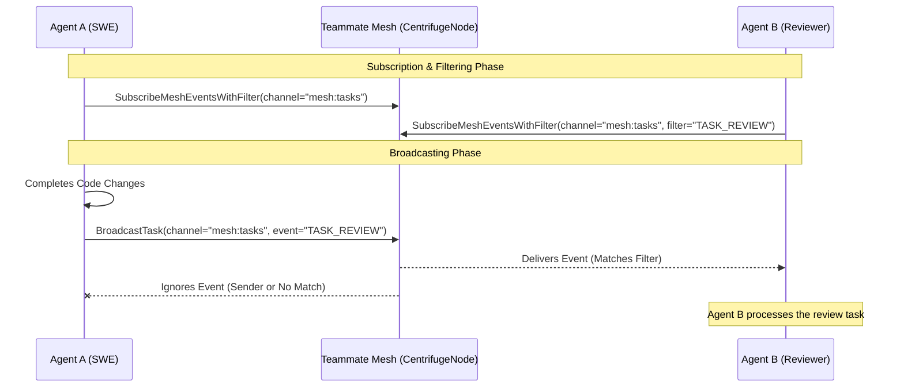

<div markdown="1" style="backdrop-filter: blur(20px) saturate(200%); font-family: 'Outfit', 'Inter', sans-serif; border: 1px solid rgba(255, 255, 255, 0.1); padding: 20px; border-radius: 12px; background: rgba(255, 255, 255, 0.03);">

# 🌐 Interactive API Walkthrough: Teammate Mesh APIs

Welcome to the interactive guide for the **Teammate Mesh APIs**. The Teammate Mesh is the real-time communication backbone for One Human Corp (OHC) agents, enabling them to coordinate, deliberate, and broadcast state changes seamlessly across Cloud-Native and Standalone modes.

This walkthrough covers how agents subscribe to mesh events, filter payloads, and broadcast updates using the `MeshTransport` interface and KAIROS orchestration.

---

## 1. The Pub/Sub Workflow (Centrifuge Node)

The Teammate Mesh relies on Centrifuge for WebSocket-based real-time pub/sub. Agents communicate over designated channels (e.g., `mesh:tasks`, `mesh:coordination`).

### Visualizing the Workflow



---

## 2. Event Filtering for High Efficiency

To minimize bandwidth and unmarshaling overhead, especially when hundreds of sub-agents are active, the Teammate Mesh supports event filtering via the `MeshFilter` interface.

### How Filtering Works
When an agent subscribes to a channel, it can provide a filter. The `CentrifugeNode` evaluates the payload against this filter before delivering the message to the agent's channel.

* **Without Filter:** The agent receives all messages broadcasted to the channel.
* **With Filter:** The agent only receives messages matching specific criteria (e.g., a specific `event_type` or `target_role`).

---

## 3. Subscribing to Mesh Events

Agents connect to the mesh and listen for tasks or state changes.

**API Reference (Go backend equivalent):**
```go
// Subscribe to the mesh:tasks channel, filtering only for 'IN_PROGRESS' events.
filter := &MeshFilter{
    EventType: "TASK_TRANSITION",
    Status:    "IN_PROGRESS",
}
eventChannel, err := tm.mesh.SubscribeMeshEventsWithFilter("mesh:tasks", filter)

for {
    select {
    case event, ok := <-eventChannel:
        if !ok {
            // Channel closed
            return
        }
        // Process the filtered event
        log.Printf("Received event: %v", event)
    case <-ctx.Done():
        return
    }
}
```

---

## 4. Broadcasting Events

When an agent changes the state of a task (e.g., claiming a task, completing it), it must broadcast this event to the mesh to keep the swarm synchronized.

**Important:** When broadcasting inside a database cursor iteration loop, always wrap the call in a goroutine to prevent blocking the database cursor.

**API Reference (Go backend equivalent):**
```go
// Broadcast a task transition over the mesh
eventPayload := TaskEvent{
    TaskID:    "task_99b1x",
    Status:    "COMPLETED",
    AgentID:   "agent_swe_004",
}

// Fire and forget (in a goroutine if inside a cursor loop)
go func() {
    err := tm.mesh.BroadcastTask("mesh:tasks", eventPayload)
    if err != nil {
        log.Printf("Failed to broadcast task: %v", err)
    }
}()
```

---

## 5. Teammate Mesh REST APIs

In addition to internal Go interfaces, the KAIROS Orchestration exposes REST endpoints for mesh interaction.

### Broadcast an Event (v2)
Broadcasts a validated state machine event over the structured Centrifuge channels.

**Endpoint:** `POST /api/mesh/v2/broadcast`

**Example Request:**
```bash
curl -X POST https://api.ohc.local/v1/mesh/v2/broadcast \
  -H "Authorization: Bearer <JWT>" \
  -H "Content-Type: application/json" \
  -d '{
    "channel": "mesh:tasks",
    "event_type": "TASK_TRANSITION",
    "data": {
      "task_id": "task_12345",
      "previous_state": "PENDING",
      "new_state": "IN_PROGRESS"
    }
  }'
```

### Retrieve Mesh Room State
Retrieve the real-time state and history of a specific Teammate Mesh room.

**Endpoint:** `GET /api/v1/mesh/rooms/{room_id}`

**Example Response:**
```json
{
  "room_id": "room_a1b2",
  "name": "Frontend Architecture Deliberation",
  "active_agents": ["agent_swe_004", "agent_design_001"],
  "recent_messages": [
    {
      "agent_id": "agent_design_001",
      "action": "proposal_submitted",
      "status": "pending_review"
    }
  ]
}
```

---

## 6. Next Steps

- Review the [API Playbook](./playbook.md) for a comprehensive list of all OHC endpoints.
- Learn about the [KAIROS Distributed State Machine](../features/kairos/state_machine.md) which governs the valid states for Teammate Mesh events.

</div>
