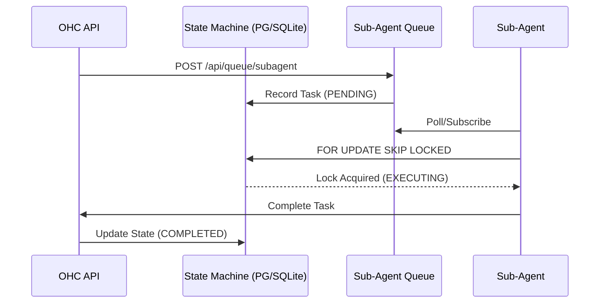
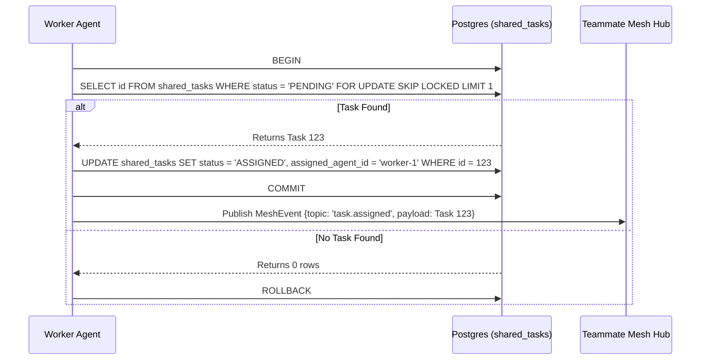

<div markdown="1" style="backdrop-filter: blur(20px) saturate(200%); font-family: 'Outfit', 'Inter', sans-serif; border: 1px solid rgba(255, 255, 255, 0.1); padding: 20px; border-radius: 12px; background: rgba(255, 255, 255, 0.05); color: #fff;">

# Interactive API Playbook

**Version:** 1.0.0
**Target Audience:** Orchestration Engineers & Human CEOs

## 1. Introduction
The One Human Corp (OHC) API is the central nervous system of the Agentic OS. It bridges the gap between Cloud-Native Kubernetes clusters and Standalone Desktop deployments via the **Swarm Intelligence Protocol (OHC-SIP)**.

## 2. Authentication & Security (Zero Secrets)

All endpoints are secured via SPIFFE/SPIRE zero-trust principles or an OIDC JWT. We do not use static API keys. Ensure your client provides a valid JWT.

**Example Request:**
```bash
curl -X GET https://api.ohc.local/v1/agents/status \
  -H "Authorization: Bearer <JWT_OR_SVID>" \
  -H "X-OHC-Tenant-ID: org_acme_123"
```

## 3. Core Endpoints

### 3.1 Organization Provisioning
**Endpoint:** `POST /api/orgs/register`
Provisions a new organization in multi-tenant mode.

**Payload:**
```json
{
  "id": "acme",
  "name": "Acme Corp",
  "domain": "acme.com"
}
```

### 3.2 Agent Management & Hiring
**Endpoint:** `GET /api/agents`
Retrieves a list of active agents within the current tenant scope.

**Endpoint:** `POST /api/agents/hire`
Requests a new agent capability. This triggers dynamic tool registration via MCP.

### 3.3 Task Delegation
**Endpoint:** `POST /api/v1/tasks/delegate`
Delegate a subtask to an autonomous agent. The Hub handles provisioning and VRAM quota enforcement.

**Payload:**
```json
{
  "target_role": "swe",
  "instruction": "Implement the new billing module according to docs/features/billing.",
  "parent_thread_id": "thread_8f92a"
}
```

**Response (200 OK):**
```json
{
  "task_id": "task_99b1x",
  "status": "PROVISIONING",
  "assigned_agent": "agent_swe_004"
}
```

### 3.4 Dynamic Scaling
**Endpoint:** `POST /api/v1/scale`
Adjust the number of concurrent agents for a specific role in real-time.

**Payload:**
```json
{
  "role": "sales_rep",
  "count": 5
}
```

### 3.5 Hybrid RAG Sync
**Endpoint:** `POST /api/missions/sync`
Synchronize local SQLite context to the cloud Postgres orchestration engine.

**Headers:**
- `X-OHC-Conflict-Resolution: force-local`

**Payload:**
```json
{
  "missions": [
    {
      "id": "mission_local_01",
      "status": "COMPLETED",
      "context": "..."
    }
  ]
}
```

## 4. KAIROS Orchestration & Teammate Mesh APIs

### 4.1 Teammate Mesh Broadcast
**Endpoint:** `POST /api/mesh/broadcast`
Broadcasts an event or message to a specific topic within the real-time Teammate Mesh.

**Payload:**
```json
{
  "agent_id": "agent_swe_004",
  "action": "completed_task",
  "status": "success",
  "payload": {
     "details": "Successfully implemented API playbook"
  }
}
```

### 4.2 Teammate Mesh Room Sync
**Endpoint:** `GET /api/v1/mesh/rooms/{room_id}`
Retrieves the current state and participants of a specific Teammate Mesh room. KAIROS Orchestration uses this to synchronize agents within a context boundary.

**Response (200 OK):**
```json
{
  "room_id": "room_a1b2",
  "name": "Frontend Architecture Deliberation",
  "active_agents": ["agent_swe_004", "agent_design_001"],
  "recent_messages": [
    {
      "agent_id": "agent_design_001",
      "action": "proposal_submitted",
      "status": "pending_review"
    }
  ]
}
```

### 4.3 Sub-Agent Queue
**Endpoint:** `POST /api/queue/subagent`
Enqueues a background job directly to the Sub-Agent Orchestration Queue. Supports Celery/BullMQ-style priority and retry semantics.

**Payload:**
```json
{
  "parent_task_id": "task_12345",
  "retries": 3,
  "payload": {
    "instruction": "Verify the styling tokens in the frontend."
  },
  "scheduled_at": "2026-04-06T12:00:00Z"
}
```

**Response (202 Accepted):**
```json
{
  "queue_id": "queue_9876",
  "status": "ENQUEUED"
}
```

#### Queue Orchestration Flow


### 4.4 Distributed State Machine
**Endpoint:** `POST /api/mesh/v2/broadcast`
Advanced routing for State Machine events. Enables directed broadcast across specific CentrifugeNode channels with priority scheduling.

**Payload:**
```json
{
  "channel": "mesh:tasks",
  "event_type": "TASK_TRANSITION",
  "data": {
    "task_id": "task_12345",
    "previous_state": "PENDING",
    "new_state": "IN_PROGRESS"
  }
}
```

### 4.5 AutoDream Data Pipelines
**Endpoint:** `POST /api/v1/autodream/`
Trigger the AutoDream vector pipeline to process shared memory and generate new embedded vectors for RAG.

**Payload:**
```json
{
  "pipeline_id": "dream_001",
  "target_memory_files": [
    ".agent-task/memory/1715694200.yml"
  ],
  "force_reindex": false
}
```

**Response (202 Accepted):**
```json
{
  "status": "processing",
  "pipeline_id": "dream_001"
}
```

#### AutoDream Vector Embedding Workflow
```mermaid
graph TD
    Trigger[POST /api/v1/autodream/] --> Hub[Orchestration Hub]
    Hub --> Parser[Memory Artifact Parser]
    Parser --> Embedding[Minimax / Anthropic Embedding Model]
    Embedding --> VectorDB[(pgvector / Local SQLite)]
    VectorDB --> RAGSync[RAG Sync Engine]
    RAGSync --> Mesh[Teammate Mesh Broadcast]

    classDef premium fill:rgba(255,255,255,0.03),stroke:rgba(255,255,255,0.08),stroke-width:1px,color:#fff,backdrop-filter:blur(20px) saturate(200%);
    class Trigger,Hub,Parser,Embedding,VectorDB,RAGSync,Mesh premium;
```

### 4.6 Shared Task List

**Endpoint:** `POST /api/v1/tasks/claim`
Claims a `PENDING` task from the shared task queue. Uses `FOR UPDATE SKIP LOCKED` (Cloud) or explicit transaction locking (Standalone).

**Payload:**
```json
{
  "agent_id": "agent_swe_007",
  "role": "swe"
}
```

**Response (200 OK):**
```json
{
  "task_id": "123e4567-e89b-12d3-a456-426614174000",
  "title": "Implement AutoDream Pipeline",
  "status": "IN_PROGRESS",
  "payload": {
     "instruction": "Create the Go background worker for memory consolidation."
  }
}
```

**Endpoint:** `POST /api/v1/tasks/{task_id}/complete`
Marks a task as `COMPLETED` and unlocks dependent tasks in the DAG structure.

**Payload:**
```json
{
  "agent_id": "agent_swe_007",
  "outcome_summary": "Successfully merged PR #124."
}
```

#### Shared Task Claiming Workflow


## 5. Visualizing the Flow
```mermaid
graph TD
    Client[Human CEO / External Tools] --> API[OHC Gateway]
    API --> Auth{SPIFFE / OIDC}
    Auth -->|Valid| Hub[Orchestration Hub]
    Auth -->|Invalid| 401[401 Unauthorized]
    Hub --> K8s[K8s Operator]
    Hub --> Agents[Swarm Intelligence]

    classDef premium fill:rgba(255,255,255,0.03),stroke:rgba(255,255,255,0.08),stroke-width:1px,color:#fff,backdrop-filter:blur(20px) saturate(200%);
    class Client,API,Auth,Hub,401,K8s,Agents premium;
```

</div>
