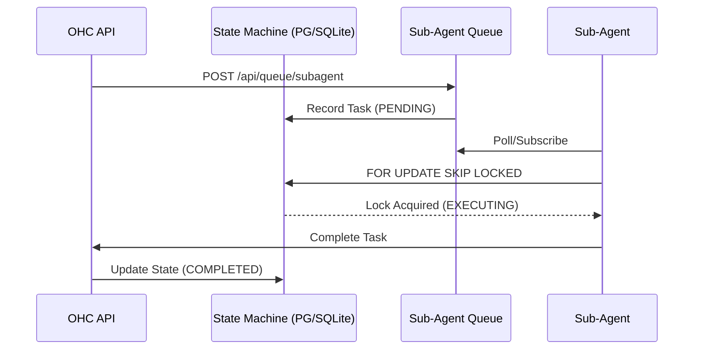

<div markdown="1" style="backdrop-filter: blur(20px) saturate(200%); font-family: 'Outfit', 'Inter', sans-serif; border: 1px solid rgba(255, 255, 255, 0.1); padding: 20px; border-radius: 12px; background: rgba(255, 255, 255, 0.05); color: #fff;">

# OHC API Playbook

**Version:** 1.0.0
**Target Audience:** Orchestration Engineers & Human CEOs

## 1. Introduction
The One Human Corp (OHC) API Playbook provides an interactive reference for the core components of the Hybrid Agentic OS, specifically focusing on the newly added KAIROS Orchestration layers.

## 2. KAIROS Sub-Agent Queue API

**Endpoint:** `POST /api/queue/subagent`
Enqueues a sub-agent task into the highly available distributed queue (backed by Rueidis ZSETs in Cloud-Native mode or application-level mutexed SQLite in Standalone mode).

**Payload:**
```json
{
  "parent_task_id": "task_12345",
  "payload": {
    "instruction": "Verify the styling tokens in the frontend."
  },
  "scheduled_at": "2026-04-06T12:00:00Z"
}
```

**Response (202 Accepted):**
```json
{
  "queue_id": "queue_9876",
  "status": "ENQUEUED"
}
```

### Sub-Agent Queue Orchestration Flow


## 3. Teammate Mesh v2 (Centrifuge)

**Endpoint:** `POST /api/mesh/v2/broadcast`
Broadcasts a validated state machine event over the structured Centrifuge channels, replacing legacy WebSockets for robust sub-agent coordination.

**Payload:**
```json
{
  "channel": "mesh:tasks",
  "event_type": "TASK_TRANSITION",
  "data": {
    "task_id": "task_12345",
    "previous_state": "PENDING",
    "new_state": "IN_PROGRESS"
  }
}
```

</div>
