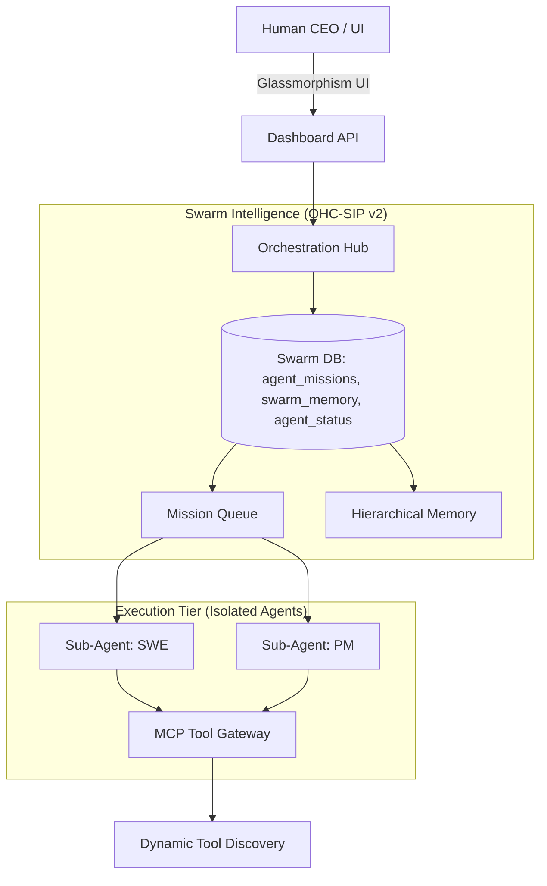

# OHC Agentic OS Blueprint: Future State Architecture

**Author:** Principal Product Architect & Visionary (L7)
**Date:** 2026-03-30
**Status:** Approved

## 1. Overview
The OHC Agentic OS is evolving to incorporate market-leading patterns: Sub-Agent Isolation, Hierarchical Memory via OHC-SIP v2, and Dynamic MCP Tool Discovery. This document defines the architectural blueprint for these capabilities, grounded in our Visual Excellence Mandate (Glassmorphism `blur(20px) saturate(200%)`, `Outfit/Inter` typography).

## 2. Core Capabilities (OHC-SIP v2)

### 2.1 Sub-Agent Isolation
To prevent context bleed and security escalation, agents operate in isolated K8s pods. Communication is strictly asynchronous via the OHC-SIP Swarm database and message bus.
- **Strict Boundary**: Agents only receive context relevant to their role.
- **Zero-Trust Synthesis**: SPIFFE SVIDs are dynamically provisioned.

### 2.2 Hierarchical Memory
Memory is now structured across tiers to support long-running orchestration:
- **Short-Term Context**: LangGraph checkpointing for active workflows.
- **Episodic Memory**: Semantic vector retrieval for historical decisions.
- **Global Swarm Memory**: Shared state synchronized via `.agents-tasks/memory/` and `swarm_memory` in SQLite.

### 2.3 Dynamic MCP Tool Discovery
Agents are no longer hardcoded to tools. They utilize the MCP Gateway to query, discover, and bind to capabilities just-in-time.

## 3. Aesthetic Guidelines (Premium Feel)
All new interfaces must strictly adhere to the updated Glassmorphism tokens:
- **Backdrop**: `backdrop-filter: blur(20px) saturate(200%)`
- **Surface**: `background: rgba(255, 255, 255, 0.03)`
- **Border**: `border: 1px solid rgba(255, 255, 255, 0.08)`
- **Typography**: `Outfit`, `Inter`, sans-serif.

## 4. System Architecture Diagram

