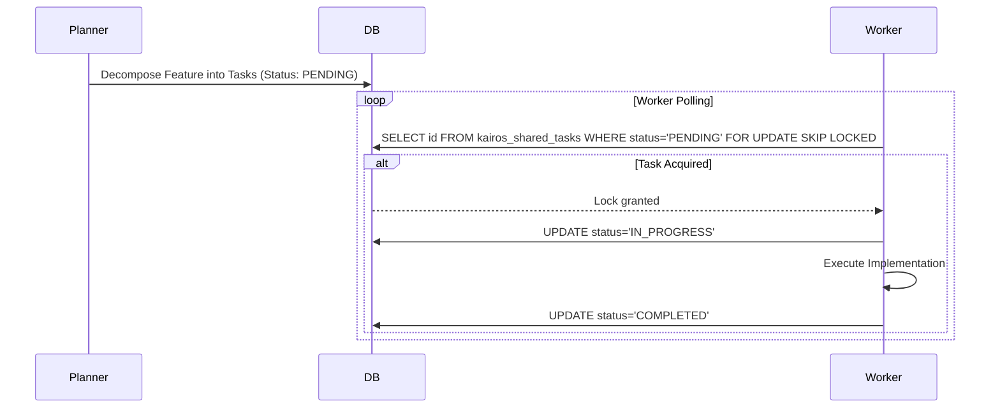

<div markdown="1" style="backdrop-filter: blur(20px) saturate(200%); background: rgba(255, 255, 255, 0.03); font-family: 'Outfit', 'Inter', sans-serif; padding: 20px; border-radius: 12px; border: 1px solid rgba(255, 255, 255, 0.1); color: #FFFFFF;">

# KAIROS AI OS: Shared Task List, Mesh & autoDream
**Author:** Principal Product Architect & KAIROS Orchestrator (L7)

## Overview
This document serves as the Master Plan for orchestrating the One Human Corp (OHC) Swarm using a robust, database-backed Shared Task List, a low-latency Realtime Teammate Mesh, and the pgvector-powered autoDream memory consolidation pipeline.

## 1. Shared Task List (Decomposition)
High-level feature requests are decomposed into a lock-safe Shared Task List. This forms the distributed state machine for KAIROS Orchestration.

**Cloud-Native PostgreSQL Schema:**
```sql
CREATE TABLE IF NOT EXISTS kairos_shared_tasks (
    id UUID PRIMARY KEY DEFAULT gen_random_uuid(),
    organization_id VARCHAR NOT NULL,
    title VARCHAR NOT NULL,
    description TEXT,
    status VARCHAR NOT NULL DEFAULT 'PENDING',
    agent_id VARCHAR,
    priority VARCHAR NOT NULL DEFAULT 'P2',
    payload JSONB,
    created_at TIMESTAMP WITH TIME ZONE DEFAULT CURRENT_TIMESTAMP,
    updated_at TIMESTAMP WITH TIME ZONE DEFAULT CURRENT_TIMESTAMP
);
```

**Task Decomposition Sequence:**


**Task Claiming Logic (Cloud):**
Workers claim tasks using `SELECT id FROM kairos_shared_tasks WHERE status='PENDING' FOR UPDATE SKIP LOCKED`.

**Standalone SQLite Graceful Degradation:**
In local standalone mode, we rely on standard `BEGIN EXCLUSIVE TRANSACTION` locking and in-memory application mutexes.

## 2. Realtime Teammate Mesh APIs
The Teammate Mesh provides sub-millisecond communication across the Swarm.

**API Contract (`POST /api/mesh/broadcast`):**
```json
{
    "agent_id": "architect_l7",
    "channel": "mesh:tasks",
    "event_type": "TASK_CREATED",
    "data": {
        "task_id": "uuid-1234",
        "status": "PENDING"
    }
}
```

## 3. autoDream Data Pipelines (pgvector)
For omni-context memory consolidation, completed tasks are processed by background workers to generate LLM embeddings.

**pgvector Schema:**
```sql
CREATE EXTENSION IF NOT EXISTS vector;

CREATE TABLE IF NOT EXISTS autodream_vector_memories (
    id UUID PRIMARY KEY DEFAULT gen_random_uuid(),
    task_id UUID REFERENCES kairos_shared_tasks(id),
    content TEXT NOT NULL,
    embedding vector(1536),
    created_at TIMESTAMP WITH TIME ZONE DEFAULT CURRENT_TIMESTAMP
);
```

## 4. Sub-Agent Orchestration Queue
Background queuing logic for spawning isolated sub-agents.

**Queue Schema:**
```sql
CREATE TABLE IF NOT EXISTS kairos_sub_agent_queue (
    id TEXT PRIMARY KEY,
    organization_id TEXT NOT NULL,
    parent_task_id TEXT NOT NULL,
    payload JSONB,
    status TEXT NOT NULL DEFAULT 'QUEUED',
    worker_id TEXT
);
```

</div>
