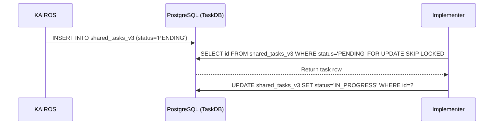

<div markdown="1" style="backdrop-filter: blur(20px) saturate(200%); font-family: 'Outfit', 'Inter', sans-serif; background: rgba(255, 255, 255, 0.03); color: #fff; padding: 20px; border-radius: 12px; border: 1px solid rgba(255, 255, 255, 0.1);">

# Design Doc: KAIROS Orchestration & Hybrid AI OS
**Author:** Principal Product Architect & KAIROS Orchestrator (L7)

## 1. Phase 1: Shared Task List (Decomposition)
The Shared Task List tracks complex feature decomposition into actionable, sequenced `shared_tasks`.

**Database Schema (PostgreSQL):**
```sql
CREATE TABLE IF NOT EXISTS shared_tasks_v3 (
    id TEXT PRIMARY KEY,
    organization_id TEXT NOT NULL,
    title TEXT NOT NULL,
    status TEXT NOT NULL DEFAULT 'PENDING',
    assigned_agent_id TEXT,
    dependencies JSONB,
    created_at TIMESTAMPTZ DEFAULT CURRENT_TIMESTAMP,
    updated_at TIMESTAMPTZ DEFAULT CURRENT_TIMESTAMP
);
```

**Sequence Diagram:**


## 2. Phase 2: Orchestration (Teammate Mesh Architecture)
Realtime communication via Centrifuge node integration in `srcs/server/orchestration/centrifuge_hub.go` and transport components like `LocalTeammateMesh`.
- **Cloud-Native Mode:** Uses Redis Pub/Sub (`rueidis`).
- **Standalone Mode:** In-memory Go channel broadcast.

## 3. Phase 3: autoDream (Memory Consolidation Pipeline)
Background workers consolidate `agent_session_data` and optional `OHC_MEMORY_DIR/*.yml` runtime memory files to embeddings stored in PostgreSQL with pgvector, in the `consolidated_memory` table.

## 4. Phase 4: Sub-Agent Orchestration Queue
Background worker system with Redis or SQLite implementations for spawning isolated sub-agents.

## 5. Visual Excellence Mandate
All associated UI components must represent the OHC "Premium Feel".
- Backdrop Filter: `blur(20px) saturate(200%)`
- Background: `rgba(255, 255, 255, 0.03)`
- Typography: `'Outfit', 'Inter', sans-serif`

</div>
