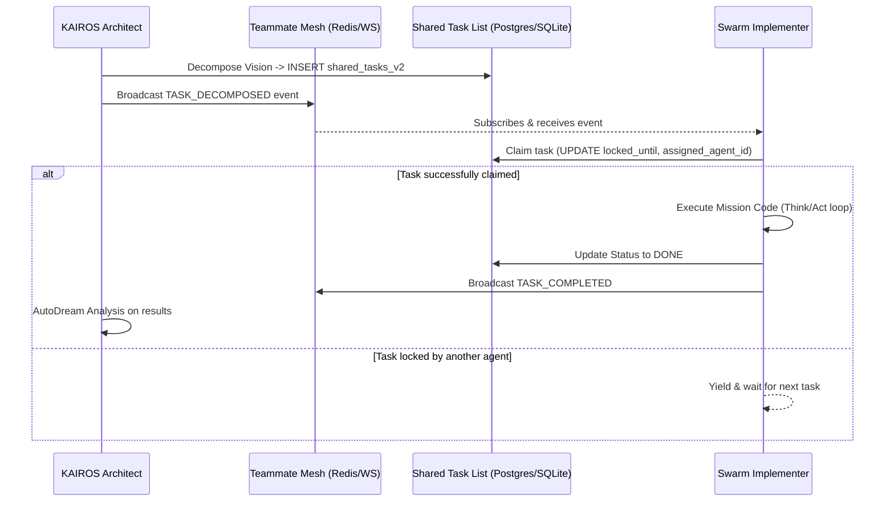

<div markdown="1" style="backdrop-filter: blur(20px) saturate(200%); font-family: 'Outfit', 'Inter', sans-serif; background: rgba(255, 255, 255, 0.03); color: #fff; padding: 20px; border-radius: 12px; border: 1px solid rgba(255, 255, 255, 0.1);">

# KAIROS AI OS: Final Hybrid Orchestration Blueprint

## 1. Executive Summary
This document serves as the final design and architectural specification for the One Human Corp (OHC) AI OS Shared Task Orchestration. It explicitly maps out the state machines, dependencies, and synchronization mechanisms required to safely orchestrate an unbounded Swarm of Agents across the OHC Hybrid Infrastructure.

## 2. Distributed State Machine & Task Decomposition

The Shared Task List serves as the central Nervous System for KAIROS, enabling an Architect to decompose High-Level Missions into concrete Executable Directives that Implementers pull from a shared queue.

### 2.1 Database Schema (Cloud Native - PostgreSQL)
For multi-tenant cloud operations, KAIROS relies on `pg_crypto` and PostgreSQL's native `JSONB` for flexible schema tracking and strict transactional safety.

```sql
CREATE TABLE IF NOT EXISTS shared_tasks_v2 (
    id UUID PRIMARY KEY DEFAULT gen_random_uuid(),
    organization_id VARCHAR NOT NULL,
    title VARCHAR NOT NULL,
    description TEXT,
    status VARCHAR NOT NULL DEFAULT 'PENDING', -- PENDING, IN_PROGRESS, REVIEW, DONE, BLOCKED, CANCELLED
    assigned_agent_id VARCHAR,
    priority VARCHAR NOT NULL DEFAULT 'P2',
    payload JSONB,
    parent_plan_id TEXT,
    dependencies JSONB NOT NULL DEFAULT '[]',
    locked_until TIMESTAMP,
    created_at TIMESTAMP WITH TIME ZONE DEFAULT CURRENT_TIMESTAMP,
    updated_at TIMESTAMP WITH TIME ZONE DEFAULT CURRENT_TIMESTAMP
);

CREATE INDEX idx_shared_tasks_org_status ON shared_tasks_v2 (organization_id, status);
CREATE INDEX idx_shared_tasks_agent ON shared_tasks_v2 (assigned_agent_id);
```

### 2.2 Database Schema (Standalone - SQLite)
For single-user local inference and graceful degradation, SQLite handles the state machine without native `JSONB` functions, using standard `TEXT` fields for fallback schema support.

```sql
CREATE TABLE IF NOT EXISTS shared_tasks_v2 (
    id TEXT PRIMARY KEY,
    organization_id TEXT NOT NULL,
    title TEXT NOT NULL,
    description TEXT,
    status TEXT NOT NULL DEFAULT 'PENDING',
    assigned_agent_id TEXT,
    priority TEXT NOT NULL DEFAULT 'P2',
    payload TEXT, -- JSON structure serialized as TEXT
    parent_plan_id TEXT,
    dependencies TEXT NOT NULL DEFAULT '[]', -- JSON array of parent IDs
    locked_until DATETIME,
    created_at DATETIME DEFAULT CURRENT_TIMESTAMP,
    updated_at DATETIME DEFAULT CURRENT_TIMESTAMP
);

CREATE INDEX idx_shared_tasks_org_status ON shared_tasks_v2 (organization_id, status);
```

## 3. Teammate Mesh & Mailbox API Contracts

The Teammate Mesh coordinates state transitions across the swarm. Rather than continuous polling, Implementers rely on Redis Pub/Sub events or WebSocket streams.

### 3.1 Broadcast API Contract (`POST /api/v1/mesh/broadcast`)
Agents use this endpoint to announce task state transitions.

**Request Payload:**
```json
{
  "agent_id": "kairos-orchestrator-1",
  "channel": "orchestration.tasks",
  "action": "TASK_DECOMPOSED",
  "status": "SUCCESS",
  "payload": {
    "task_id": "uuid-1234",
    "priority": "P0",
    "timestamp": "2026-04-14T17:02:23Z"
  }
}
```

### 3.2 Sub-Agent Task Queue Payload (BullMQ / Celery)
When KAIROS decomposes a mission, it submits jobs to a distributed background queue.
```json
{
  "job_id": "worker-task-77",
  "queue_name": "l5-implementers",
  "data": {
    "mission_path": ".agent-task/missions/2026-04-14T17-02-23Z.md",
    "repository_state_hash": "sha256-abc123def456",
    "execution_timeout_ms": 3600000
  }
}
```

## 4. AutoDream Long-Term Consolidation Pipeline

To continuously evolve the AI OS bit by bit, the AutoDream system wakes up periodically to vectorize architectural decisions and agent memories into pgvector.

### 4.1 pgvector Schema Definition
```sql
CREATE EXTENSION IF NOT EXISTS vector;

CREATE TABLE IF NOT EXISTS agent_memory_embeddings (
    id UUID PRIMARY KEY DEFAULT gen_random_uuid(),
    organization_id VARCHAR NOT NULL,
    agent_id VARCHAR NOT NULL,
    memory_type VARCHAR NOT NULL, -- e.g., 'ARCHITECTURAL_DECISION', 'CODE_PATTERN', 'FAILURE_ANALYSIS'
    content TEXT NOT NULL,
    embedding vector(1536), -- Assuming OpenAI ada-002 dimensionality
    created_at TIMESTAMP WITH TIME ZONE DEFAULT CURRENT_TIMESTAMP
);

CREATE INDEX idx_agent_memory_embeddings ON agent_memory_embeddings USING ivfflat (embedding vector_cosine_ops) WITH (lists = 100);
```

## 5. Orchestration Sequence Diagram



</div>