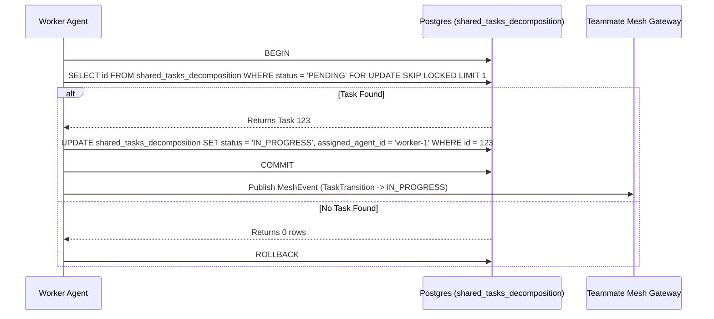

<div markdown="1" style="backdrop-filter: blur(20px) saturate(200%); background: rgba(255, 255, 255, 0.03); font-family: 'Outfit', 'Inter', sans-serif; padding: 20px; border-radius: 12px; border: 1px solid rgba(255, 255, 255, 0.1); color: #FFFFFF;">

# KAIROS AI OS: Final Premium Design

## 1. Vision & Architecture Overview
The One Human Corp (OHC) AI OS is powered by the **KAIROS Orchestrator**, a distributed system designed to manage complex agent swarms with zero friction. This design document finalizes the structural and aesthetic vision for the OHC "Hybrid Agentic OS", enabling a single human to orchestrate a vast swarm of AI agents.

## 2. Phase 1: Shared Task List (Decomposition)
To execute high-level feature requests, KAIROS decomposes them into a shared task list.

### Database Schema (PostgreSQL)
```sql
CREATE TABLE IF NOT EXISTS shared_tasks_decomposition (
    id UUID PRIMARY KEY DEFAULT gen_random_uuid(),
    organization_id VARCHAR NOT NULL,
    title VARCHAR NOT NULL,
    description TEXT,
    status VARCHAR NOT NULL DEFAULT 'PENDING',
    assigned_agent_id VARCHAR,
    priority VARCHAR NOT NULL DEFAULT 'P2',
    payload JSONB,
    parent_plan_id TEXT,
    dependencies JSONB NOT NULL DEFAULT '[]',
    locked_until TIMESTAMP,
    created_at TIMESTAMP WITH TIME ZONE DEFAULT CURRENT_TIMESTAMP,
    updated_at TIMESTAMP WITH TIME ZONE DEFAULT CURRENT_TIMESTAMP
);
```

### Shared Task Claiming Workflow
Agents use `FOR UPDATE SKIP LOCKED` in PostgreSQL to claim tasks safely, ensuring no race conditions during orchestration.



## 3. Phase 2: Orchestration (Teammate Mesh APIs)
Realtime communication is established via the Teammate Mesh APIs.

- **Cloud-Native Mode**: Uses Redis Pub/Sub (`rueidis`) for distributed event broadcasting.
- **Standalone Mode**: Utilizes in-memory channels for local, low-latency IPC.

Agents broadcast state transitions (e.g., `TaskTransition`) over channels like `orchestration.tasks`.

### 3.1 Broadcast API Contract (`POST /api/v1/mesh/broadcast`)
Agents use this endpoint to announce task state transitions.

**Request Payload:**
```json
{
  "agent_id": "worker-1",
  "channel": "orchestration.tasks",
  "action": "TaskTransition",
  "status": "success",
  "payload": {
    "task_id": "task_12345",
    "priority": "P0",
    "timestamp": "2026-04-14T17:02:23Z"
  }
}
```

## 4. Phase 3: autoDream (Memory Consolidation Pipeline)
The state machine consolidates long-term memory into a vector database to retain architectural decisions and agent memories.

### Vector Schema Definition (pgvector)
```sql
CREATE EXTENSION IF NOT EXISTS vector;

CREATE TABLE IF NOT EXISTS autodream_memories (
    id UUID PRIMARY KEY DEFAULT gen_random_uuid(),
    organization_id VARCHAR NOT NULL,
    source_mission_id UUID REFERENCES shared_tasks_decomposition(id),
    content TEXT NOT NULL,
    embedding vector(1536),
    created_at TIMESTAMP WITH TIME ZONE DEFAULT CURRENT_TIMESTAMP
);

CREATE INDEX idx_autodream_memories_embedding ON autodream_memories USING ivfflat (embedding vector_cosine_ops) WITH (lists = 100);
```

## 5. Phase 4: Sub-Agent Orchestration Queue
KAIROS manages distributed tasks via a background Sub-Agent Orchestration Queue.

### Sub-Agent Queue Schema
```sql
CREATE TABLE IF NOT EXISTS sub_agent_queue (
    id UUID PRIMARY KEY DEFAULT gen_random_uuid(),
    organization_id VARCHAR NOT NULL,
    parent_task_id UUID NOT NULL,
    payload JSONB,
    status VARCHAR NOT NULL DEFAULT 'QUEUED',
    worker_id VARCHAR,
    created_at TIMESTAMP WITH TIME ZONE DEFAULT CURRENT_TIMESTAMP,
    updated_at TIMESTAMP WITH TIME ZONE DEFAULT CURRENT_TIMESTAMP
);
```

### Sub-Agent Task Queue Payload (BullMQ / Celery)
When KAIROS decomposes a mission, it submits jobs to a distributed background queue.
```json
{
  "job_id": "worker-task-77",
  "queue_name": "l5-implementers",
  "data": {
    "issue_ref": "GitHub issue created from the repository task template",
    "repository_state_hash": "sha256-abc123def456",
    "execution_timeout_ms": 3600000
  }
}
```

### Execution Strategy
- The Queue Manager polls for `status='QUEUED'` tasks.
- In Cloud-Native Mode, Redis coordinates workers.
- Tasks are executed by isolated sub-agents, with status updates published back to the Teammate Mesh upon completion.

---
*Authored by: Principal Product Architect & KAIROS Orchestrator (L7)*
*Identity: One Human Corp*

</div>
