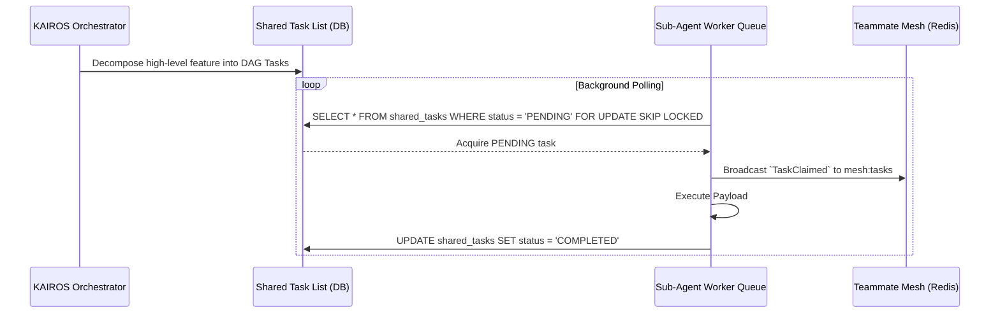

<div markdown="1" style="backdrop-filter: blur(20px) saturate(200%); font-family: 'Outfit', 'Inter', sans-serif; border: 1px solid rgba(255, 255, 255, 0.1); padding: 20px; border-radius: 12px; background: rgba(255, 255, 255, 0.03);">

# KAIROS: Hybrid Agentic OS Core Orchestration Design

## 1. Vision & Orchestration Master Loop
The OHC Hybrid Agentic OS operates via the KAIROS Orchestrator. The orchestration master loop (Think → Act → Observe → Decide) requires deep architectural decomposition, real-time agent coordination, and durable vector memory to ensure autonomy and precision.

## 2. Phase 1 (UltraPlan/Decomposition): Shared Task List Architecture

The Shared Task List serves as a distributed state machine backing the OHC Swarm.

### PostgreSQL Schema (Cloud-Native Mode)
The cloud-native implementation leverages `FOR UPDATE SKIP LOCKED` for lock-free parallel consumption. Tasks are mapped as Directed Acyclic Graphs (DAGs) using JSONB arrays for dependency resolution.

```sql
CREATE TABLE IF NOT EXISTS shared_tasks (
    id UUID PRIMARY KEY DEFAULT gen_random_uuid(),
    organization_id VARCHAR NOT NULL,
    title VARCHAR NOT NULL,
    description TEXT,
    status VARCHAR NOT NULL DEFAULT 'PENDING',
    assigned_agent_id VARCHAR,
    priority VARCHAR NOT NULL DEFAULT 'P2',
    dependencies JSONB NOT NULL DEFAULT '[]',
    payload JSONB,
    created_at TIMESTAMP WITH TIME ZONE DEFAULT CURRENT_TIMESTAMP,
    updated_at TIMESTAMP WITH TIME ZONE DEFAULT CURRENT_TIMESTAMP
);
```

### SQLite Schema (Standalone Desktop Mode)
The standalone desktop mode uses SQLite with explicit file-level and Go Mutex transaction locking to achieve identical functionality without heavy external database dependencies.

```sql
CREATE TABLE shared_tasks (
    id TEXT PRIMARY KEY,
    organization_id TEXT NOT NULL,
    title TEXT NOT NULL,
    description TEXT,
    status TEXT NOT NULL DEFAULT 'PENDING',
    assigned_agent_id TEXT,
    priority TEXT NOT NULL DEFAULT 'P2',
    dependencies TEXT NOT NULL DEFAULT '[]',
    payload TEXT,
    created_at DATETIME DEFAULT CURRENT_TIMESTAMP,
    updated_at DATETIME DEFAULT CURRENT_TIMESTAMP
);
```

## 3. Phase 2 (Orchestration): Teammate Mesh APIs

The Realtime Teammate Mesh facilitates near-zero latency swarm communication.

### Teammate Mesh API Contracts
All KAIROS operations broadcast real-time state changes via the Teammate Mesh. In production, this utilizes Redis Pub/Sub channels (e.g., `mesh:coordination`, `mesh:tasks`).

**POST `/api/mesh/broadcast`**
```json
{
  "agent_id": "orchestrator_kairos_1",
  "action": "TaskAssigned",
  "status": "success",
  "payload": {
      "task_id": "uuid-1234",
      "channel": "mesh:tasks",
      "dependencies": ["uuid-0987"]
  }
}
```

## 4. Phase 3 (autoDream): Vector Memory Pipeline

To maintain omni-context across sessions, agent outputs are continuously synthesized and inserted into the `autodream_memories` vector table.

### pgvector Consolidation Architecture
```sql
CREATE TABLE IF NOT EXISTS autodream_memories (
    id UUID PRIMARY KEY DEFAULT gen_random_uuid(),
    task_id UUID REFERENCES shared_tasks(id),
    semantic_context TEXT NOT NULL,
    embedding vector(1536),
    created_at TIMESTAMP WITH TIME ZONE DEFAULT CURRENT_TIMESTAMP
);
```

## 5. Phase 4: Sub-Agent Queuing Sequence Diagram


</div>
