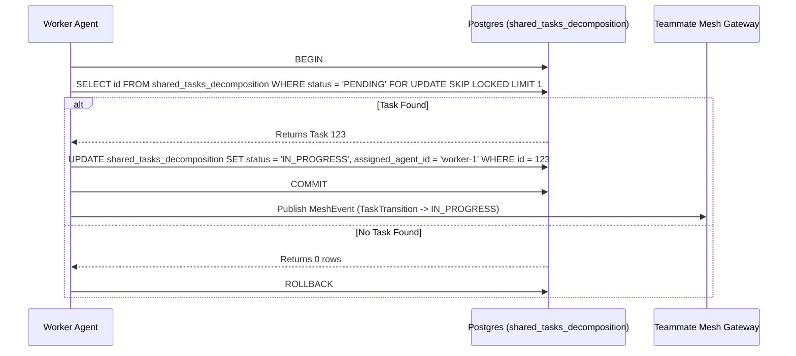
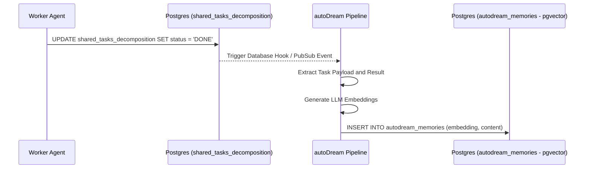

<div markdown="1" style="backdrop-filter: blur(20px) saturate(200%); font-family: 'Outfit', 'Inter', sans-serif; background: rgba(255, 255, 255, 0.03); color: #fff; padding: 20px; border-radius: 12px; border: 1px solid rgba(255, 255, 255, 0.1);">

# KAIROS Hybrid Architecture Decomposition

## 1. Vision
The One Human Corp (OHC) AI OS is powered by the **KAIROS Orchestrator**, a distributed system designed to manage complex agent swarms with zero friction.

## 2. Phase 1: Shared Task List (Decomposition)
### Database Schema (PostgreSQL):
```sql
CREATE TABLE IF NOT EXISTS shared_tasks_decomposition (
    id UUID PRIMARY KEY DEFAULT gen_random_uuid(),
    organization_id VARCHAR NOT NULL,
    title VARCHAR NOT NULL,
    description TEXT,
    status VARCHAR NOT NULL DEFAULT 'PENDING',
    assigned_agent_id VARCHAR,
    priority VARCHAR NOT NULL DEFAULT 'P2',
    payload JSONB,
    parent_plan_id TEXT,
    dependencies JSONB NOT NULL DEFAULT '[]',
    locked_until TIMESTAMP,
    created_at TIMESTAMP WITH TIME ZONE DEFAULT CURRENT_TIMESTAMP,
    updated_at TIMESTAMP WITH TIME ZONE DEFAULT CURRENT_TIMESTAMP
);
```

### Shared Task Claiming Workflow


## 3. Phase 2: Realtime Teammate Mesh APIs
The Teammate Mesh ensures agents coordinate without delays. It provides a real-time event broadcast and subscription system for all swarm members.

### Contract API / Endpoints:
- **Endpoint:** `POST /api/mesh/v2/broadcast`
  Broadcasts a state machine event over structured channels.

```json
{
  "channel": "mesh:tasks",
  "event_type": "TASK_TRANSITION",
  "data": {
    "task_id": "task_12345",
    "previous_state": "PENDING",
    "new_state": "IN_PROGRESS"
  }
}
```

- **Endpoint:** `GET /api/mesh/v2/subscribe?channel=mesh:tasks`
  Websocket endpoint for agent workers to listen to state events for reactive coordination.

## 4. Phase 3: AutoDream Data Pipelines
The AutoDream pipeline is responsible for long-term memory consolidation, synchronizing local/hybrid storage, and generating LLM embeddings to index knowledge base.

### Data Pipeline Sequence


### Vector Database Schema (pgvector)
```sql
CREATE TABLE IF NOT EXISTS autodream_memories (
    id UUID PRIMARY KEY DEFAULT gen_random_uuid(),
    task_id UUID REFERENCES shared_tasks_decomposition(id),
    content TEXT NOT NULL,
    embedding vector(1536),
    created_at TIMESTAMP WITH TIME ZONE DEFAULT CURRENT_TIMESTAMP
);
```
</div>
