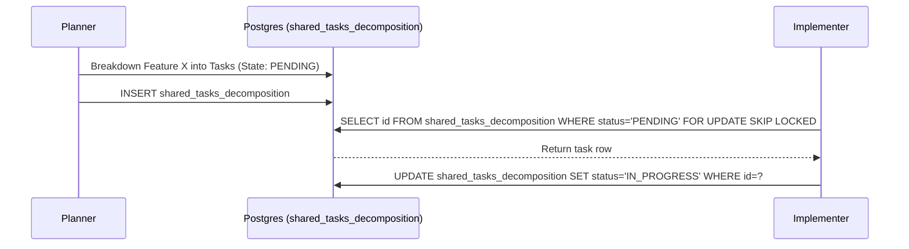

<div markdown="1" style="backdrop-filter: blur(20px) saturate(200%); font-family: 'Outfit', 'Inter', sans-serif; background: rgba(255, 255, 255, 0.03); color: #fff; padding: 20px; border-radius: 12px; border: 1px solid rgba(255, 255, 255, 0.1);">

# Design Doc: KAIROS AI OS Hybrid Core Master Plan
**Author:** Principal Product Architect & KAIROS Orchestrator (L7)

## 1. Phase 1: Shared Task List (Decomposition)
The Shared Task List tracks complex feature decomposition into actionable, sequenced tasks.

**Database Schema (PostgreSQL):**
```sql
CREATE TABLE IF NOT EXISTS shared_tasks_decomposition (
    id UUID PRIMARY KEY DEFAULT gen_random_uuid(),
    organization_id VARCHAR NOT NULL,
    title VARCHAR NOT NULL,
    description TEXT,
    status VARCHAR NOT NULL DEFAULT 'PENDING',
    assigned_agent_id VARCHAR,
    priority VARCHAR NOT NULL DEFAULT 'P2',
    payload JSONB,
    parent_plan_id TEXT,
    dependencies JSONB NOT NULL DEFAULT '[]',
    locked_until TIMESTAMP,
    created_at TIMESTAMP WITH TIME ZONE DEFAULT CURRENT_TIMESTAMP,
    updated_at TIMESTAMP WITH TIME ZONE DEFAULT CURRENT_TIMESTAMP
);
```

**Sequence Diagram:**


## 2. Phase 2: Orchestration (Teammate Mesh Architecture)
Realtime communication via transport components utilizing the `mesh:tasks` and `mesh:coordination` channels to broadcast a state machine event over structured channels.

## 3. Phase 3: autoDream (Memory Consolidation Pipeline)
Background workers consolidate temporary agent scratchpads and completed task results to embeddings stored in PostgreSQL with pgvector, in the `consolidated_memory` table.

## 4. Phase 4: Sub-Agent Orchestration Queue
Background worker system integrating the task table with a background Queue. In cloud mode, it is backed by Redis ZSETs. In Standalone, it uses an internal SQLite table (`sub_agent_jobs`) with locking.

</div>
