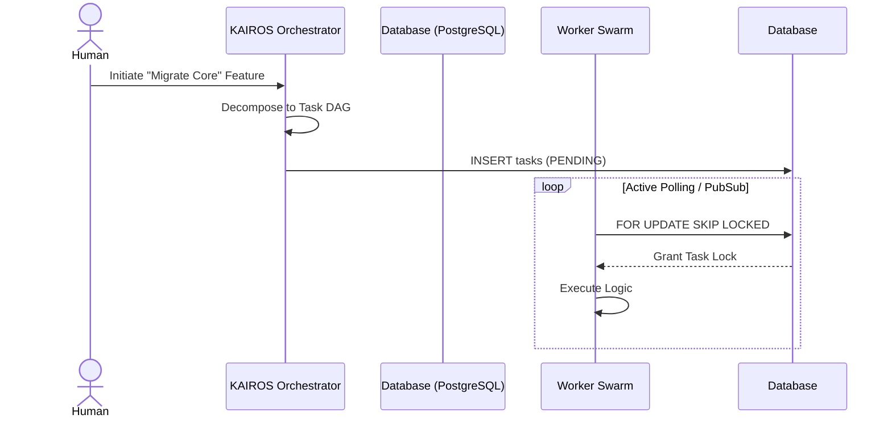

# KAIROS AI OS: Comprehensive Hybrid Core Design Blueprint

## 1. Vision
The One Human Corp (OHC) AI OS requires robust structural architecture to coordinate complex agent swarms. This premium blueprint finalizes the Master Execution Playbook covering the Shared Task List, Teammate Mesh, AutoDream Pipelines, and Queue Sub-Agent Orchestration.

## 2. Phase 1: Shared Task List (Decomposition)
### 2.1 Architecture
High-level objectives are broken down into DAG dependencies. KAIROS manages a unified `shared_tasks_decomposition` PostgreSQL table.

### 2.2 Sequence Flow

## 3. Phase 2: Teammate Mesh APIs (Orchestration)
### 3.1 Architecture
A highly available real-time communication mesh utilizing Redis Pub/Sub streams for agent coordination (`mesh:tasks` and `mesh:coordination`).

### 3.2 Protocol Interface
Agents bind to `TeammateMesh` via gRPC/WebSocket bridging.
- **`BroadcastStatus(taskId UUID, status TaskState)`**: Informs swarm of completion.
- **`AquireResourceLock(resourceId string)`**: Distributed locking mechanism via Redis (or `sync.Mutex` fallback).

## 4. Phase 3: AutoDream (Memory Consolidation)
### 4.1 Architecture
Agents operate with transient scratchpads. A background worker periodically processes completed task contexts, utilizes an LLM to generate high-dimensional embeddings, and stores these into the `autodream_memories` table via `pgvector`.

### 4.2 Data Pipeline
Context Payload -> Embedding Generation -> Vector Insertion (pgvector/Pinecone).

## 5. Phase 4: Sub-Agent Orchestration Queue
### 5.1 Architecture
The background routing queue to spawn isolated sub-agents without blocking KAIROS. Utilizes a dual-strategy (Redis ZSET for Cloud Mode, application Mutex for Standalone Mode).

## 6. Conclusion
These four phases complete the core orchestration architecture for the OHC Hybrid AI OS, allowing flawless Swarm Intelligence and structural delegation.

