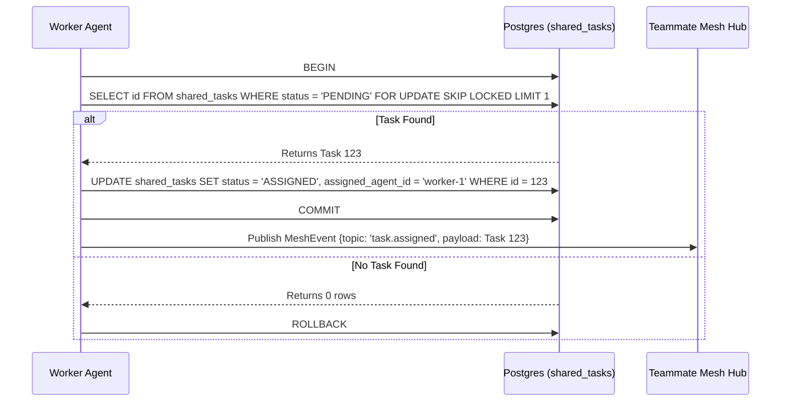

<div markdown="1" style="backdrop-filter: blur(20px) saturate(200%); font-family: 'Outfit', 'Inter', sans-serif; background: rgba(255, 255, 255, 0.03); color: #fff; padding: 20px; border-radius: 12px; border: 1px solid rgba(255, 255, 255, 0.1);">

# OHC KAIROS Orchestration: Master Hybrid Blueprint

## 1. Phase 1: Shared Task List Decomposition (KAIROS Mode)

The Shared Task List relies on database-backed state machines to prevent race conditions during task claiming. We track dependencies via parent pointers or adjacency lists in PostgreSQL and SQLite.

### Database Schema (PostgreSQL):
```sql
CREATE TABLE IF NOT EXISTS shared_tasks (
    id UUID PRIMARY KEY DEFAULT gen_random_uuid(),
    organization_id VARCHAR NOT NULL,
    title VARCHAR NOT NULL,
    description TEXT,
    status VARCHAR NOT NULL DEFAULT 'PENDING',
    agent_id VARCHAR,
    priority VARCHAR NOT NULL DEFAULT 'P2',
    payload JSONB,
    parent_plan_id TEXT,
    dependencies JSONB NOT NULL DEFAULT '[]',
    locked_until TIMESTAMP,
    created_at TIMESTAMP WITH TIME ZONE DEFAULT CURRENT_TIMESTAMP,
    updated_at TIMESTAMP WITH TIME ZONE DEFAULT CURRENT_TIMESTAMP
);
```

### Database Schema Fallback (SQLite):
```sql
CREATE TABLE IF NOT EXISTS shared_tasks (
    id TEXT PRIMARY KEY,
    organization_id TEXT NOT NULL,
    title TEXT NOT NULL,
    description TEXT,
    status TEXT NOT NULL DEFAULT 'PENDING',
    agent_id TEXT,
    priority TEXT NOT NULL DEFAULT 'P2',
    payload TEXT,
    parent_plan_id TEXT,
    dependencies TEXT NOT NULL DEFAULT '[]',
    locked_until DATETIME,
    created_at DATETIME DEFAULT CURRENT_TIMESTAMP,
    updated_at DATETIME DEFAULT CURRENT_TIMESTAMP
);
```

### Shared Task Claiming Workflow


## 2. Phase 2: Teammate Mesh APIs

The Teammate Mesh ensures agents coordinate without delays, leveraging WebSocket or Redis Pub/Sub for realtime mesh sync over K8s clusters.

- **Endpoint:** `POST /api/mesh/v2/broadcast`
  Broadcasts a state machine event over structured channels.

```json
{
  "channel": "mesh:tasks",
  "event_type": "TASK_TRANSITION",
  "data": {
    "task_id": "task_12345",
    "previous_state": "PENDING",
    "new_state": "IN_PROGRESS"
  }
}
```

## 3. Phase 3: autoDream Memory Vector Architecture

The Swarm Intelligence Protocol (OHC-SIP) dictates that temporary agent scratchpads be consolidated into long-term durable state via pgvector embedding indexing.

```sql
CREATE TABLE IF NOT EXISTS consolidated_memory (
    id UUID PRIMARY KEY DEFAULT gen_random_uuid(),
    task_id UUID REFERENCES shared_tasks(id),
    content TEXT NOT NULL,
    embedding vector(1536),
    created_at TIMESTAMP WITH TIME ZONE DEFAULT CURRENT_TIMESTAMP
);
```

### Database Schema Fallback (SQLite):
```sql
CREATE TABLE IF NOT EXISTS consolidated_memory (
    id TEXT PRIMARY KEY,
    task_id TEXT REFERENCES shared_tasks(id),
    content TEXT NOT NULL,
    embedding BLOB,
    created_at DATETIME DEFAULT CURRENT_TIMESTAMP
);
```

</div>
