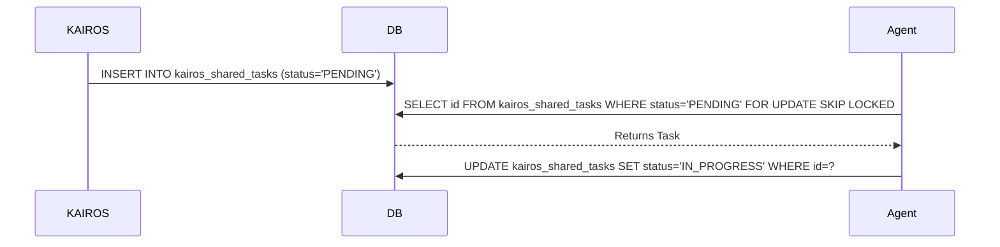

<div markdown="1" style="backdrop-filter: blur(20px) saturate(200%); font-family: 'Outfit', 'Inter', sans-serif; background: rgba(255, 255, 255, 0.03); color: #fff; padding: 20px; border-radius: 12px; border: 1px solid rgba(255, 255, 255, 0.1);">

# KAIROS Orchestration: Shared Task List, Teammate Mesh & AutoDream
**Author:** Principal Product Architect & KAIROS Orchestrator (L7)

## Phase 1: Shared Task List (Decomposition)
To support autonomous feature decomposition across the swarm, we require a durable tracking mechanism.

**Database Schema (Cloud Native - PostgreSQL / SQLite Compatible):**
```sql
CREATE TABLE IF NOT EXISTS kairos_shared_tasks (
    id VARCHAR PRIMARY KEY,
    organization_id VARCHAR NOT NULL,
    parent_mission_id VARCHAR,
    title VARCHAR NOT NULL,
    status VARCHAR NOT NULL DEFAULT 'PENDING',
    payload JSONB,
    dependencies TEXT NOT NULL DEFAULT '[]',
    created_at TIMESTAMP DEFAULT CURRENT_TIMESTAMP
);
```

**Sequence Diagram:**


## Phase 2: Teammate Mesh Architecture
Agents require realtime coordination. We will expose an HTTP endpoint `POST /api/v1/mesh/broadcast` backed by Redis Pub/Sub (Cloud) or Memory Channel (Standalone).

**API Contract:**
```json
{
  "agent_id": "string",
  "channel": "orchestration.mesh",
  "action": "TASK_ACQUIRED",
  "payload": {}
}
```

## Phase 3: AutoDream Pipeline (Memory Consolidation)
To convert episodic interactions into long-term knowledge, we will utilize `pgvector` for semantic search.
```sql
CREATE EXTENSION IF NOT EXISTS vector;
CREATE TABLE IF NOT EXISTS kairos_autodream_memory (
    id UUID PRIMARY KEY,
    content TEXT NOT NULL,
    embedding vector(1536)
);
```
</div>
