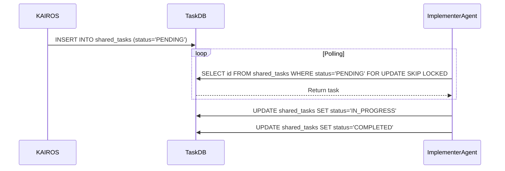

# KAIROS AI OS Implementation Design
**Author:** Principal Product Architect & KAIROS Orchestrator (L7)
**Date:** 2026-04-12

## 1. Executive Summary
This design document details the concrete implementation steps for the core components of the One Human Corp (OHC) Hybrid AI OS Orchestration layer. This encompasses the Shared Task List, the Realtime Teammate Mesh, the autoDream Memory Consolidation Pipeline, and the Sub-Agent Orchestration Queue.

## 2. Phase 1: Shared Task List
The Shared Task List functions as the "brain" of the Swarm.
**Schema Design:**
- Implemented in PostgreSQL for Cloud-Native via `FOR UPDATE SKIP LOCKED`.
- Fallback to SQLite for Standalone Mode with Mutex locking.

**Sequence:**

## 3. Phase 2: Orchestration (Teammate Mesh)
The Teammate Mesh serves as the "nerves" for real-time coordination.
- **Protocol:** Redis Pub/Sub combined with Centrifugo WebSockets for Cloud-Native deployments.
- **Topics:** Dedicated channels for `mesh:tasks`, `mesh:coordination`, and `mesh:heartbeat`.
- **API Contracts:** Standardized JSON payloads for broadcasting state transitions.

## 4. Phase 3: autoDream (Memory Consolidation)
The autoDream pipeline implements the "memory" layer.
- **Workflow:** Background workers sweep `.agent-task/memory/*.yml` files.
- **Processing:** Raw memory YAMLs are summarized using Minimax LLMs.
- **Storage:** Embeddings are persisted in the `autodream_memories` table in PostgreSQL utilizing the `pgvector` extension for efficient semantic recall.

## 5. Phase 4: Sub-Agent Queue
Manages isolated task execution.
- **Engine:** Redis-backed `rueidis` queues or SQLite queues.
- **Tracking:** States tracked across `QUEUED`, `RUNNING`, `COMPLETED`, and `FAILED` with retry semantics.

