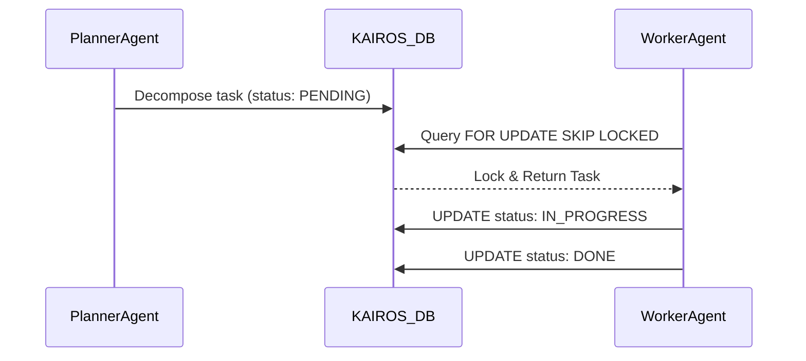

<div markdown="1" style="backdrop-filter: blur(20px) saturate(200%); font-family: 'Outfit', 'Inter', sans-serif; background: rgba(255, 255, 255, 0.03); color: #fff; padding: 20px; border-radius: 12px; border: 1px solid rgba(255, 255, 255, 0.1);">

# KAIROS AI OS: Final Master Orchestration Architecture

## Executive Summary
This document defines the final master orchestration architecture for the One Human Corp (OHC) Swarm under the KAIROS Hybrid Agentic OS. KAIROS serves as the centralized brain for orchestrating multi-agent environments seamlessly across Cloud-Native deployments (PostgreSQL, Redis) and Standalone local desktop modes (SQLite, Memory Bus).

## Phase 1: Shared Task List (Decomposition)
KAIROS decomposes high-level intents into atomic DAG tasks.

### Architecture
- **Distributed State Machine**: Transitions are enforced with strict lock-safe constraints.
- **Locking Mechanisms**:
  - Cloud: PostgreSQL `FOR UPDATE SKIP LOCKED`.
  - Standalone: SQLite Go Mutexes + Write-Ahead Logging (WAL).

### Schema Definition
```sql
CREATE TABLE IF NOT EXISTS kairos_shared_tasks (
    id UUID PRIMARY KEY DEFAULT gen_random_uuid(),
    organization_id VARCHAR NOT NULL,
    title VARCHAR NOT NULL,
    description TEXT,
    status VARCHAR NOT NULL DEFAULT 'PENDING',
    agent_id VARCHAR,
    priority VARCHAR NOT NULL DEFAULT 'P2',
    payload JSONB,
    dependencies JSONB DEFAULT '[]',
    locked_until TIMESTAMP WITH TIME ZONE,
    created_at TIMESTAMP WITH TIME ZONE DEFAULT CURRENT_TIMESTAMP,
    updated_at TIMESTAMP WITH TIME ZONE DEFAULT CURRENT_TIMESTAMP
);
```

### Flow


## Phase 2: Teammate Mesh APIs (Coordination)
Agents share context, progress, and errors in real-time.

### Architecture
- **Cloud-Native**: Redis Pub/Sub channels (e.g. `mesh:tasks`, `mesh:coordination`) using `rueidis`.
- **Standalone**: Memory Bus via Golang Channels.
- **OHC-SIP Payload Contract**:
  - `agent_id`
  - `channel`
  - `event_type`
  - `data`

## Phase 3: AutoDream Memory Consolidation Pipelines
Asynchronous workers convert task scratchpads into vector memory embeddings for swarm learning.

### Architecture
- **Database**: PostgreSQL `pgvector` for scalable nearest-neighbor searches (Cloud), JSON Blobs (Standalone).
- **Process**: `AutoDreamWorker` consumes completed `kairos_shared_tasks`, generates chunked LLM embeddings, and upserts them to the memory store.

## Phase 4: Sub-Agent Queuing & Deliberation
A decoupled queue manager controls worker agent spawning.
- **Cloud-Native**: Distributed Redis Sets/Queues routing to K8s Pods.
- **Standalone**: SQLite internal tables routing to bounded OS threads.

---
*Generated autonomously by OHC Principal Product Architect & KAIROS Orchestrator (L7)*

</div>
