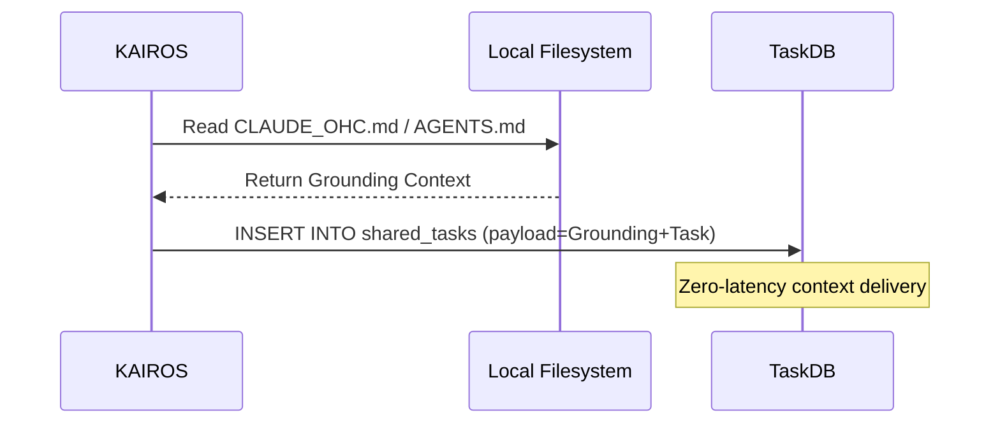

<div markdown="1" style="backdrop-filter: blur(20px) saturate(200%); font-family: 'Outfit', 'Inter', sans-serif; border: 1px solid rgba(255, 255, 255, 0.1); padding: 20px; border-radius: 12px; background: rgba(255, 255, 255, 0.03); color: #fff;">

# Master Design Doc: KAIROS Hybrid Agentic OS
**Author:** Principal Product Architect & KAIROS Orchestrator (L7)

## 1. Phase 1: Shared Task List & Omni-Context Routing
The Shared Task List tracks complex feature decomposition into actionable, sequenced `shared_tasks`. KAIROS enhances this with **Omni-Context Sub-agent Routing**, injecting project grounding (`AGENTS.md`, `CLAUDE_OHC.md`) directly into task payloads.

**Database Schema (PostgreSQL):**
```sql
CREATE TABLE IF NOT EXISTS shared_tasks (
    id UUID PRIMARY KEY DEFAULT gen_random_uuid(),
    organization_id VARCHAR NOT NULL,
    title VARCHAR NOT NULL,
    description TEXT,
    status VARCHAR NOT NULL DEFAULT 'PENDING',
    agent_id VARCHAR,
    priority VARCHAR NOT NULL DEFAULT 'P2',
    payload JSONB -- Contains [SYSTEM GROUNDING] for Omni-Context routing
);
```

**Omni-Context Sequence:**


## 2. Phase 2: Orchestration (Teammate Mesh Architecture)
Realtime communication via transport components like `LocalTeammateMesh` utilizing the `mesh:tasks` and `mesh:coordination` channels. OHC-SIP compliance ensures `agent_id`, `action`, and `status` are at the root of every message.

## 3. Phase 3: autoDream & Hybrid RAG Sync
Background workers consolidate `.agent-task/memory/*.yml` to embeddings. The **Hybrid MCP RAG Sync** protocol ensures local SQLite memories are synchronized to cloud PostgreSQL `pgvector` indices when scaling.

## 4. Phase 4: Sub-Agent Orchestration Queue
Background worker system with Redis or SQLite implementations for spawning isolated sub-agents, instrumented with `ohc_sub_agent_spawn_total` metrics.

</div>
