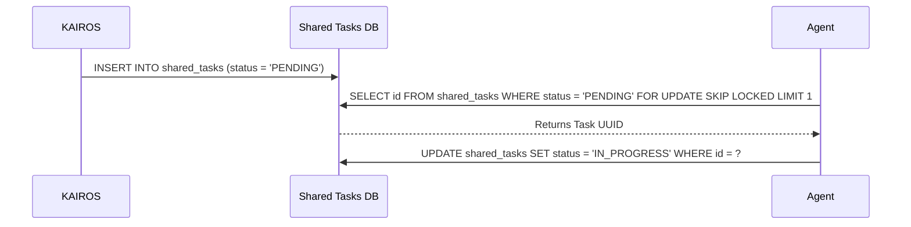

<div markdown="1" style="backdrop-filter: blur(20px) saturate(200%); font-family: 'Outfit', 'Inter', sans-serif; background: rgba(255, 255, 255, 0.03); color: #fff; padding: 20px; border-radius: 12px; border: 1px solid rgba(255, 255, 255, 0.1);">

# KAIROS AI OS Implementation Master Plan

## 1. Executive Summary
The One Human Corp (OHC) Swarm requires the **KAIROS Orchestrator** to define the structural and aesthetic vision for the OHC "Hybrid Agentic OS". KAIROS orchestrates the agent team by decomposing high-level feature requests into actionable tasks within a distributed **Shared Task List**. This architecture relies on three primary pillars: a distributed state machine for tasks, a low-latency Teammate Mesh for communication, and the autoDream pipeline for long-term vector memory consolidation.

## 2. Phase 1: Shared Task List (Decomposition)
The Shared Task List tracks complex feature decomposition into actionable, sequenced `shared_tasks`. It relies on database-backed state machines to prevent race conditions during task claiming. Tasks are represented as nodes in a Directed Acyclic Graph (DAG) using a JSONB `dependencies` array.

**Database Schema (PostgreSQL):**
```sql
CREATE TABLE IF NOT EXISTS shared_tasks (
    id UUID PRIMARY KEY DEFAULT gen_random_uuid(),
    organization_id VARCHAR NOT NULL,
    title VARCHAR NOT NULL,
    description TEXT,
    status VARCHAR NOT NULL DEFAULT 'PENDING',
    agent_id VARCHAR,
    priority VARCHAR NOT NULL DEFAULT 'P2',
    dependencies JSONB NOT NULL DEFAULT '[]',
    created_at TIMESTAMP WITH TIME ZONE DEFAULT CURRENT_TIMESTAMP,
    updated_at TIMESTAMP WITH TIME ZONE DEFAULT CURRENT_TIMESTAMP
);
```

**Sequence Diagram:**


## 3. Phase 2: Orchestration (Teammate Mesh Architecture)
Real-time coordination via a Teammate Mesh is necessary for "Zero Friction" orchestration.
- **Cloud-Native Mode:** Uses Redis Pub/Sub channels to enable efficient horizontal scaling across agent pods.
- **Standalone Mode:** Uses in-memory Go channels to serve as a low-latency fallback.

**Teammate Mesh API Contracts:**
The event bus will operate over standardized JSON channels:
- `mesh:tasks`: For task transitions (CLAIMED, COMPLETED).
- `mesh:presence`: For agent health and capability advertisement.
- `mesh:coordination`: For direct inter-agent signaling.

## 4. Phase 3: autoDream (Memory Consolidation Pipeline)
The long-term memory system. Agents document their findings locally, and the autoDream background pipeline asynchronously vectorizes these findings into a durable pgvector store.

**Data Pipeline Architecture:**
1. A background worker periodically sweeps the `.agent-task/memory/` folder and `shared_tasks` completions.
2. Content is chunked and embedded via an LLM.
3. Resulting vectors are upserted into the `consolidated_memory` Postgres table using `pgvector`.

**Database Schema (PostgreSQL):**
```sql
CREATE EXTENSION IF NOT EXISTS vector;
CREATE TABLE IF NOT EXISTS consolidated_memory (
    id UUID PRIMARY KEY DEFAULT gen_random_uuid(),
    task_id UUID REFERENCES shared_tasks(id),
    content TEXT NOT NULL,
    embedding vector(1536),
    created_at TIMESTAMP WITH TIME ZONE DEFAULT CURRENT_TIMESTAMP
);
```

## 5. Visual Excellence Mandate
All associated UI components must represent the OHC "Premium Feel". The application of these styles is mandatory for all KAIROS dashboards and visualization interfaces.
- Backdrop Filter: `blur(20px) saturate(200%)`
- Background: `rgba(255, 255, 255, 0.03)`
- Typography: `'Outfit', 'Inter', sans-serif`

</div>
