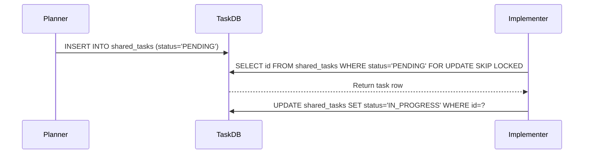

<div markdown="1" style="backdrop-filter: blur(20px) saturate(200%); font-family: 'Outfit', 'Inter', sans-serif; background: rgba(255, 255, 255, 0.03); color: #fff; padding: 20px; border-radius: 12px; border: 1px solid rgba(255, 255, 255, 0.1);">

# Master Design Doc: KAIROS Hybrid Agentic OS
**Author:** Principal Product Architect & KAIROS Orchestrator (L7)

## 1. Phase 1: Shared Task List (Decomposition)
The Shared Task List tracks complex feature decomposition into actionable, sequenced `shared_tasks`.

**Database Schema (PostgreSQL):**
```sql
CREATE TABLE IF NOT EXISTS shared_tasks (
    id UUID PRIMARY KEY DEFAULT gen_random_uuid(),
    organization_id VARCHAR NOT NULL,
    title VARCHAR NOT NULL,
    description TEXT,
    status VARCHAR NOT NULL DEFAULT 'PENDING',
    agent_id VARCHAR,
    priority VARCHAR NOT NULL DEFAULT 'P2',
    payload JSONB
);
```

**Sequence Diagram:**


## 2. Phase 2: Orchestration (Teammate Mesh Architecture)
Realtime communication via transport components like `LocalTeammateMesh` utilizing the `mesh:tasks` and `mesh:coordination` channels.

## 3. Phase 3: autoDream (Memory Consolidation Pipeline)
Background workers consolidate `agent_session_data` and optional `OHC_MEMORY_DIR/*.yml` runtime memory files to embeddings stored in PostgreSQL with pgvector, in the `consolidated_memory` table.

## 4. Phase 4: Sub-Agent Orchestration Queue
Background worker system with Redis or SQLite implementations for spawning isolated sub-agents.

</div>
